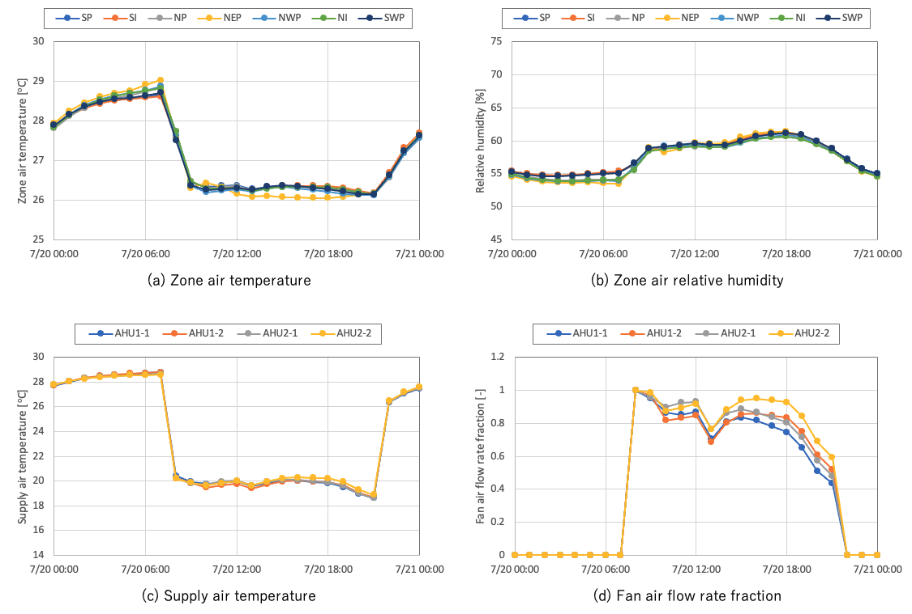
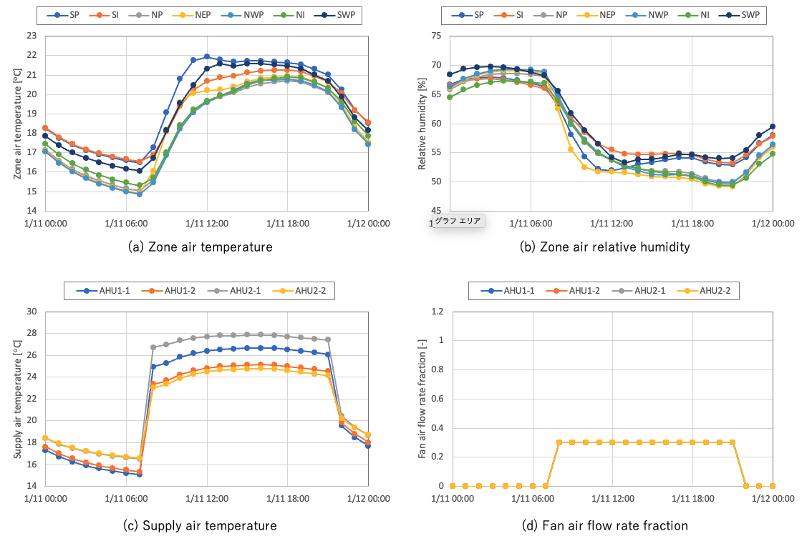

== DesignBuilderを用いた全体システムモデルの作成（JE110:VAVシステム）
以下では「CAVシステムモデルの作成.adoc」からの変更点のみを説明する。

=== Zone HVAC air loop terminal unit
AirTerminal:SingleDuct:ConstantVolume:NoReheatからAirTerminal:SingleDuct:VAV:NoReheatまたはAirTerminal:SingleDuct:VAV:HeatAndCool:NoReheatへ変更する。link:https://bigladdersoftware.com/epx/docs/9-4/input-output-reference/group-air-distribution-equipment.html#airterminalsingleductvavnoreheat[Input Output Reference]によれば、前者の場合は暖房負荷発生時に風量は最小風量で固定されるようである。また、後者は冷房時・暖房時ともに変風量制御となるようだが、元々はChangeover-bypass VAV unitary systemというやや特殊なシステムを対象に開発されたようで、通常のVAVシステムへの適用可否は明言されていない。とりあえず、ここでは後者を選択した。

=== AHU fan
空調機ファンを固定風量タイプから変風量タイプに変更する。

=== Supply air temperature reset control
選択可能な主な給気温度制御の種類を下表に示す（link:https://bigladdersoftware.com/epx/docs/9-4/input-output-reference/group-setpoint-managers.html#setpointmanagerscheduled[Input Output Reference]）。冷房用にSetpointManager:WarmestTemperatureFlowを、暖房用にSetpointManager:Coldestを選択した。

.給気温度制御の種類
|======================================
| SetpointManager:Scheduled | スケジュールで設定値を与える。最もシンプルな設定。
| SetpointManager:Warmest | 冷房用のリセット制御。最大風量ベースでリセットするため風量は大きくなる。
| SetpointManager:Coldest | 暖房用のリセット制御。Warmestと同様、風量は大きくなる。
| SetpointManager:WarmestTemperatureFlow | 冷房用のリセット制御。温度優先と風量優先を選択可能。
|======================================

=== Evaporative cooler
これはCAV・VAV共通の変更である。EnergyPlusには気化式加湿器のオブジェクトがないため、気化冷却器のオブジェクトで代用する。「CAVシステムモデルの作成.adoc」ではEvaporativeCooler:Direct:ResearchSpecialを使用していたが、EvaporativeCooler:Direct:CelDekPadに変更した。後者の方が無制御であるがシンプルな入力であり、気化式加湿器の代用にはこちらの方が向いていると思われる。ただし、デフォルトの入力では飽和効率がほぼ80％以上となり、連続運転する場合には湿度が上がり過ぎるため、エレメントの面積と厚さを調整して飽和効率を20〜30％程度まで低減した。最終的に用いた値は面積0.4m^2^、厚さ0.001mである。飽和効率の計算式等についてはlink:https://bigladdersoftware.com/epx/docs/9-4/engineering-reference/evaporative-coolers.html#direct-evaporative-cooler[Engineering Reference]を参照。

=== 現状（2021.7.12）の計算結果
上記のようにまずは2次側の入力を重点的に見直し、試計算を行った。現時点の計算結果は下図に示す。

夏期については比較的意図通りに動いているが、以下の点について確認が必要である。

* 室温が設定値26℃よりもやや高い
* 給気温度が高く、風量が多めになっている

冬期については以下の点の確認が必要である。

* 室温が設定値22℃から乖離している（設定値になるように制御されているように見えない）
* 給気風量が最小値30％で一定となっている

特に、風量が30％で一定となっている理由が不明である。AirTerminal:SingleDuct:VAV:HeatAndCool:NoReheatあるいはSetpointManager:Coldestのアルゴリズムが影響している可能性がある。

EnergyPlusでは、給気温度リセット制御は冷水コイル／温水コイルのいずれか一方と紐付け、冷房／暖房で別々に定義する仕組みになっている点が日本の考え方と異なっている。また、SetpointManager:WarmestTemperatureFlowの暖房用に相当するオブジェクトが無いことから、EnergyPlusは冷房を主に設計されており、暖房にはあまり気が払われていないとも考えられる。

.夏期代表日の計算結果

.冬期代表日の計算結果

