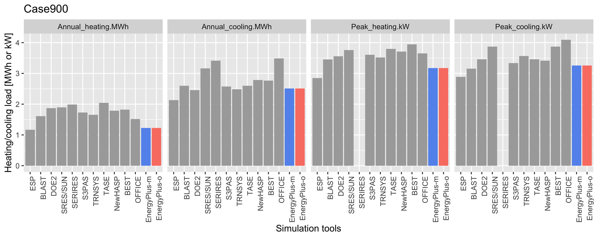
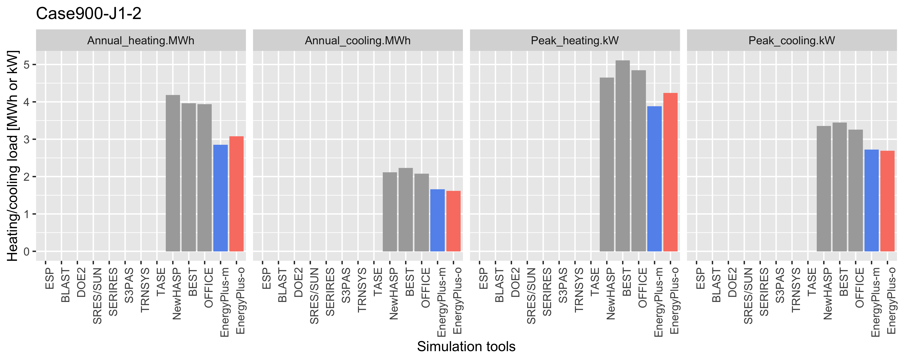

== Case900Jシリーズの計算結果の比較

Case900Jシリーズについて、Miyata modelとOno modelの両モデルで計算した結果を他の日本ツールと比較する。

=== Case900
基準ケースとなるCase900の計算結果をFigure 1に示す。EnergyPlusは他のツール比べてやや小さいが（ESPの結果に近い）、両モデルの結果は一致している。

.Case900の計算結果

=== Case900-J1-1
Case900-J1-1の計算結果をFigure 2に示す。Case900ど同様の傾向となっている。

.Case900-J1-1の計算結果
image::figures/Case900-J1-1_annual_peak_load.png[]

=== Case900-J1-2
Case900-J1-2の計算結果をFigure 3に示す。両モデルに若干の差が生じている。特に暖房負荷に差がある。材料、壁構成の定義について一通り確認したが、両モデルの違いは発見できていない。。。

.Case900-J1-2の計算結果

=== Case900-J2
Case900-J2の計算結果をFigure 4に示す。両モデルに若干の差が生じている。暖房ピークの差はCase900-J1-2と逆転している。

.Case900-J2の計算結果

=== Case900-J3
Case900-J3の計算結果をFigure 5に示す。両モデルに大きな差がある。EnergyPlus-oではスラット角の入力を誤っていると考えられる。

.Case900-J3の計算結果
image::figures/Case900-J3_annual_peak_load.png[]

