DesignBuilder（version 6.1.5.001）とR（version 4.0.4）を使ってASHRAE Standard 140の単室テストを実施する。

IDE（統合開発環境）は、IDFはVisual Studio Code（version 1.54）、RはRstudio（version 1.4.1106）を使用。

# DesignBuilderによるCase600モデルの作成
## 新しいプロジェクトを作成
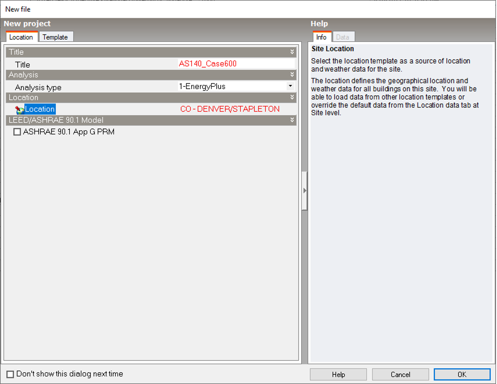
 
<br/>
 
## Locationの定義
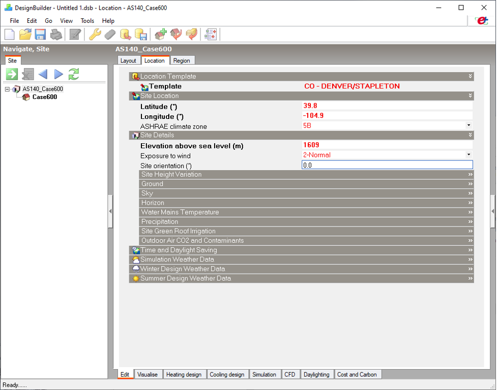
 
<br/>
 
## 新しいBuildingの作成
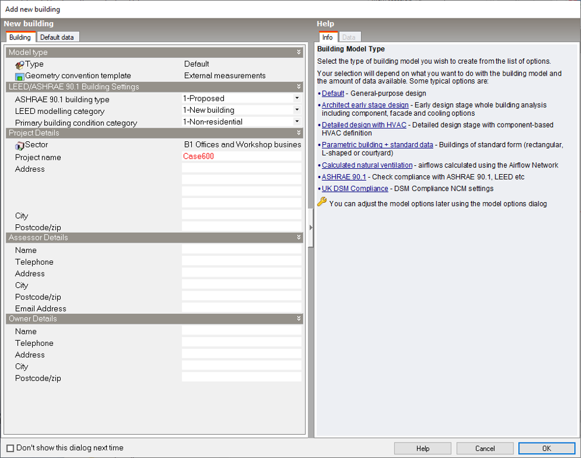
 
<br/>
 
## 新しいBlockの作成
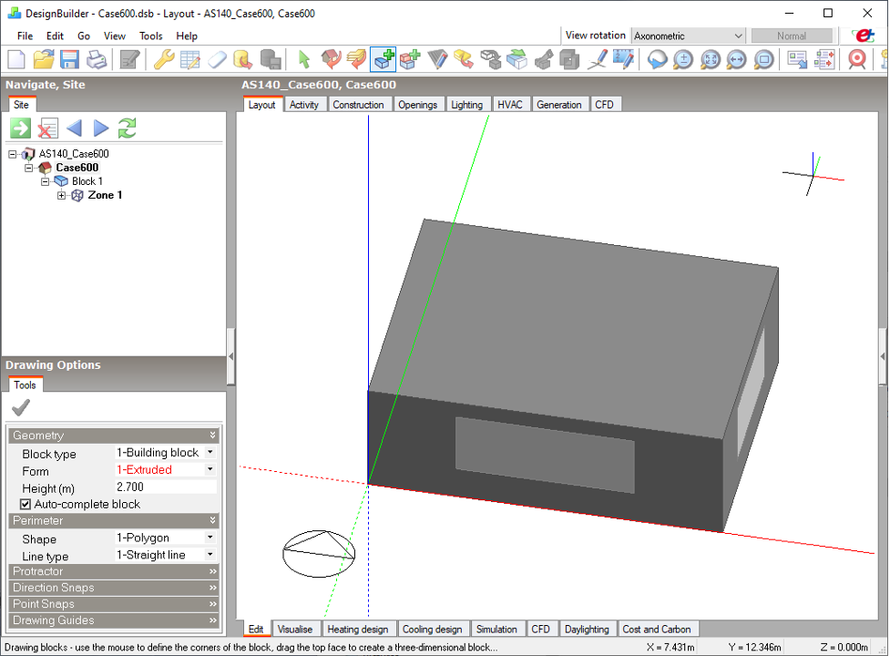
 
<br/>
 
## Activityの入力
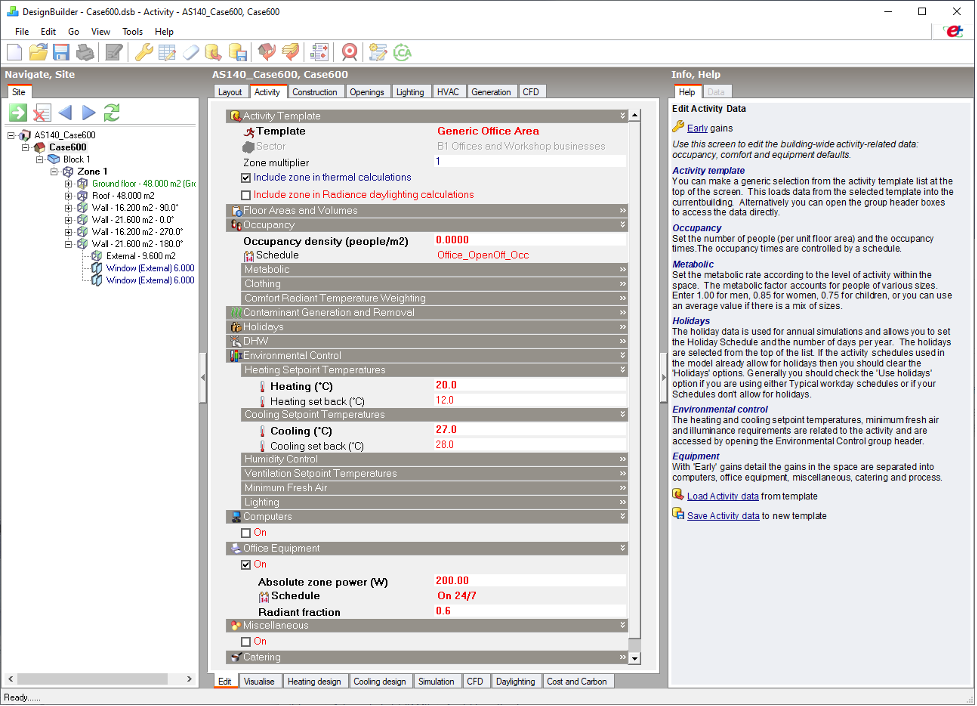
 
<br/>
 
## Constructionの入力
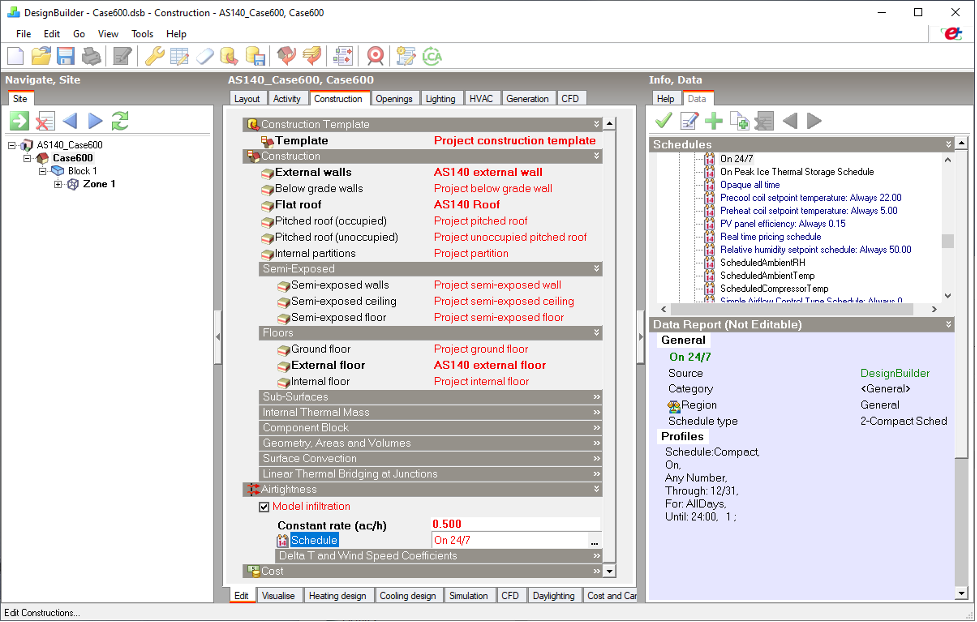
 
<br/>
 
## 南面以外のOpeningの削除
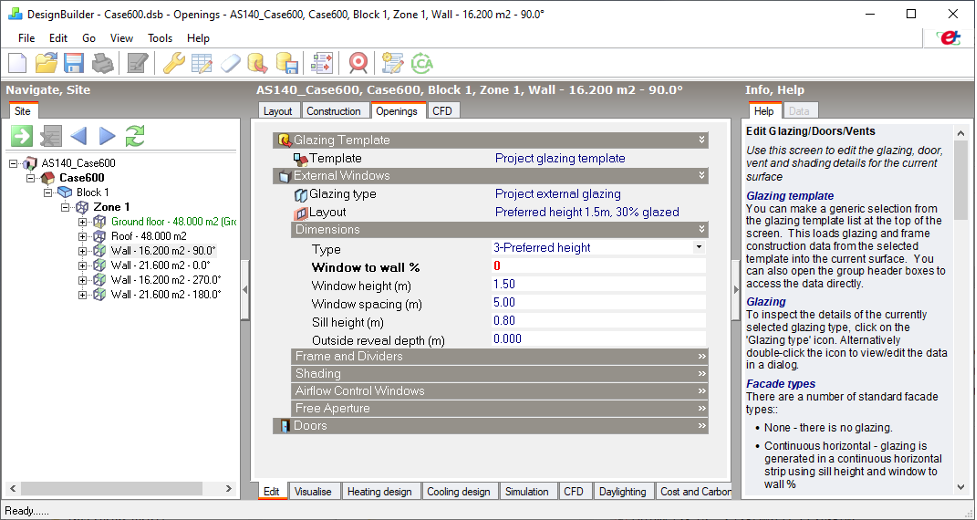
 
<br/>
 
## 南面の窓面の入力
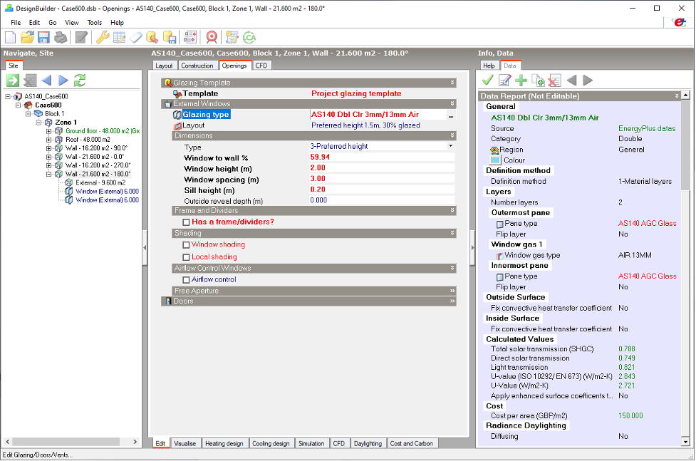
 
<br/>
 
## Ground floorをExternal floorに変更
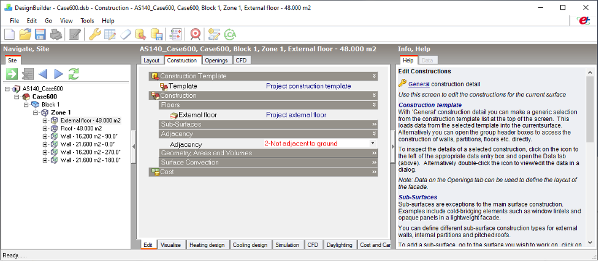
  
<br/>
 
## HVACの入力
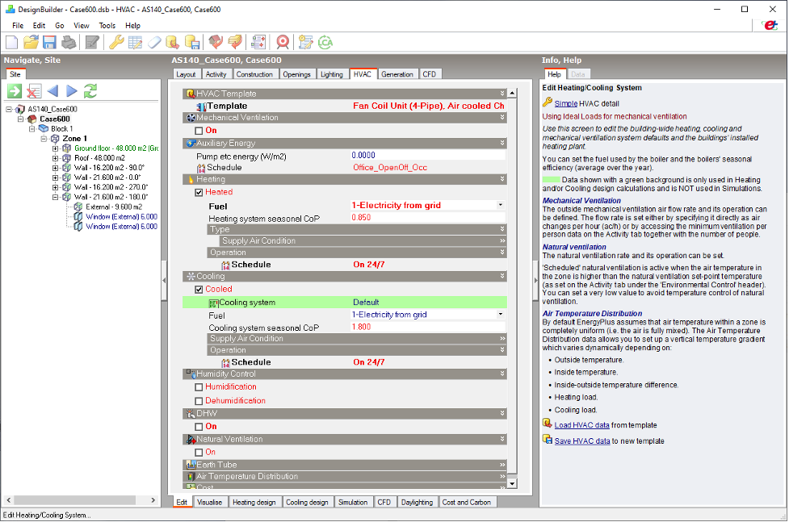
 
<br/>
 
## IDFファイルのExport
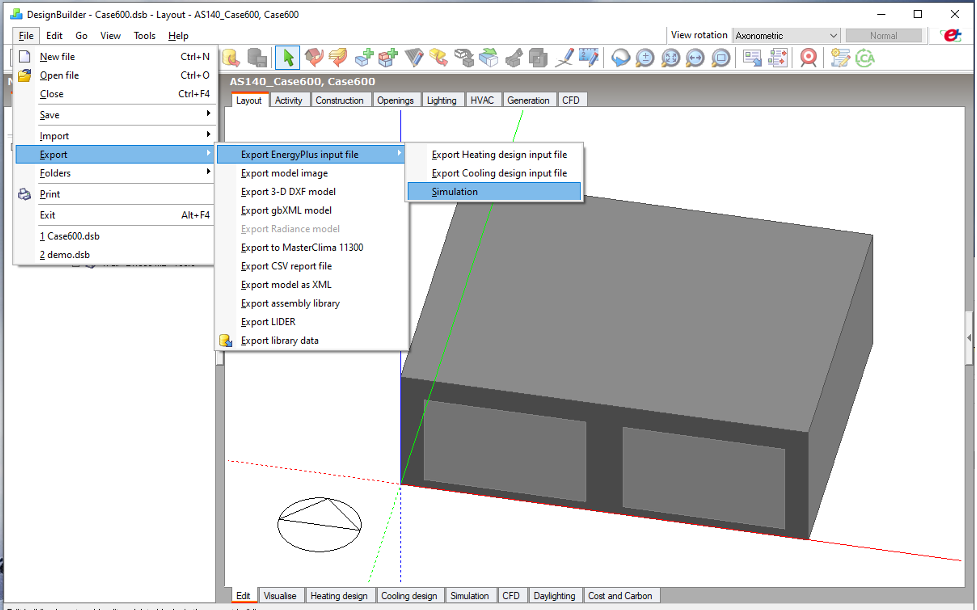
 
<br/>
 
## 手作業によるIDFファイルの修正
床面積と容積が合っていないため修正。おそらく壁の厚さを考慮しているため。
```
! Block 1 - Zone 1
Zone,
    Block1:Zone1,            !- Name
    0,                       !- Direction of Relative North {deg}
    0,                       !- X Origin {m}
    0,                       !- Y Origin {m}
    0,                       !- Z Origin {m}
    1,                       !- Type
    1,                       !- Multiplier
    ,                        !- Ceiling Height {m}
    123.104                  !- Volume {m3}
    45.59                    !- Floor Area {m2}
    TARP,                    !- Zone Inside Convection Algorithm
    ,                        !- Zone Outside Convection Algorithm
    Yes;                     !- Part of Total Floor Area
```
```
! Block 1 - Zone 1
Zone,
    Block1:Zone1,            !- Name
    0,                       !- Direction of Relative North {deg}
    0,                       !- X Origin {m}
    0,                       !- Y Origin {m}
    0,                       !- Z Origin {m}
    1,                       !- Type
    1,                       !- Multiplier
    ,                        !- Ceiling Height {m}
    129.6,                   !- Volume {m3}
    48,                      !- Floor Area {m2}
    TARP,                    !- Zone Inside Convection Algorithm
    ,                        !- Zone Outside Convection Algorithm
    Yes;                     !- Part of Total Floor Area
```
    
<br/>
 
隙間風も上記の容積ベースで計算されているため修正。
```
ZoneInfiltration:DesignFlowRate,
    Block1:Zone1 Infiltration,  !- Name
    Block1:Zone1,            !- Zone or ZoneList Name
    On 24/7,                 !- Schedule Name
    Flow/Zone,               !- Design Flow Rate Calculation Method
    .017098,                 !- Design Flow Rate {m3/s}
    ,                        !- Flow per Zone Floor Area {m3/s-m2}
    ,                        !- Flow per Exterior Surface Area {m3/s-m2}
    ,                        !- Air Changes per Hour {1/hr}
    1,                       !- Constant Term Coefficient
    0,                       !- Temperature Term Coefficient
    0,                       !- Velocity Term Coefficient
    0;                       !- Velocity Squared Term Coefficient
```
```
ZoneInfiltration:DesignFlowRate,
    Block1:Zone1 Infiltration,  !- Name
    Block1:Zone1,            !- Zone or ZoneList Name
    On 24/7,                 !- Schedule Name
    Flow/Zone,               !- Design Flow Rate Calculation Method
    0.018,                   !- Design Flow Rate {m3/s}
    ,                        !- Flow per Zone Floor Area {m3/s-m2}
    ,                        !- Flow per Exterior Surface Area {m3/s-m2}
    ,                        !- Air Changes per Hour {1/hr}
    1,                       !- Constant Term Coefficient
    0,                       !- Temperature Term Coefficient
    0,                       !- Velocity Term Coefficient
    0;                       !- Velocity Squared Term Coefficient
```
   
<br/>

表面の座標も微妙にずれているので手作業で修正。。。
```
! Block 1, Zone 1, External floor - 48.000 m2, Surface Area: 48.000m2
BuildingSurface:Detailed,                       !- Surface
    Block1:Zone1_ExtFloor_0_0_0,                !- Surface name
    Floor, AS14O external floor,                !- Class and Construction Name
    Block1:Zone1,                               !- Zone Name
    Outdoors, ,                                 !- Outside Face Environment
    SunExposed,                                 !- Sun Exposure
    WindExposed,                                !- Wind Exposure
    AutoCalculate,                              !- View Factor to Ground
    4,                                          !- Number vertices
    7.9972501683,-.0070641262, 0,               !- Vertex 1
    -.0027498317,-.0070641262, 0,               !- Vertex 2
    -.0027498317, 5.9929358738, 0,              !- Vertex 3
    7.9972501683, 5.9929358738, 0;              !- Vertex 4
```  
```
! Block 1, Zone 1, External floor - 48.000 m2, Surface Area: 48.000m2
BuildingSurface:Detailed,                       !- Surface
    Block1:Zone1_ExtFloor_0_0_0,                !- Surface name
    Floor, AS14O external floor,                !- Class and Construction Name
    Block1:Zone1,                               !- Zone Name
    Outdoors, ,                                 !- Outside Face Environment
    SunExposed,                                 !- Sun Exposure
    WindExposed,                                !- Wind Exposure
    AutoCalculate,                              !- View Factor to Ground
    4,                                          !- Number vertices
    8, 0, 0,                                    !- Vertex 1
    0, 0, 0,                                    !- Vertex 2
    0, 6, 0,                                    !- Vertex 3
    8, 6, 0;                                    !- Vertex 4
```  
   
<br/>

## Case600モデルの実行
[eplusr](https://github.com/hongyuanjia/eplusr)を使用してRからIDFを実行する。

[run_idf.R](https://github.com/MasatoMiyata/EnergyPlus_SHASEG1008/blob/master/DesignBuilder/run_idf.R)を参照。

`eplusr` を用いることで、IDFの編集、実行、計算結果のポスト処理まで一貫して行うことができる。

<br/>
<br/>

# Case600FFモデルの作成
Case600モデルから、冷暖房のAvailability schedulesを1->0に変更するだけでよい。
```
! Modified schedule: On 24/7
Schedule:Compact,
    Block1:Zone1 Heating Availability Sch,  !- Name
    Any Number,              !- Schedule Type Limits Name
    Through: 12/31,          !- Field 1
    For: AllDays,            !- Field 2
    Until: 24:00,            !- Field 3
    1;                       !- Field 4

! Modified schedule: On 24/7
Schedule:Compact,
    Block1:Zone1 Cooling Availability Sch,  !- Name
    Any Number,              !- Schedule Type Limits Name
    Through: 12/31,          !- Field 1
    For: AllDays,            !- Field 2
    Until: 24:00,            !- Field 3
    1;                       !- Field 4
```
```
! Modified schedule: On 24/7
Schedule:Compact,
    Block1:Zone1 Heating Availability Sch,  !- Name
    Any Number,              !- Schedule Type Limits Name
    Through: 12/31,          !- Field 1
    For: AllDays,            !- Field 2
    Until: 24:00,            !- Field 3
    0;                       !- Field 4

! Modified schedule: On 24/7
Schedule:Compact,
    Block1:Zone1 Cooling Availability Sch,  !- Name
    Any Number,              !- Schedule Type Limits Name
    Through: 12/31,          !- Field 1
    For: AllDays,            !- Field 2
    Until: 24:00,            !- Field 3
    0;                       !- Field 4
```


