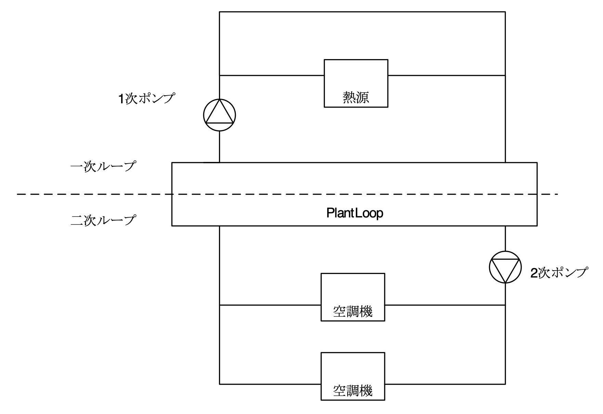
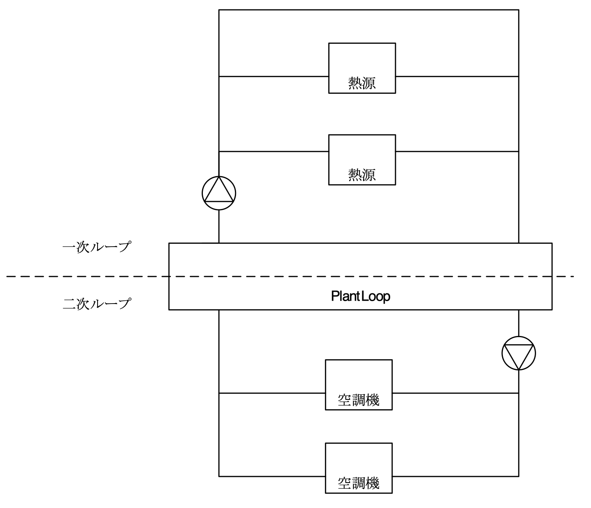
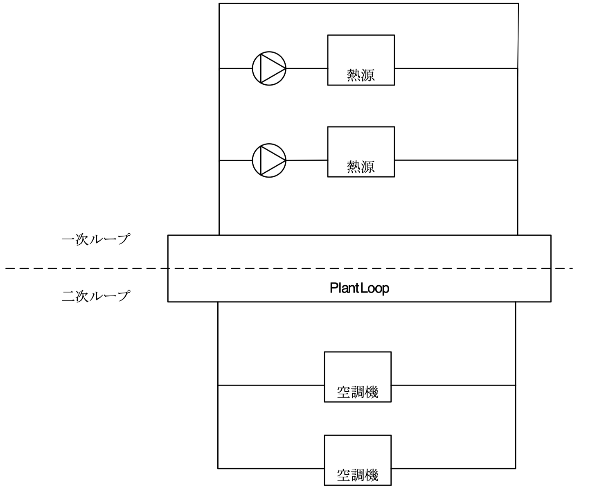

// 参考

=== 隣室条件の与え方

==== Outside Boundary Condition

BuildingSurface:DetailedオブジェクトのField: Outside Boundary Conditionにて、壁の外側の条件を設定することができる。 +
OtherSideCoefficientsを選択すると計算式で与えることもできる（内壁に使えるかどうかは未確認）。

link:https://bigladdersoftware.com/epx/docs/9-4/input-output-reference/group-thermal-zone-description-geometry.html#field-outside-boundary-condition-3[bigladder:BuildingSurface:Detailed]

.Outside Boundary Condition の選択肢
....

1.	Surface
この表面が内部表面である場合はこれを選択します。
値は、ベースゾーンのサーフェスまたは別のゾーンのサーフェスのいずれかになります。
隣接するゾーンの表面を指定することにより、2つのゾーン間の熱バランスを正確にシミュレートできます。
EnergyPlusは、ゾーンのグループを同時にシミュレートし、ゾーン間の熱伝達を含みます。
ただし、これにより計算が複雑になるため、2つのゾーンに大きな温度差がない限り、他のゾーンを指定する必要はありません。 
2つのゾーンに大きな違いがない場合（温度に関して）、サーフェスはそれ自体を外部環境として使用するか、このフィールドを断熱として指定する必要があります。
このサーフェスの「外側」（に隣接）のサーフェス名は、次のフィールドに配置されます。

2.	Adiabatic 
同じゾーンの内面。この表面はゾーン外に熱を伝達しませんが、それでも熱を熱質量で蓄えます。
表面の内面のみがゾーンと熱を交換します（つまり、表面の両側がゾーンと熱を交換する内部パーティションをモデル化するには、2つの断熱表面が必要です）。
外部境界条件オブジェクトは空白のままにすることができます。

3.	Zone
これはSurfaceに似ていますが、EnergyPlusは、これがサーフェスに入力されると、隣接するゾーンに必要なサーフェスを自動的に作成します。
サーフェスに窓やドアがある場合、EnergyPlusは適切なサブサーフェスも自動的に作成します。

4.	Outdoors
この表面が外気温条件にさらされる場合は、これが選択です。
この種の表面の詳細な仕様については、以下の太陽への露出と風への露出を参照してください。

5.	Foundation
代替モデル（現在はKivaTMモデルのみ）を使用して、基礎表面の多次元熱伝達を説明します。
外側境界条件オブジェクトは、Foundation：Kivaオブジェクトの名前を参照します（または、追加の断熱材なしでデフォルトの基礎を使用するには、空白のままにします）。

6.	Ground
この表面の外側の温度は、その月のSite：GroundTemperature：Surfaceの値になります。

7.	GroundFCfactorMethod
この表面が地面に露出していて、Construction：CfactorUndergroundWallを使用している場合は、これが選択です。この表面の外側の温度は、その月のSite：GroundTemperature：FcfactorMethod値になります。

8.	OtherSideCoefficients
このサーフェスにカスタムのユーザー指定の温度またはその他のパラメーターがある場合（SurfaceProperty：OtherSideCoefficientsの仕様を参照）、これを選択します。
外側の境界条件は、SurfaceProperty：OtherSideCoefficients仕様の名前になります。

9.	OtherSideConditionsModel
この表面に、外部に取り付けられた、蒸散コレクターや通気型太陽光発電パネルなどの特別にモデル化されたマルチスキンコンポーネントがある場合（SurfaceProp-erty：OtherSideConditionsModel仕様を参照）、これを選択します。外面環境は、SurfaceProperty：OtherSideConditionsModel仕様の名前になります。

10. GroundSlabPreprocessorAverage
スラブプリプロセッサ計算の平均結果を使用します。

11. GroundSlabPreprocessorCore
スラブプリプロセッサ計算からのコア結果を使用します。

12. GroundSlabPreprocessorPerimeter
スラブプリプロセッサ計算からの境界結果を使用します。

13. GroundBasementPreprocessorAverageWall
地下室のプリプロセッサ計算からの平均壁結果を使用します。

14. GroundBasementPreprocessorAverageFloor
地下室のプリプロセッサ計算からの平均フロア結果を使用します。

15. GroundBasementPreprocessorUpperWall
地下室のプリプロセッサ計算からの上部壁の結果を使用します。

16. GroundBasementPreprocessorLowerWall
地下室のプリプロセッサ計算からの下部壁の結果を使用します。
....

==== SurfaceProperty:OtherSideCoefficients

link:https://bigladdersoftware.com/epx/docs/9-4/input-output-reference/group-advanced-surface-concepts.html#surfacepropertyothersidecoefficients[bigladder:SurfaceProperty:OtherSideCoefficients]

サーフェスのステートメント（＝Outside Boundary Condition）でOther Side Coefficientsのステートメントを参照することで、サーフェスの外面の温度を直接制御することができます。また、Other Side Coefficientsを使用して、サーフェイスの外部対流熱伝達係数と、それに対応する外気温度を制御することもできます。他の側の係数を使用する場合、太陽の影響は考慮されないことに注意する必要があります。さらに、他方の側の係数がサーフェスに指定された場合、そのサーフェスのサブサーフェスにも適用されます（サブサーフェスは独自の係数セットを持つことができますが）。

other side 係数は、すべてのタイプの伝熱面に同じ効果を与えます。言い換えれば、他方の側の係数を指定した室内表面と、同一の他方の側の係数を指定した外壁は、まったく同じようにシミュレーションされます。他の側の係数を使用するサーフェスは、新しいまたは別のタイプのサーフェスと考えるべきです。すべての熱伝達面は、伝導伝達関数によって同じようにシミュレートされます。様々な種類の伝熱面の唯一の違いは、伝熱面の反対側の環境です。例えば、外面の場合は屋外の環境が相手側の環境となります。内部表面の場合、表面の外側の面の温度は、表面の内側の面の温度と等しく設定されます。同様に、他面係数を指定したサーフェスでは、他面環境をコントロールすることができます。

サーフェスを介した熱伝導は、ゾーンロードの計算において非常に重要な要素です。この熱伝達を計算するための情報は、表面が屋外環境やシミュレーションされている別のゾーンにさらされていれば、すぐに入手できます。時には、EnergyPlusモデルに含まれていないエリアに隣接する表面の熱伝達をモデル化したい場合があります。例えば、オフィスエリアが倉庫に隣接していて、ユーザーはオフィスエリアのシミュレーションにしか興味がない場合です。Other Side Coefficientsが指定されたインテリアサーフェスは、サーフェスの反対側の環境を制御するために使用することができ、それによって隣接するサーフェスを介した熱伝達を考慮することができます。

Other Side Coefficientsは、以下のように表面の「反対側」に影響を与えます。各係数には特別な意味があります。特定の係数を使用しない場合は、0または空白を入力することができます。反対側の係数を使用する方法は2つあることに注意してください。外側面の温度を直接設定する場合（下記の対流・輻射複合係数が0以下の場合）と、フィルム係数（下記の対流・輻射複合係数の正の値）と外気温度の両方を設定する場合に使用します。


.SurfaceProperty:OtherSideCoefficients
----
!  Example input using temperature schedule
SurfaceProperty:OtherSideCoefficients,
      OSCCoef:Zn005:Wall003,   !- Name
      0,                       !- Combined Convective/Radiative Film Coefficient {W/m2-K}
      0.000000,                !- Constant Temperature {C}
      1.000000,                !- Constant Temperature Coefficient
      0.000000,                !- External Dry-Bulb Temperature Coefficient
      0.000000,                !- Ground Temperature Coefficient
      0.000000,                !- Wind Speed Coefficient
      0.000000,                !- Zone Air Temperature Coefficient
      Zn005Wall003OtherSideTempSched;  !- Constant Temperature Schedule Name

!  Example input for outside heat transfer coefficient of 1.23, using Toadb
SurfaceProperty:OtherSideCoefficients,
      OSCCoef:Zn005:Wall004,   !- Name
      1.230000,                !- Combined Convective/Radiative Film Coefficient {W/m2-K}
      0.000000,                !- Constant Temperature {C}
      0.000000,                !- Constant Temperature Coefficient
      1.000000,                !- External Dry-Bulb Temperature Coefficient
      0.000000,                !- Ground Temperature Coefficient
      0.000000,                !- Wind Speed Coefficient
      0.000000,                !- Zone Air Temperature Coefficient
      ,                        !- Constant Temperature Schedule Name
      No,                      !- Sinusoidal Variation of Constant Temperature Coefficient
      24,                      !- Period of Sinusoidal Variation {hr}
      0.,                      !- Previous Other Side Temperature Coefficient
      ,                        !- Minimum Other Side Temperature Limit {C}
      ;                        !- Maximum Other Side Temperature Limit {C}
----

OtherSideCoefficientsは、下記の式で与えられる。

.OtherSideCoefficients 
image::figures/OthersideCoefficients.png[図,800]


=== ポンプの設定方法

==== 2ポンプシステムのモデリング方法

2ポンプシステム（一次ポンプと二次ポンプがあるシステム）をモデリングする場合は、
「PlantLoop」オブジェクトの「Common Pipe Simulation」フィールドを「TwoWayCommonPipe」として、
一次ポンプをprimaryループの熱源入り口側ブランチに、二次ポンプをsecondaryループの空調機入り口側ブランチに設置する。

.2ポンプシステムのモデリング 



==== 様々なパターンのモデリング

複数の熱源を設置したうえで、一次ポンプと二次ポンプを設置した場合の解析に不具合が発生する。

パターン1： NG +
一次ポンプを変流量とする。運転しない熱源の通過流量は０となる。一次ポンプ流量は最大で、バイパス管を通じて流れていると考えられる。

.パターン1



パターン2： NG +
熱源の運転台数にかかわらず、全ての一次ポンプが運転する。全ての熱源が停止すると、全ての一次ポンプが停止する。

.パターン2
image::figures/secondarypump03.png[図,600]


パターン3：OK +
単一熱源で一次ポンプ、二次ポンプを設置することは可能である。

.パターン3
image::figures/secondarypump04.png[図,600]

パターン4：OK +
複数の熱源を設置した１ポンプ方式は計算可能である。熱源の容量が異なる場合も計算できることを確認した。

.パターン4



EnergyPlusでポンプの運転は、ループや熱源の運転に連動する。
しかし、連動する機器を指定できないため、意図しないポンプの運転が発生してしまう。
EMS（EnergyPlus状のマクロ）を使用してポンプの動作を制御すれば、意図通りの運転を再現出来る可能性がある。

.Plant/Condenser Supply Side Solution Scheme
image::figures/secondarypump06.png[図,600]


=== EnergyPlusにおけるErrorの取り扱い

==== Errorの重大さによる分類
link:https://bigladdersoftware.com/epx/docs/9-4/input-output-reference/errors.html#errors[bigladder:Input Output Reference]

EnergyPlusを実行した結果、出力ファイルの1つである「***.err」に3段階のエラー（Warning, Severe, Fatal）が出力される。エラーのレベルと求められるアクションについて下表に示す。

.EnergyPlusにおけるErrorの分類
[options="header"]
|======================================
| Error Level | Action
| Warning | Take note
| Severe | Should fix
| Fatal | Program will abort
|======================================

==== Errorの実行プロセスによる分類
link:https://bigladdersoftware.com/epx/docs/9-4/tips-and-tricks-using-energyplus/error-messages-details.html#error-messages-details[bigladder:Tips and Tricks]

エラーメッセージは、EnergyPlusの以下の5段階のプロセスから生成される。

* Input Processing (comparing IDF fields/values to IDD requirements)

* GetInput for each module (further checking for correct values from the IDF)

* Sizing operations

* Warmup operations

* Simulation of the environments


以下の例のように、errファイルではプロセスに応じてエラーが集計される。
```
************* EnergyPlus Warmup Error Summary. During Warmup: 0 Warning; 0 Severe Errors.
************* EnergyPlus Sizing Error Summary. During Sizing: 0 Warning; 0 Severe Errors.
************* EnergyPlus Completed Successfully-- 1 Warning; 0 Severe Errors; Elapsed Time = 00hr 00min  6.58sec
```

==== Preprocessorからのエラーメッセージ
link:https://bigladdersoftware.com/epx/docs/9-4/tips-and-tricks-using-energyplus/example-error-messages-for-preprocessors.html#example-error-messages-for-preprocessors[bigladder:Tips and Tricks]

すべてのPreprocessorプログラムは、検出したエラーに対してOutput：PreprocessorMessageオブジェクトを生成する。これらのエラーを理解するには、実際のPreprocessorプログラムのドキュメントを参照する必要がある場合がある。 Preprocessorからのエラーメッセージは、errファイルの最初に表示される。メッセージの形式は、<objectname>（つまり、Output：Preprocessormessage）、引用符で囲まれたプログラム名（たとえば、EPMacro）、そしてメッセージの文字列（Warning、Severe、Fatal）である。 Fatalの場合、EnergyPlusはすべてのエラーメッセージを生成した後に実行を中止する。

===== Warningの例
```
Output:PreprocessorMessage = "EPXMLPreProc2" has the following Warning conditions:
   **   ~~~   ** Problem with the width for requested floor area and
   **   ~~~   ** perimeter depth.  Reduced perimeter depth from 4.57
   **   ~~~   ** to 3.656 to accommodate perimeter and core layout
```

===== Severeの例
```
Output:PreprocessorMessage = "EPMacro" has the following Severe conditions:
   **   ~~~   ** at approximately input line number = 200: column = 11
   **   ~~~   ** cannot find/read include file
   **   ~~~   ** symbol = HVAC3ZoneMat-Const.imf
   **   ~~~   ** refer to <file>.epmdet for details.
```

==== Input Pocessorからのエラーメッセージ
link:https://bigladdersoftware.com/epx/docs/9-4/tips-and-tricks-using-energyplus/example-error-messages-for-the-input.html#example-error-messages-for-the-input-processor[bigladder:Tips and Tricks]

InputProcessorはEnergyPlusプログラムの一部であり、入力ファイルをスキャンし、IDD（Input Data Dictionary）の要件と照合する。InputProcessorのエラーはIPから始まる文字列で表示される。

===== Warningの例

* 必須項目のうち入力されていないものがある場合（デフォルト値が入力される）
```
IP: Note -- Some missing fields have been filled with defaults. See the audit output file for details.
```

===== Severeの例

* オブジェクトの入力フィールドの途中でコンマではなくセミコロン（そのオブジェクトの最終ライン）が入力されている場合
```
IP: IDF line~345 Did not find "UNTIL: 22:00" in list of Objects
```

* 必須オブジェクトである「BUILDING」が定義されていない場合
```
IP: No items found for Required Object = BUILDING
IP: Required Object = "BUILDING" not found in IDF.
```

* IDDのバージョンが一致していない場合
```
IP: Possible incorrect IDD File
IDD Version:"IDD\_Version xxx"
Possible Invalid Numerics or other problems
```

===== Fatalの例

Fatalエラーのメッセージは上記のSevereエラーの結果として表示されるようである。
```
IP: Errors occurred on processing IDF file. Preceding condition(s) cause termination.
```

==== Module GetInputからのエラーメッセージ
link:https://bigladdersoftware.com/epx/docs/9-4/tips-and-tricks-using-energyplus/example-error-messages-from-module-getinput.html#example-error-messages-from-module-getinput-routines[bigladder:Tips and Tricks]

シミュレーションが開始されると、各モジュールが呼び出され、入力ファイルから値を取得する。これらは通常、GetInputルーチンと呼ばれる。IDDの制限では完全に記述できないエラーチェックを入力に対して追加で行い、さらに、オブジェクトが別のオブジェクトに対して与える可能性のある影響も考慮する。

===== Warningの例

* 地盤温度の入力が推奨範囲を超えている場合
```
Site:GroundTemperature:BuildingSurface: Some values fall outside the range of 15-25C.
These values may be inappropriate.  Please consult the Input Output Reference for more details.
```

* IDF（入力ファイル）で指定した立地情報とEPW（気象データファイル）に含まれる立地情報に齟齬がある場合
```
Weather file location will be used rather than entered Location object.
..Location object = ATLANTA
..Weather File Location = Tampa International Ap FL USA TMY3 WMO# = 722110
..due to location differences, Latitude difference = [5.68] degrees, Longitude difference = [1.89] degrees.
..Time Zone difference = [0.0] hour(s), Elevation difference = [98.10] percent, [309.00] meters.
```

* 求めている出力に対して必要な入力が足りていない場合
```
GetPollutionFactorInput: Requested reporting for Carbon Equivalent Pollution, but insufficient information is entered.
```

* 外壁ではないSurfaceにSunExposedが指定されている場合
```
BuildingSurface:Detailed = "SURF:xyz", Sun Exposure = "SUNEXPOSED".
 ..This surface is not exposed to External Environment.  Sun exposure has no effect.
```

* 内壁の両側（両ゾーンから定義する）で面積が一致していない場合
```
GetSurfaceData: InterZone Surface Areas do not match as expected and might not satisfy conservation of energy:
   Area = 1.4E-002 in Surface = 319767, Zone = 2PAV_CONDIC_LOJA_D
   Area = 67.0 in Surface = 6C0708, Zone = 3PAV_CONDIC_TEATRO_G
```

* 内壁の両側で角度が一致していない場合
```
GetSurfaceData: InterZone Surface Azimuths do not match as expected.
   Azimuth = 270.0, Tilt = 90.0, in Surface = 319767, Zone = 2PAV_CONDIC_LOJA_D
   Azimuth = 180.0, Tilt = 90.0, in Surface = 6C0708, Zone = 3PAV_CONDIC_TEATRO_G
..surface class of base surface = Wall
```

* 床や屋根の傾斜角がおかしい場合
```
GetVertices: Floor is upside down! Tilt angle = [0.0], should be near 180, Surface = "ROOM302-FLOOR", in Zone = "ROOM302".
Automatic fix is attempted.

GetVertices: Roof is upside down! Tilt angle = [180.0], should be near 0, Surface = "ROOM302-CEILING", in Zone = "ROOM302".
Automatic fix is attempted.
```

* 極めて大きい内部発熱が指定されている場合
```
GetInternalHeatGains: Zone = "02AO_FCU04_AN" occupant density is extremely high.
Occupant Density = [14] person/m2.
Occupant Density = [7.000E-002] m2/person. Problems in Temperature Out of Bounds may result.
```

* Surfaceを構成する2点間の距離が極めて小さい場合（2つのうち1つが除外される）
```
GetVertices: Distance between two vertices < .01, possibly coincident. for Surface = 1%PIANOINTERRATO:UFFICI_WALL_3_0_1, in Zone = 1%PIANOINTERRATO:UFFICI
Vertex [2] = (-53.99,5.86,0.50)
Vertex [1] = (-53.99,5.86,0.51)
Dropping Vertex [2].
```

* ゾーンの形状がConvexでない場合
```
CheckConvexity: Surface = "ZN001:ROOF001" is non-convex.
```

===== Severeの例

* Subsurfaceの構成点がBase surfaceと逆の順番（時計回りか反時計周りか）で指定されている場合
```
GetSurfaceData: Some Outward Facing angles of subsurfaces differ significantly from base surface.
...use Output:Diagnostics,DisplayExtraWarnings; to show more details on individual surfaces.

GetSurfaceData: Outward facing angle [95.5] of subsurface = "WL2-1" significantly different than
..facing angle [275.5] of base surface = WEST WALL 2 Tilt = 90.0
..surface class of base surface = Wall
```

* No massの材料のみで建物が構成されている場合
```
This building has no thermal mass which can cause an unstable solution.
Use Material object for all opaque material definitions except very light insulation layers.
```

* Surfaceを構成する2点間の距離が極めて小さい場合（頂点の数が3点未満になるためその頂点を除外できない）
```
GetVertices: Distance between two vertices < .01, possibly coincident. for Surface = 1%PIANOINTERRATO:UFFICI_WALL_3_0_1, in Zone = 1%PIANOINTERRATO:UFFICI
Vertex [3] = (-44.82,-12.14,0.51)
Vertex [2] = (-44.82,-12.14,0.50)
Cannot Drop Vertex [3].
Number of Surface Sides at minimum.
```

* 日陰面となるSurfaceがConvexでない場合
```
DetermineShadowingCombinations: Surface = "0%VESPAIO:ZONA1\_ROOF\_1\_6\_0" is a receiving surface and is non-convex.
...Shadowing values may be inaccurate. Check .shd report file for more surface shading details
```

===== Fatalの例

このカテゴリーのSevereエラーはたいていFatalエラーにつながり、シミュレーションは途中で終了する。

==== SizingとSimulationからのエラーメッセージ
link:https://bigladdersoftware.com/epx/docs/9-4/tips-and-tricks-using-energyplus/example-error-messages-during-sizing.html#example-error-messages-during-sizing-and-simulation[bigladder:Tips and Tricks]

===== Warningの例

* 熱負荷がゼロのゾーンがある場合
```
Calculated design cooling load for zone = B1AE_FCU02_AN is zero.
Check Sizing:Zone and ZoneControl:Thermostat inputs.

Calculated design heating load for zone = B1AE\_FCU02\_AN is zero.
Check Sizing:Zone and ZoneControl:Thermostat inputs.
```

===== Severeの例

* 温度があるレンジを超えている場合
```
Temperature (high) out of bounds (206.82] for zone = "ZONE 1", for surface = "SOUTH WALL"
During Warmup & Sizing, Environment = ALEXANDRIA ESLER REGIONAL AP ANN HTG 99.6% CONDNS DB, at Simulation time = 12/21 01:00 - 01:04
Zone = "ZONE 1", Diagnostic Details:
...Internal Heat Gain [155.557] W/m2
...Infiltration/Ventilation [3.500E-002] m3/s
...Mixing/Cross Mixing [0.000] m3/s
...Zone is part of HVAC controlled system.
```

===== Fatalの例

Severeエラーの数などが表示される。

```
EnergyPlus has exited due to the reason stated above
...Summary of Errors that led to program termination:
..... Reference severe error count = 11
..... Last severe error = Temperature (high) out of bounds (210.11] for zone = "ZONE 1", for surface = "ROOF1"
```

==== EnergyPlusのErrorに対する考え方についての考察
上記より、建物側（負荷計算）に関するエラーは多く定義されている印象を受ける。しかし、システム側については参照できるドキュメント類からエラーの定義について十分確認できなかった。オブジェクトによってはユーザー自ら温度や流量などの上下限値を指定するものある。

link:https://bigladdersoftware.com/epx/docs/9-4/module-developer/input-services.html#rangecheck[Guide for Module Developers]によればRangeCheckというルーチンがあるようだが、具体的にどこで使われているのか、レンジをどのように決めているかについては記載が見当たらない。

例えば冷却塔では、UA値（伝熱係数×伝熱面積）は0〜3000,000W/Kの範囲で入力することとlink:https://bigladdersoftware.com/epx/docs/9-4/input-output-reference/group-condenser-equipment.html#group----condenser-equipment[マニュアル]に記載されているが、多くの入力項目に対してこのような範囲が明示されているわけではない。

冷却塔のソースコード（CoolTower.cc）を見てみると、以下のような上下限値が直接記述されていたが、これがすべてかどうかは不明である。一方で、電動チラーのソースコード（ChillerElectricEIR.cc）には冷却塔のような上下限値の記述はなかった。

```
Real64 const MaximumWaterFlowRate(0.016667); // Maximum limit of water flow rate in m3/s (1000 l/min)
Real64 const MinimumWaterFlowRate(0.0);      // Minimum limit of water flow rate
Real64 const MaxHeight(30.0);                // Maximum effective tower height in m
Real64 const MinHeight(1.0);                 // Minimum effective tower height in m
Real64 const MaxValue(100.0);                // Maximum limit of outlet area, airflow, and temperature
Real64 const MinValue(0.0);                  // Minimum limit of outlet area, airflow, and temperature
Real64 const MaxFrac(1.0);                   // Maximum fraction
Real64 const MinFrac(0.0);                   // Minimum fraction
```

=== EnergyPlusのAuto-sizing機能における予熱/予冷時間の取り扱い
日本では、容量設計を行う際、立ち上がり時の蓄熱負荷の影響を緩和するため、予熱/予冷時間の概念を取り入れることが一般的である。この時間は、空調システムを起動してから設定温度に達するまでの時間を表している。例えば、予熱時間を2時間として朝6時にシステムが起動する場合、7時の時点では設定温度に達しないが、8時には達することになる。この場合、7時の時点で設定温度に達するようにする場合よりも設計容量を小さくすることができる。特に蓄熱負荷の影響が大きい冬季暖房運転においては予熱時間を2〜3時間とする方が実際的な容量とすることができる。なお、予熱時間をゼロとした場合、理論上必要な装置容量は無限大となる。

EnergyPlusにおいては予熱時間そのものの概念はないが、最大負荷を求める際の平均時間を設定することで、類似の処理を行えるようになっている。オブジェクトSizing:ParametersのTimesteps in Averaging Windowに平均処理を行うタイムステップ数を指定することができる。以下はlink:https://bigladdersoftware.com/epx/docs/9-4/input-output-reference/group-design-objects.html#sizingparameters[bigladder:Input Output Reference:Sizing:Parameters:Timesteps in Averaging Window]の和訳である。以下ではゾーン設計風量にのみ言及しているが、ゾーン設計風量の計算はAuto-sizingの計算フロー上、最も上流側で行われるようであるため、空調システムや熱源システムの容量設計においてもここで指定したステップ数が反映されると思われる。


=== Timesteps in Averaging Window
ゾーン設計風量の平均化処理を行う際のタイムステップ数を入力する。デフォルトは1であり、この場合、計算されたゾーン設計風量は、タイムステップにわたって平均化された値である。

ゾーン設計風量計算は、一定の温度で加熱または冷却空気が無限に供給されると想定して実行される。したがって、計算された設計風量は、どれほど大きく急激な負荷であっても、常にあらゆる負荷変動に対応できる。実際には、風量はダクトのサイズとファンの容量によって制限される。理想的なゾーン設計風量計算では、特にユーザーが夜間のセットアップまたはセットバックを伴うサーモスタットスケジュールを使用してサイジング計算を実行している場合、非現実的に大きな風量が発生する可能性がある。計算されたゾーン設計風量は、常にタイムステップにわたって平均化される。ユーザーは、サーモスタットのセットアップとセットバックの影響を軽減し、ウォームアップまたはクールダウン時の風量が設計風量の計算において支配的になるのを防ぐために、より平均時間を長く指定することができる。

たとえば、負荷計算のタイムステップが15分で、ユーザーがこの平均化タイムステップ数を4に指定した場合、ゾーン設計風量は1時間にわたって平均化される。8を指定すると、2時間の平均となる。


=== DesignBuilderの使い方

link:https://masatomiyata.github.io/EnergyPlus_SHASEG1008/DesignBuilder.html[DesignBuilder＋Rを用いたAS140単室テスト]
