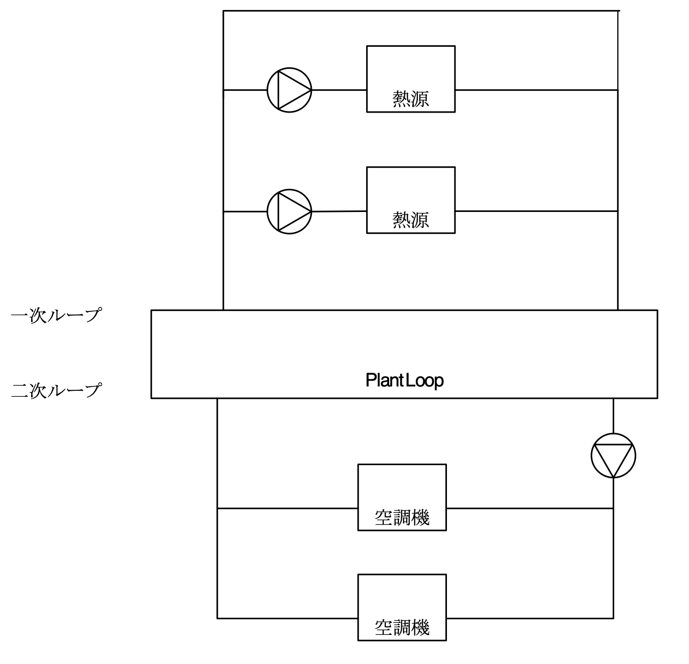
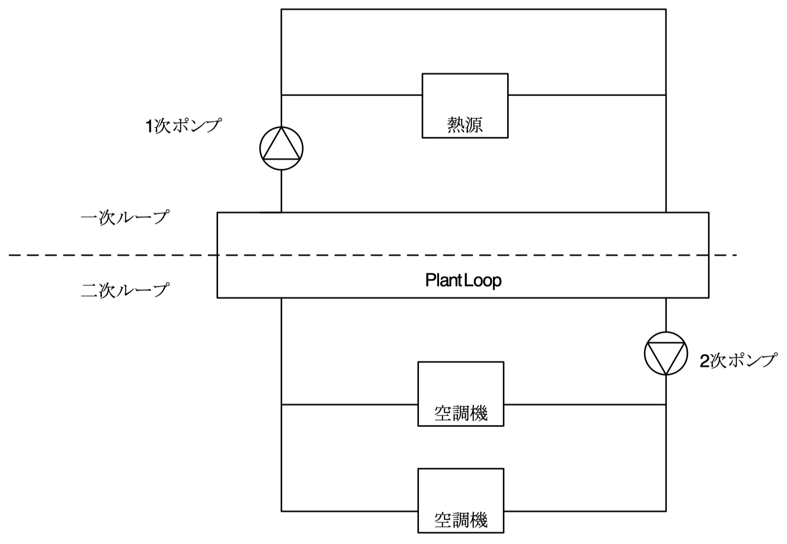

// 参考

=== 機器能力の設定

==== Sizing:Parameters

参考：　https://bigladdersoftware.com/epx/docs/9-4/input-output-reference/group-design-objects.html#sizingparameters[bigladder解説]

このオブジェクトでは、グローバルな冷暖房サイズ比を指定することができる。
これらの比率は、ゾーンレベルで、すべてのゾーンの冷暖房負荷と空気流量に適用される。
これらの新しい負荷と空気流量は、システムレベルの流量と容量の計算に使用され、すべてのコンポーネントのサイジング計算に使用される。
ユーザーは、計算されたゾーン設計流量シーケンスを平滑化するために使用できる移動平均ウィンドウの幅（負荷タイムステップ）を指定することもできます。
このパラメータの使用方法は以下の通りです。

===== Heating Sizing Factor

すべてのゾーン設計加熱負荷と風量に適用されるグローバル加熱サイズ比。

=====  Cooling Sizing Factor

すべてのゾーンの設計冷房負荷と風量に適用されるグローバル冷房サイズ比

===== Timesteps in Averaging Window

ゾーン設計流量シーケンスの平均化ウィンドウにおける負荷タイムステップの数。
デフォルトは1で、この場合、計算されたゾーン設計流量は負荷タイムステップで平均化される。

ゾーン設計空気流量の計算は、固定温度で加熱または冷却された空気が無限に供給される可能性を想定して実行される。
したがって、計算された設計風量は、負荷や負荷の変化がどれほど大きくても、また急激であっても、常に満たすことができる。
しかし、実際には、風量はダクトサイズとファンの容量によって制限されます。
理想的なゾーン設計流量の計算は、特にユーザーが夜間設定やセットバックのあるサーモスタットスケジュールを使用してサイジング計算を行っている場合、非現実的に大きな流量になる可能性があります。
計算されたゾーン設計流量は、常に負荷タイムステップの平均値である。
ユーザーは、サーモスタットの設定やセットバックの影響を軽減し、ウォームアップやクールダウンの流量が設計流量の計算を支配するのを防ぐために、より広範な平均を実行したいと思うかもしれません。
平均化ウィンドウの幅を指定することで、ユーザーはこれを行うことができます。

例えば、負荷計算のタイムステップが15分で、ユーザーが「平均化ウィンドウのタイムステップ」を4に指定した場合、ゾーンの設計空気流量は1時間の時間帯で平均化されます。
8を指定すると、2時間の期間で平均化されることになります。


==== Sizing:Zone

参考：　https://bigladdersoftware.com/epx/docs/9-4/input-output-reference/group-design-objects.html#sizingzone[bigladder解説]


Sizing:Zoneオブジェクトは、単一ゾーンのゾーン設計気流計算を行うために必要なデータを提供します。
この計算は、一定の温度と湿度で可変量の供給空気を想定している。
必要な情報は、ゾーン入口の給気条件、すなわち冷暖房の温度と湿度の比率である。
この計算は、入力に含まれるすべての設計日に対して行われる。
最大冷房負荷と風量、最大暖房負荷と風量は、システムレベルの設計計算やコンポーネントの自動サイジング計算のために保存されます。

Sizing:Zoneオブジェクトは、設計仕様の外気オブジェクトの名前を参照することで、ユーザーが設計外気流量を指定できる場所でもあります。
このデータは、システムのサイジング計算や、外気を使用するゾーン・コンポーネントのサイジングに使用するために保存されます。

ユーザーは、暖房および冷却設計空気流量に制限を設けることもできます。
以下の「暖房設計風量法」および「冷房設計風量法」と、各暖房・冷房風量入力フィールドの説明を参照してください。
ユーザーは、ゾーン設計計算において、専用外気システムがゾーン設計負荷と風量に与える影響を考慮するよう求めることができます。
設計計算では、理想化されたSOAシステムのゾーンへの熱付加率を計算し、その結果をゾーンの総負荷と流量に加減します。

===== Zone Name

このSizing:Zoneオブジェクトに対応するゾーンの名前。これは、このSizing:Zoneオブジェクトの入力データを使用して、設計風量の計算が行われるゾーンである。

===== Zone Cooling Design Supply Air Temperature Input Method

入力は、SupplyAirTemperatureまたはTemperatureDifferenceのいずれかでなければならない。
SupplyAirTemperature は、ゾーン冷却設計供給空気温度のフィールド入力が、ゾーン冷却設計空気流量の決定に使用されることを意味する。
TemperatureDifference は、ゾーン冷却設計供給空気温度差のフィールドの入力が、ゾーン冷却設計空気流量を決定するために使用されることを意味する。

===== Zone Cooling Design Supply Air Temperature

ゾーン冷却設計風量計算のための供給空気温度（摂氏）。
冷房設計日のシミュレーションでは、この温度の空気がゾーンに供給される。
ゾーンの負荷は、ゾーン空気流量を変化させることで満たされる。最大ゾーン流量は、ゾーン冷却設計風量として保存される。
このフィールドは、Zone Cooling Design Supply Air Temperature Input Method = SupplyAirTemperatureの場合にのみ使用される。

===== Zone Cooling Design Supply Air Temperature Difference

ゾーンの冷房設計空気流量を計算するための、冷房設計供給空気温度と室内空気温度の温度差（摂氏）。
冷房設計日のシミュレーションでは、この温度の空気がゾーンに供給される。
ゾーン負荷は、ゾーン風量を変化させることで満たされる。最大ゾーン流量は、ゾーン冷却設計風量として保存される。
このフィールドは、Zone Cooling Design Supply Air Temperature Input Method = TemperatureDifferenceの場合にのみ使用される。

===== Zone Heating Design Supply Air Temperature Input Method

入力は、SupplyAirTemperatureまたはTemperatureDifferenceのいずれかでなければならない。
SupplyAirTemperatureは、ゾーン暖房設計供給空気温度のフィールドからのユーザー入力が、ゾーン暖房設計空気流量の決定に使用されることを意味する。
温度差とは、ゾーン暖房設計供給空気温度差のフィールドからのユーザーの入力が、ゾーン暖房設計空気流量の決定に使用されることを意味する。

===== Zone Heating Design Supply Air Temperature

ゾーン暖房設計風量計算のための供給空気温度（摂氏）。暖房設計日のシミュレーションでは、この温度の空気がゾーンに供給される。
ゾーンの負荷は、ゾーンの空気流量を変化させることで満たされる。
ゾーンの最大流量は、ゾーン暖房設計風量として保存されます。
このフィールドは、Zone Heating Design Supply Air Temperature Input Method = SupplyAirTemperatureの場合にのみ使用される。

===== Zone Heating Design Supply Air Temperature Difference

ゾーンの暖房設計風量を計算するための、暖房設計供給空気温度と室内空気温度の温度差（摂氏）。
暖房設計日のシミュレーションでは、この温度の空気がゾーンに供給される。ゾーンの負荷は、ゾーン風量を変化させることで満たされる。
ゾーンの最大流量は、ゾーン暖房設計風量として保存されます。
このフィールドは、Zone Heating Design Supply Air Temperature Input Method = TemperatureDifferenceの場合にのみ使用される。

===== Zone Cooling Design Supply Air Humidity Ratio

ゾーン冷房設計風量計算における供給空気の乾燥空気1キログラムあたりの水のキログラム単位の湿度比。

===== Zone Heating Design Supply Air Humidity Ratio

ゾーン暖房設計風量計算における給気の乾燥空気1キログラムあたりの水のキログラム単位の湿度比。

===== Design Specification Outdoor Air Object Name

このアルファ・フィールドは、ゾーンの設計外気流量を指定するDesignSpecification:OutdoorAirオブジェクトの名前を指定する。
DesignSpecification:OutdoorAirオブジェクトのOutdoor Air MethodフィールドにIndoorAirQualityProcedureの選択肢が入力されると、同じフィールドのSumの選択肢に基づいて設計外気流量が計算される。
ProportionalControlBasedOnDesignOccupancy または ProportionalControlBasedonOccupancySchedule の選択が入力された場合、設計外気流量は、エンジニアリングリファレンスの「Proportional Control」のセクションで指定された方程式に基づいて計算されます。

===== Zone Heating Sizing Factor

この入力は、ゾーンレベルの暖房サイズ比である。ゾーンの設計暖房空気流量および負荷は、このフィールドに入力された数値を乗じて得られる。
この入力は、Sizing:Parametersオブジェクトの建物レベルのサイズ調整係数の入力よりも優先されます。
もちろん、このフィールドが空白またはゼロの場合は、Sizing:Parametersオブジェクトのグローバルな暖房のサイズ調整係数が使用されます。


===== Zone Cooling Sizing Factor

この入力は、ゾーンレベルの冷却サイズ比である。
ゾーン設計の冷却風量および負荷は、このフィールドに入力された数値を乗じて算出される。
この入力は、Sizing:Parametersオブジェクトに入力された建物レベルのサイジング係数よりも優先される。
もちろん、このフィールドが空白またはゼロの場合は、Sizing:Parametersオブジェクトのグローバル冷却サイズ係数が使用される。

===== Cooling Design Air Flow Method

入力は、Flow/Zone、DesignDay、または DesignDayWithLimit のいずれかでなければならない。Flow/Zoneは、プログラムがフィールドCooling Design Air Flow Rateの入力をゾーン設計冷却空気流量として使用することを意味する。DesignDayとは、プログラムがSizing:Zoneの入力データと設計日のシミュレーションを用いて、最小外気要求によって設定された制限以外の制限を課すことなく、ゾーン設計冷房空気流量を算出することを意味する。DesignDayWithLimitとは、「ゾーン床面積当たりの冷却最小風量」と「冷却最小風量」の最大値が、設計最大冷却風量の下限値を設定することを意味する。既定の方法はDesignDay：すなわち、プログラムは換気要件を条件として計算された設計値を使用する。

===== Cooling Design Air Flow Rate

設計ゾーンの冷却空気流量を立方メートル／秒で示す。この入力は、「Cooling Design Air Flow Method」が「Flow/Zone」と指定されている場合に使用される。この値には、グローバルまたはゾーンサイジングファクターとゾーンマルチプライヤーが乗じられる。

===== Cooling Minimum Air Flow per Zone Floor Area

平方メートルあたりのゾーン冷却最小体積流量（単位はm3/s-m2）。このフィールドは、「Cooling Design Air Flow Method」が「DesignDayWithLimit」と指定されている場合に使用される。この場合には、ゾーン設計冷却空気流量の下限を設定する。どのような場合でも、ゾーン床面積当たりの冷却最小風量、冷却最小風量、冷却最小風量フラクション、および設計外気風量（VRP調整を含む）から得られる最大風量を用いて、VAVシステムのゾーンの最小給気風量を設定する。既定値は0.000762で、0.15cfm/ft2に相当する。適用されるサイジングファクターは、この値には適用されない。


===== Cooling Minimum Air Flow

ゾーン冷却の最小体積流量（単位：m3/s）。このフィールドは、Cooling Design Air Flow MethodがDesignDayWithLimitとして指定されている場合に使用される。この場合には、ゾーン設計冷却空気流量の下限を設定する。すべての場合において、ゾーン床面積当たりの冷却最小空気流量、冷却最小空気流量、冷却最小空気流量フラクション、および設計外気流量（VRP調整を含む）から得られた最大流量が、VAVシステムのゾーンの最小供給空気流量を設定するために使用される。デフォルトはゼロである。適用されるサイジングファクターはこの値には適用されない。


===== Cooling Minimum Air Flow Fraction

ゾーン設計冷却体積流量の端数として表されるゾーン設計冷却体積流量の最小値。どのような場合でも、「ゾーン床面積当たりの冷却最小空気流量」、「冷却最小空気流量」、「冷却最小空気流量分数」から得られる最大流量と、設計外気流量（VRP調整を含む）を用いて、VAVシステムのゾーンの最小給気流量を設定する。既定値は 0.2 である。この入力は現在、VAVエアターミナルユニットおよびファンの最小流量のサイズ決定に使用される。現在、他のコンポーネントの自動サイジングには影響しない。

===== Heating Design Air Flow Method

入力は、Flow/Zone、DesignDay、または DesignDayWithLimit のいずれかでなければならない。Flow/Zoneは、プログラムがフィールドHeating Design Air Flow Rateの入力をゾーン設計加熱空気流量として使用することを意味する。DesignDayとは、プログラムがSizing:Zoneの入力データと設計日のシミュレーションを使用して、最低外気要件で設定された制限以外の制限を課すことなく、ゾーン設計暖房空気流量を計算することを意味する。DesignDayWithLimitとは、「ゾーン床面積あたりの暖房最大風量」および「暖房最大風量」の最大値により、設計最大暖房風量の下限値を設定することを意味する。既定の方法はDesignDayです。つまり、プログラムは換気要件を条件として計算された設計値を使用します。

===== Heating Design Air Flow Rate

設計ゾーンの暖房空気流量を立方メートル/秒で表したもの。この入力は、「暖房設計空気流量方法」が「流量／ゾーン」と指定されている場合に使用されます。この値には、グローバルまたはゾーンサイジングファクターとゾーンマルチプライヤーが掛けられます。

===== Heating Maximum Air Flow per Zone Floor Area

平方メートルあたりのゾーン暖房最大体積流量（単位はm3/s-m2）。このフィールドは、Heating Design Air Flow MethodがDesignDayWithLimitとして指定されている場合に使用される。この場合、ゾーン設計暖房用空気流量の上限を設定する。このフィールドと次の2つの入力フィールドでは、ゾーン床面積あたりの暖房最大風量、暖房最大風量、および暖房最大風量分数から得られる最大風量を使用して、VAVシステムのゾーンの最大暖房供給風量を設定する。既定値は0.002032で、0.40cfm/ft2に相当します。これらの入力フィールドを使って計算された最大暖房設計流量が、サイジング中に計算された設計暖房流量よりも大きい場合、これらの入力フィールドはサイジングに影響を与えません。最大暖房設計流量の計算には、これら3つのフィールドのうち1つだけを選択する方が適切な場合があります（つまり、これら3つのフィールドのうち1つ以上が0の場合は、最大暖房設計流量の計算には使用されません）。

===== Heating Maximum Air Flow

ゾーン暖房の最大体積流量（単位：m3/s）。このフィールドは、「暖房設計気流方法」がDesignDayWithLimitとして指定されている場合に使用される。この場合、ゾーン設計暖房空気流量の上限を設定する。このフィールドおよびその前後の2つの入力フィールドでは、ゾーン床面積あたりの暖房最大風量、暖房最大風量、および暖房最大風量分数から得られる最大風量を使用して、VAVシステムのゾーンの最大暖房供給風量を設定する。既定値は0.1415762で、300cfmに相当します。これらの入力フィールドを使用して計算された最大暖房設計流量が、サイジング時に計算された設計暖房流量よりも大きい場合、これらの入力フィールドはサイジングに影響を与えない。最大暖房設計流量の算出には、これら3つのフィールドのうち1つだけを選択する方が適切な場合がある（すなわち、これら3つのフィールドのうち1つ以上が0の場合、最大暖房設計流量の算出には使用されない）。

===== Heating Maximum Air Flow Fraction

ゾーン設計最大暖房流量をゾーン設計冷房流量の割合で表したもの。本フィールドおよび前の2つの入力フィールドでは、ゾーン床面積当たりの暖房最大風量、暖房最大風量、および暖房最大風量分数から得られる最大風量を用いて、VAVシステムのゾーンの最大暖房供給空気流量を設定する。既定値は0.3です。これらの入力フィールドを使用して計算された最大暖房設計流量が、サイジング中に計算された設計暖房流量よりも大きい場合、これらの入力フィールドはサイジングに影響を与えません。最大暖房設計流量を計算するには、これら3つのフィールドのうち1つだけを選択する方が適切な場合があります（つまり、これら3つのフィールドのうち1つ以上が0の場合は、最大暖房設計流量の計算には使用されません）。

===== Design Specification Zone Air Distribution Object Name

ゾーンまたはゾーン・リストに適用される空気分配の有効性と二次再循環空気の割合を定義するDesignSpecification:ZoneAirDistributionオブジェクトの名前。このオブジェクトは、DesignSpecification:ZoneAirDistributionオブジェクトが指定されていない場合、Controller:MechanicalVentilationオブジェクトの同じゾーンに使用することができる。

===== Account for Dedicated Outdoor Air System

デフォルトはNoである。Yesを選択すると、ゾーンサイジング計算では、後続の入力を使用して、専用外気システム（DOAS）によってゾーンに課せられるヒートゲインまたはロス（ヒートゲインは正、ヒートロスは負）を計算する。そして、このヒートゲインをゾーンの設計ヒートゲインに加え、DOASのヒートゲインとゾーンの設計ヒートゲインを満たすようにゾーンの設計風量を調整する。


===== Dedicated Outdoor Air System Control Strategy

これは、DOAシステムの理想的な制御戦略を3つの中から選ぶ選択フィールドです。選択肢は「NeutralSupplyAir」、「NeutralDehumidifiedSupplyAir」、「ColdSupplyAir」です。デフォルトは「NeutralSupplyAir」です。

NeutralSupplyAirは、ゾーンに供給される換気空気がほとんど加熱または冷却されないことを意味します。空気は、後続の2つのフィールドで指定された低温と高温の設定値の間を保つように加熱または冷却されます。これらのフィールドには、21.1℃と23.9℃が適しています。

NeutralDehumidifiedSupplyAirは、換気用空気を冷却して除湿した後、中性の温度に再加熱することを意味します。換気用空気は、（必要に応じて）下側の設定温度まで冷却され、上側の設定温度まで再加熱されます。設定値としては、14.4度と22.2度が良いでしょう。

ColdSupplyAirは、換気用の空気をゾーンへの冷却供給に使用することを意味します。冷たい外気は上限の設定値まで加熱され、暖かい外気は下限の設定値まで冷却されます。設定値としては、12.2℃と14.4℃が良いでしょう。


===== Dedicated Outdoor Air Low Temperature Setpoint for Design

DOAS設計制御戦略で使用する低めの設定点温度。デフォルトでは、3つの設計制御戦略について上記の値に自動設定されます。

===== Dedicated Outdoor Air High Temperature Setpoint for Design

DOASの設計制御戦略で使用する高い方のセットポイント温度です。単位は℃で、デフォルトは3つのデザイン制御戦略について上記の値に自動設定されます。


=== EnergyPlusのAuto-sizing機能における予熱/予冷時間の取り扱い
日本では、容量設計を行う際、立ち上がり時の蓄熱負荷の影響を緩和するため、予熱/予冷時間の概念を取り入れることが一般的である。この時間は、空調システムを起動してから設定温度に達するまでの時間を表している。例えば、予熱時間を2時間として朝6時にシステムが起動する場合、7時の時点では設定温度に達しないが、8時には達することになる。この場合、7時の時点で設定温度に達するようにする場合よりも設計容量を小さくすることができる。特に蓄熱負荷の影響が大きい冬季暖房運転においては予熱時間を2〜3時間とする方が実際的な容量とすることができる。なお、予熱時間をゼロとした場合、理論上必要な装置容量は無限大となる。

EnergyPlusにおいては予熱時間そのものの概念はないが、最大負荷を求める際の平均時間を設定することで、類似の処理を行えるようになっている。オブジェクトSizing:ParametersのTimesteps in Averaging Windowに平均処理を行うタイムステップ数を指定することができる。以下はlink:https://bigladdersoftware.com/epx/docs/9-4/input-output-reference/group-design-objects.html#sizingparameters[bigladder:Input Output Reference:Sizing:Parameters:Timesteps in Averaging Window]の和訳である。以下ではゾーン設計風量にのみ言及しているが、ゾーン設計風量の計算はAuto-sizingの計算フロー上、最も上流側で行われるようであるため、空調システムや熱源システムの容量設計においてもここで指定したステップ数が反映されると思われる。


=== Timesteps in Averaging Window
ゾーン設計風量の平均化処理を行う際のタイムステップ数を入力する。デフォルトは1であり、この場合、計算されたゾーン設計風量は、タイムステップにわたって平均化された値である。

ゾーン設計風量計算は、一定の温度で加熱または冷却空気が無限に供給されると想定して実行される。したがって、計算された設計風量は、どれほど大きく急激な負荷であっても、常にあらゆる負荷変動に対応できる。実際には、風量はダクトのサイズとファンの容量によって制限される。理想的なゾーン設計風量計算では、特にユーザーが夜間のセットアップまたはセットバックを伴うサーモスタットスケジュールを使用してサイジング計算を実行している場合、非現実的に大きな風量が発生する可能性がある。計算されたゾーン設計風量は、常にタイムステップにわたって平均化される。ユーザーは、サーモスタットのセットアップとセットバックの影響を軽減し、ウォームアップまたはクールダウン時の風量が設計風量の計算において支配的になるのを防ぐために、より平均時間を長く指定することができる。

たとえば、負荷計算のタイムステップが15分で、ユーザーがこの平均化タイムステップ数を4に指定した場合、ゾーン設計風量は1時間にわたって平均化される。8を指定すると、2時間の平均となる。


=== ポンプの設定方法

==== 2ポンプシステムのモデリング方法

2ポンプシステム（一次ポンプと二次ポンプがあるシステム）をモデリングする場合は、
「PlantLoop」オブジェクトの「Common Pipe Simulation」フィールドを「TwoWayCommonPipe」として、
一次ポンプをprimaryループの熱源入り口側ブランチに、二次ポンプをsecondaryループの空調機入り口側ブランチに設置する。

.2ポンプシステムのモデリング 
image::figures/secondarypump01.png[図,600]


==== 様々なパターンのモデリング

複数の熱源を設置したうえで、一次ポンプと二次ポンプを設置した場合の解析に不具合が発生する。

パターン1： NG +
一次ポンプを変流量とする。運転しない熱源の通過流量は０となる。一次ポンプ流量は最大で、バイパス管を通じて流れていると考えられる。

.パターン1
image::figures/secondarypump02.png[図,600]


パターン2： NG +
熱源の運転台数にかかわらず、全ての一次ポンプが運転する。全ての熱源が停止すると、全ての一次ポンプが停止する。

.パターン2



パターン3：OK +
単一熱源で一次ポンプ、二次ポンプを設置することは可能である。

.パターン3


パターン4：OK +
複数の熱源を設置した１ポンプ方式は計算可能である。熱源の容量が異なる場合も計算できることを確認した。

.パターン4
image::figures/secondarypump05.png[図,600]


EnergyPlusでポンプの運転は、ループや熱源の運転に連動する。
しかし、連動する機器を指定できないため、意図しないポンプの運転が発生してしまう。
EMS（EnergyPlus状のマクロ）を使用してポンプの動作を制御すれば、意図通りの運転を再現出来る可能性がある。

.Plant/Condenser Supply Side Solution Scheme
image::figures/secondarypump06.png[図,600]


=== EnergyPlusにおけるErrorの取り扱い

==== Errorの重大さによる分類
link:https://bigladdersoftware.com/epx/docs/9-4/input-output-reference/errors.html#errors[bigladder:Input Output Reference]

EnergyPlusを実行した結果、出力ファイルの1つである「***.err」に3段階のエラー（Warning, Severe, Fatal）が出力される。エラーのレベルと求められるアクションについて下表に示す。

.EnergyPlusにおけるErrorの分類
[options="header"]
|======================================
| Error Level | Action
| Warning | Take note
| Severe | Should fix
| Fatal | Program will abort
|======================================

==== Errorの実行プロセスによる分類
link:https://bigladdersoftware.com/epx/docs/9-4/tips-and-tricks-using-energyplus/error-messages-details.html#error-messages-details[bigladder:Tips and Tricks]

エラーメッセージは、EnergyPlusの以下の5段階のプロセスから生成される。

* Input Processing (comparing IDF fields/values to IDD requirements)

* GetInput for each module (further checking for correct values from the IDF)

* Sizing operations

* Warmup operations

* Simulation of the environments


以下の例のように、errファイルではプロセスに応じてエラーが集計される。
```
************* EnergyPlus Warmup Error Summary. During Warmup: 0 Warning; 0 Severe Errors.
************* EnergyPlus Sizing Error Summary. During Sizing: 0 Warning; 0 Severe Errors.
************* EnergyPlus Completed Successfully-- 1 Warning; 0 Severe Errors; Elapsed Time = 00hr 00min  6.58sec
```

==== Preprocessorからのエラーメッセージ
link:https://bigladdersoftware.com/epx/docs/9-4/tips-and-tricks-using-energyplus/example-error-messages-for-preprocessors.html#example-error-messages-for-preprocessors[bigladder:Tips and Tricks]

すべてのPreprocessorプログラムは、検出したエラーに対してOutput：PreprocessorMessageオブジェクトを生成する。これらのエラーを理解するには、実際のPreprocessorプログラムのドキュメントを参照する必要がある場合がある。 Preprocessorからのエラーメッセージは、errファイルの最初に表示される。メッセージの形式は、<objectname>（つまり、Output：Preprocessormessage）、引用符で囲まれたプログラム名（たとえば、EPMacro）、そしてメッセージの文字列（Warning、Severe、Fatal）である。 Fatalの場合、EnergyPlusはすべてのエラーメッセージを生成した後に実行を中止する。

===== Warningの例
```
Output:PreprocessorMessage = "EPXMLPreProc2" has the following Warning conditions:
   **   ~~~   ** Problem with the width for requested floor area and
   **   ~~~   ** perimeter depth.  Reduced perimeter depth from 4.57
   **   ~~~   ** to 3.656 to accommodate perimeter and core layout
```

===== Severeの例
```
Output:PreprocessorMessage = "EPMacro" has the following Severe conditions:
   **   ~~~   ** at approximately input line number = 200: column = 11
   **   ~~~   ** cannot find/read include file
   **   ~~~   ** symbol = HVAC3ZoneMat-Const.imf
   **   ~~~   ** refer to <file>.epmdet for details.
```

==== Input Pocessorからのエラーメッセージ
link:https://bigladdersoftware.com/epx/docs/9-4/tips-and-tricks-using-energyplus/example-error-messages-for-the-input.html#example-error-messages-for-the-input-processor[bigladder:Tips and Tricks]

InputProcessorはEnergyPlusプログラムの一部であり、入力ファイルをスキャンし、IDD（Input Data Dictionary）の要件と照合する。InputProcessorのエラーはIPから始まる文字列で表示される。

===== Warningの例

* 必須項目のうち入力されていないものがある場合（デフォルト値が入力される）
```
IP: Note -- Some missing fields have been filled with defaults. See the audit output file for details.
```

===== Severeの例

* オブジェクトの入力フィールドの途中でコンマではなくセミコロン（そのオブジェクトの最終ライン）が入力されている場合
```
IP: IDF line~345 Did not find "UNTIL: 22:00" in list of Objects
```

* 必須オブジェクトである「BUILDING」が定義されていない場合
```
IP: No items found for Required Object = BUILDING
IP: Required Object = "BUILDING" not found in IDF.
```

* IDDのバージョンが一致していない場合
```
IP: Possible incorrect IDD File
IDD Version:"IDD\_Version xxx"
Possible Invalid Numerics or other problems
```

===== Fatalの例

Fatalエラーのメッセージは上記のSevereエラーの結果として表示されるようである。
```
IP: Errors occurred on processing IDF file. Preceding condition(s) cause termination.
```

==== Module GetInputからのエラーメッセージ
link:https://bigladdersoftware.com/epx/docs/9-4/tips-and-tricks-using-energyplus/example-error-messages-from-module-getinput.html#example-error-messages-from-module-getinput-routines[bigladder:Tips and Tricks]

シミュレーションが開始されると、各モジュールが呼び出され、入力ファイルから値を取得する。これらは通常、GetInputルーチンと呼ばれる。IDDの制限では完全に記述できないエラーチェックを入力に対して追加で行い、さらに、オブジェクトが別のオブジェクトに対して与える可能性のある影響も考慮する。

===== Warningの例

* 地盤温度の入力が推奨範囲を超えている場合
```
Site:GroundTemperature:BuildingSurface: Some values fall outside the range of 15-25C.
These values may be inappropriate.  Please consult the Input Output Reference for more details.
```

* IDF（入力ファイル）で指定した立地情報とEPW（気象データファイル）に含まれる立地情報に齟齬がある場合
```
Weather file location will be used rather than entered Location object.
..Location object = ATLANTA
..Weather File Location = Tampa International Ap FL USA TMY3 WMO# = 722110
..due to location differences, Latitude difference = [5.68] degrees, Longitude difference = [1.89] degrees.
..Time Zone difference = [0.0] hour(s), Elevation difference = [98.10] percent, [309.00] meters.
```

* 求めている出力に対して必要な入力が足りていない場合
```
GetPollutionFactorInput: Requested reporting for Carbon Equivalent Pollution, but insufficient information is entered.
```

* 外壁ではないSurfaceにSunExposedが指定されている場合
```
BuildingSurface:Detailed = "SURF:xyz", Sun Exposure = "SUNEXPOSED".
 ..This surface is not exposed to External Environment.  Sun exposure has no effect.
```

* 内壁の両側（両ゾーンから定義する）で面積が一致していない場合
```
GetSurfaceData: InterZone Surface Areas do not match as expected and might not satisfy conservation of energy:
   Area = 1.4E-002 in Surface = 319767, Zone = 2PAV_CONDIC_LOJA_D
   Area = 67.0 in Surface = 6C0708, Zone = 3PAV_CONDIC_TEATRO_G
```

* 内壁の両側で角度が一致していない場合
```
GetSurfaceData: InterZone Surface Azimuths do not match as expected.
   Azimuth = 270.0, Tilt = 90.0, in Surface = 319767, Zone = 2PAV_CONDIC_LOJA_D
   Azimuth = 180.0, Tilt = 90.0, in Surface = 6C0708, Zone = 3PAV_CONDIC_TEATRO_G
..surface class of base surface = Wall
```

* 床や屋根の傾斜角がおかしい場合
```
GetVertices: Floor is upside down! Tilt angle = [0.0], should be near 180, Surface = "ROOM302-FLOOR", in Zone = "ROOM302".
Automatic fix is attempted.

GetVertices: Roof is upside down! Tilt angle = [180.0], should be near 0, Surface = "ROOM302-CEILING", in Zone = "ROOM302".
Automatic fix is attempted.
```

* 極めて大きい内部発熱が指定されている場合
```
GetInternalHeatGains: Zone = "02AO_FCU04_AN" occupant density is extremely high.
Occupant Density = [14] person/m2.
Occupant Density = [7.000E-002] m2/person. Problems in Temperature Out of Bounds may result.
```

* Surfaceを構成する2点間の距離が極めて小さい場合（2つのうち1つが除外される）
```
GetVertices: Distance between two vertices < .01, possibly coincident. for Surface = 1%PIANOINTERRATO:UFFICI_WALL_3_0_1, in Zone = 1%PIANOINTERRATO:UFFICI
Vertex [2] = (-53.99,5.86,0.50)
Vertex [1] = (-53.99,5.86,0.51)
Dropping Vertex [2].
```

* ゾーンの形状がConvexでない場合
```
CheckConvexity: Surface = "ZN001:ROOF001" is non-convex.
```

===== Severeの例

* Subsurfaceの構成点がBase surfaceと逆の順番（時計回りか反時計周りか）で指定されている場合
```
GetSurfaceData: Some Outward Facing angles of subsurfaces differ significantly from base surface.
...use Output:Diagnostics,DisplayExtraWarnings; to show more details on individual surfaces.

GetSurfaceData: Outward facing angle [95.5] of subsurface = "WL2-1" significantly different than
..facing angle [275.5] of base surface = WEST WALL 2 Tilt = 90.0
..surface class of base surface = Wall
```

* No massの材料のみで建物が構成されている場合
```
This building has no thermal mass which can cause an unstable solution.
Use Material object for all opaque material definitions except very light insulation layers.
```

* Surfaceを構成する2点間の距離が極めて小さい場合（頂点の数が3点未満になるためその頂点を除外できない）
```
GetVertices: Distance between two vertices < .01, possibly coincident. for Surface = 1%PIANOINTERRATO:UFFICI_WALL_3_0_1, in Zone = 1%PIANOINTERRATO:UFFICI
Vertex [3] = (-44.82,-12.14,0.51)
Vertex [2] = (-44.82,-12.14,0.50)
Cannot Drop Vertex [3].
Number of Surface Sides at minimum.
```

* 日陰面となるSurfaceがConvexでない場合
```
DetermineShadowingCombinations: Surface = "0%VESPAIO:ZONA1\_ROOF\_1\_6\_0" is a receiving surface and is non-convex.
...Shadowing values may be inaccurate. Check .shd report file for more surface shading details
```

===== Fatalの例

このカテゴリーのSevereエラーはたいていFatalエラーにつながり、シミュレーションは途中で終了する。

==== SizingとSimulationからのエラーメッセージ
link:https://bigladdersoftware.com/epx/docs/9-4/tips-and-tricks-using-energyplus/example-error-messages-during-sizing.html#example-error-messages-during-sizing-and-simulation[bigladder:Tips and Tricks]

===== Warningの例

* 熱負荷がゼロのゾーンがある場合
```
Calculated design cooling load for zone = B1AE_FCU02_AN is zero.
Check Sizing:Zone and ZoneControl:Thermostat inputs.

Calculated design heating load for zone = B1AE\_FCU02\_AN is zero.
Check Sizing:Zone and ZoneControl:Thermostat inputs.
```

===== Severeの例

* 温度があるレンジを超えている場合
```
Temperature (high) out of bounds (206.82] for zone = "ZONE 1", for surface = "SOUTH WALL"
During Warmup & Sizing, Environment = ALEXANDRIA ESLER REGIONAL AP ANN HTG 99.6% CONDNS DB, at Simulation time = 12/21 01:00 - 01:04
Zone = "ZONE 1", Diagnostic Details:
...Internal Heat Gain [155.557] W/m2
...Infiltration/Ventilation [3.500E-002] m3/s
...Mixing/Cross Mixing [0.000] m3/s
...Zone is part of HVAC controlled system.
```

===== Fatalの例

Severeエラーの数などが表示される。

```
EnergyPlus has exited due to the reason stated above
...Summary of Errors that led to program termination:
..... Reference severe error count = 11
..... Last severe error = Temperature (high) out of bounds (210.11] for zone = "ZONE 1", for surface = "ROOF1"
```

==== EnergyPlusのErrorに対する考え方についての考察
上記より、建物側（負荷計算）に関するエラーは多く定義されている印象を受ける。しかし、システム側については参照できるドキュメント類からエラーの定義について十分確認できなかった。オブジェクトによってはユーザー自ら温度や流量などの上下限値を指定するものある。

link:https://bigladdersoftware.com/epx/docs/9-4/module-developer/input-services.html#rangecheck[Guide for Module Developers]によればRangeCheckというルーチンがあるようだが、具体的にどこで使われているのか、レンジをどのように決めているかについては記載が見当たらない。

例えば冷却塔では、UA値（伝熱係数×伝熱面積）は0〜3000,000W/Kの範囲で入力することとlink:https://bigladdersoftware.com/epx/docs/9-4/input-output-reference/group-condenser-equipment.html#group----condenser-equipment[マニュアル]に記載されているが、多くの入力項目に対してこのような範囲が明示されているわけではない。

冷却塔のソースコード（CoolTower.cc）を見てみると、以下のような上下限値が直接記述されていたが、これがすべてかどうかは不明である。一方で、電動チラーのソースコード（ChillerElectricEIR.cc）には冷却塔のような上下限値の記述はなかった。

```
Real64 const MaximumWaterFlowRate(0.016667); // Maximum limit of water flow rate in m3/s (1000 l/min)
Real64 const MinimumWaterFlowRate(0.0);      // Minimum limit of water flow rate
Real64 const MaxHeight(30.0);                // Maximum effective tower height in m
Real64 const MinHeight(1.0);                 // Minimum effective tower height in m
Real64 const MaxValue(100.0);                // Maximum limit of outlet area, airflow, and temperature
Real64 const MinValue(0.0);                  // Minimum limit of outlet area, airflow, and temperature
Real64 const MaxFrac(1.0);                   // Maximum fraction
Real64 const MinFrac(0.0);                   // Minimum fraction
```

=== DesignBuilderの使い方

link:https://masatomiyata.github.io/EnergyPlus_SHASEG1008/DesignBuilder.html[DesignBuilder＋Rを用いたAS140単室テスト]
