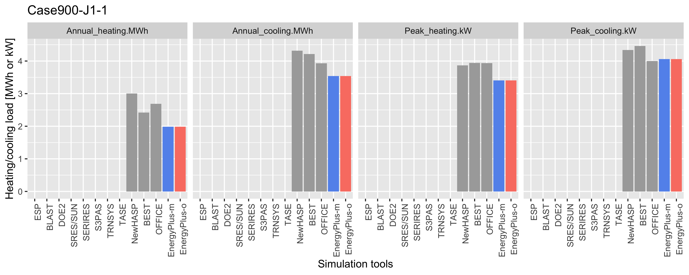
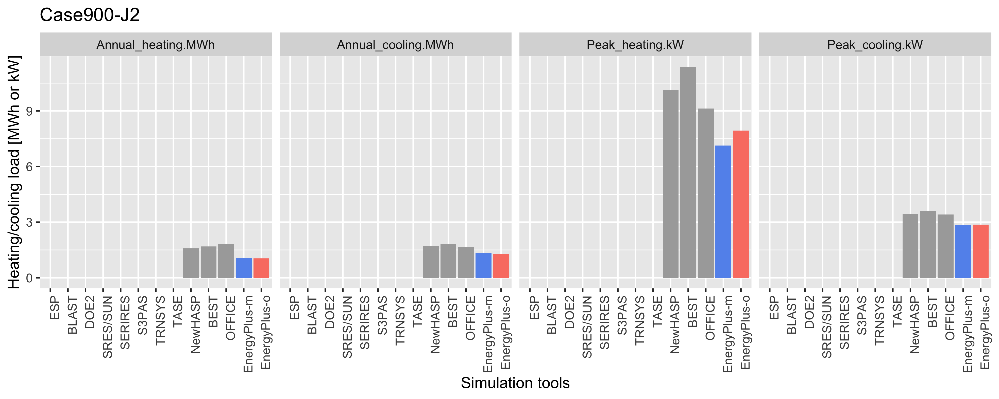
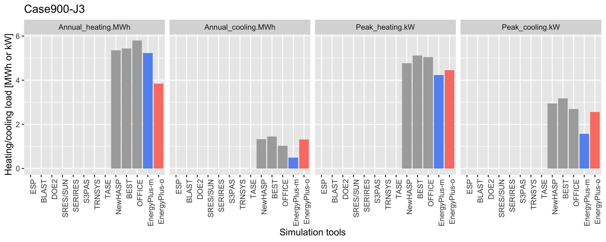

=== Case900Jシリーズの詳細分析

Case900Jシリーズについて、2人が別々にモデル化を行った。
作成者Mが作成したモデルをmodel-m、作成者Oが作成したモデルをmodel-oとし、モデル化の方法の差異、この差異による算出結果の違いについて紹介する。

==== Case900
基準ケースとなるCase900の計算結果を<<Case900の計算結果>>に示す。EnergyPlusは他のツール比べてやや小さいが（ESPの結果に近い）、両モデルの結果は一致している。

[[Case900の計算結果]]
.Case900の計算結果
image::figures/Case900_annual_peak_load.png[]

==== Case900-J1-1
Case900-J1-1の計算結果を<<Case900-J1-1の計算結果>>に示す。Case900ど同様の傾向となっている。

[[Case900-J1-1の計算結果]]
.Case900-J1-1の計算結果


==== Case900-J1-2
Case900-J1-2の計算結果を<<Case900-J1-2の計算結果>>に示す。
両モデルに若干の差が生じている。特に暖房負荷に差がある。
入力ファイルを確認したところ、model-mにおいて屋根の60mmのコンクリート厚さが600mmとなっていたことが分かったため、修正した。

[[Case900-J1-2の計算結果]]
.Case900-J1-2の計算結果（model-m 修正前）
image::figures/Case900-J1-2_annual_peak_load.png[]

```
Material,
    CONCRATE-60mm,           !- Name
    Rough,                   !- Roughness
    0.6000,                  !- Thickness {m}
    1.600,                   !- Conductivity {W/m-K}
    2300.00,                 !- Density {kg/m3}
    870.00,                  !- Specific Heat {J/kg-K}
    0.9000000,               !- Thermal Absorptance
    0.600000,                !- Solar Absorptance
    0.600000;                !- Visible Absorptance
```

==== Case900-J2
Case900-J2の計算結果を<<Case900-J2の計算結果>>に示す。
両モデルに若干の差が生じている。暖房ピークの差はCase900-J1-2と逆転している。

[[Case900-J2の計算結果]]
.Case900-J2の計算結果
image::figures/Case900-J2_annual_peak_load.png[]

上記のコンクリート厚さの修正を行った後も特に暖房ピークの差は大きいままであったため、原因を追究した。
model-mとmodel-oでは、下記の通り間欠空調のスケジュール指定の方法が異なっていた。

* model-mのスケジュール指定（Thermostatの制御スケジュールで指定）
```
Schedule:Day:Hourly,
    Control Type All Days,   !- Name
    Control Type,            !- Schedule Type Limits Name
    0,                       !- Hour 1  0:00:01〜1:00:00
    0,                       !- Hour 2
    0,                       !- Hour 3
    0,                       !- Hour 4
    0,                       !- Hour 5
    0,                       !- Hour 6
    0,                       !- Hour 7
    0,                       !- Hour 8
    4,                       !- Hour 9
    4,                       !- Hour 10
    4,                       !- Hour 11
    4,                       !- Hour 12
    4,                       !- Hour 13
    4,                       !- Hour 14
    4,                       !- Hour 15
    4,                       !- Hour 16
    4,                       !- Hour 17
    4,                       !- Hour 18  17:00:01〜18:00:00
    0,                       !- Hour 19
    0,                       !- Hour 20
    0,                       !- Hour 21
    0,                       !- Hour 22
    0,                       !- Hour 23
    0;                       !- Hour 24
```

* model-oのスケジュール指定（空調システムの運転スケジュールで指定）
```
Schedule:Compact,
    Block1:Zone1 Cooling Availability Sch,  !- Name
    Any Number,              !- Schedule Type Limits Name
    Through: 12/31,          !- Field 1
    For: AllDays,            !- Field 2
    Until:  8:00,            !- Field 3
    0,                       !- Field 4
    Until: 18:00,            !- Field 5
    1,                       !- Field 6
    Until: 24:00,            !- Field 7
    0;                       !- Field 8
```

どちらの指定方法でも同じ結果になると想定されるが、このモデル化方法の違いが結果に重大な影響を及ぼすことが判明した。
link:https://bigladdersoftware.com/epx/docs/9-4/input-output-reference/group-design-objects.html#group----design-objects[Input Output Reference: Group – Design Objects]を確認すると下記のような説明が記載されていた。

`_Other than zone thermostat setpoints, the sizing calculations generally know nothing about the system control inputs such as setpoints and availability schedules. The user must coordinate sizing inputs with the actual simulation control inputs._`

つまり、Thermostatの設定を除き、空調システムの運転スケジュール等はAuto sizingの計算には反映されないのである。
従って、model-mでは間欠空調の条件でSizingが行われていたのに対し、model-oでは24時間空調の条件でSizingされていたため、
model-oの方が容量が小さくなり、結果として年間計算におけるピーク負荷が小さくなっていたようである。
細かな話ではあるが、非常に重要なポイントであるため、EnergyPlusを使用する際にはこの点に十分注意しておく必要がある。

なお、AS140およびSHASEガイドラインでは、「空調システムの装置容量の制約はない」と規定しているため、
本来的にはAuto sizingを行わず、十分大きな容量を指定しておくべきである。
model-oの装置容量を1000kWとして再計算した結果を下図に示す。
結果、暖房ピーク以外はほぼ一致し、暖房ピークはmodel-oの方が大きくなった。
model-mにおいても装置容量の制約が影響していると考えられる。

[[model-o修正後のCase900-J2の計算結果]]
.model-o修正後のCase900-J2の計算結果


.ZoneHVAC:IdealLoadsAirSystemの設定（model-o）
----
ZoneHVAC:IdealLoadsAirSystem,
    Block1:Zone1 Ideal Loads Air,  !- Name
    ,                        !- Availability Schedule Name
    Node Block1:Zone1 In,    !- Zone Supply Air Node Name
    ,                        !- Zone Exhaust Air Node Name
    ,                        !- System Inlet Air Node Name
    35,                      !- Maximum Heating Supply Air Temperature {C}
    12,                      !- Minimum Cooling Supply Air Temperature {C}
    0.0156,                  !- Maximum Heating Supply Air Humidity Ratio {kgWater/kgDryAir}
    0.0077,                  !- Minimum Cooling Supply Air Humidity Ratio {kgWater/kgDryAir}
    LimitCapacity,           !- Heating Limit
    1000,                    !- Maximum Heating Air Flow Rate {m3/s}
    1000000,                 !- Maximum Sensible Heating Capacity {W}
    LimitFlowRateAndCapacity,!- Cooling Limit
    1000,                    !- Maximum Cooling Air Flow Rate {m3/s}
    1000000,                 !- Maximum Total Cooling Capacity {W}
    Block1:Zone1 Heating Availability Sch,  !- Heating Availability Schedule Name
    Block1:Zone1 Cooling Availability Sch,  !- Cooling Availability Schedule Name
    None,                    !- Dehumidification Control Type
    ,                        !- Cooling Sensible Heat Ratio {dimensionless}
    None,                    !- Humidification Control Type
    ,                        !- Design Specification Outdoor Air Object Name
    ,                        !- Outdoor Air Inlet Node Name
    ,                        !- Demand Controlled Ventilation Type
    NoEconomizer,            !- Outdoor Air Economizer Type
    None,                    !- Heat Recovery Type
    ,                        !- Sensible Heat Recovery Effectiveness {dimensionless}
    ;                        !- Latent Heat Recovery Effectiveness {dimensionless}
----

.ZoneHVAC:IdealLoadsAirSystemの設定（model-m）
----
ZoneHVAC:IdealLoadsAirSystem,
    Zone1Air,                !- Name
    ,                        !- Availability Schedule Name
    NODE_1,                  !- Zone Supply Air Node Name
    ,                        !- Zone Exhaust Air Node Name
    ,                        !- System Inlet Air Node Name
    50,                      !- Maximum Heating Supply Air Temperature {C}
    13,                      !- Minimum Cooling Supply Air Temperature {C}
    0.010,                   !- Maximum Heating Supply Air Humidity Ratio {kgWater/kgDryAir}
    0.010,                   !- Minimum Cooling Supply Air Humidity Ratio {kgWater/kgDryAir}
    ,                        !- Heating Limit
    ,                        !- Maximum Heating Air Flow Rate {m3/s}
    ,                        !- Maximum Sensible Heating Capacity {W}
    ,                        !- Cooling Limit
    ,                        !- Maximum Cooling Air Flow Rate {m3/s}
    ,                        !- Maximum Total Cooling Capacity {W}
    ,                        !- Heating Availability Schedule Name
    ,                        !- Cooling Availability Schedule Name
    ConstantSupplyHumidityRatio,  !- Dehumidification Control Type
    ,                        !- Cooling Sensible Heat Ratio {dimensionless}
    ConstantSupplyHumidityRatio,  !- Humidification Control Type
    ,                        !- Design Specification Outdoor Air Object Name
    ,                        !- Outdoor Air Inlet Node Name
    ,                        !- Demand Controlled Ventilation Type
    ,                        !- Outdoor Air Economizer Type
    ,                        !- Heat Recovery Type
    ,                        !- Sensible Heat Recovery Effectiveness {dimensionless}
    ;                        !- Latent Heat Recovery Effectiveness {dimensionless}
----


==== Case900-J3
Case900-J3の計算結果を <<Case900-J3の計算結果>> に示す。両モデルに大きな差がある。
model-oではスラット角の入力を誤っていると考えられる。

[[Case900-J3の計算結果]]
.Case900-J3の計算結果



