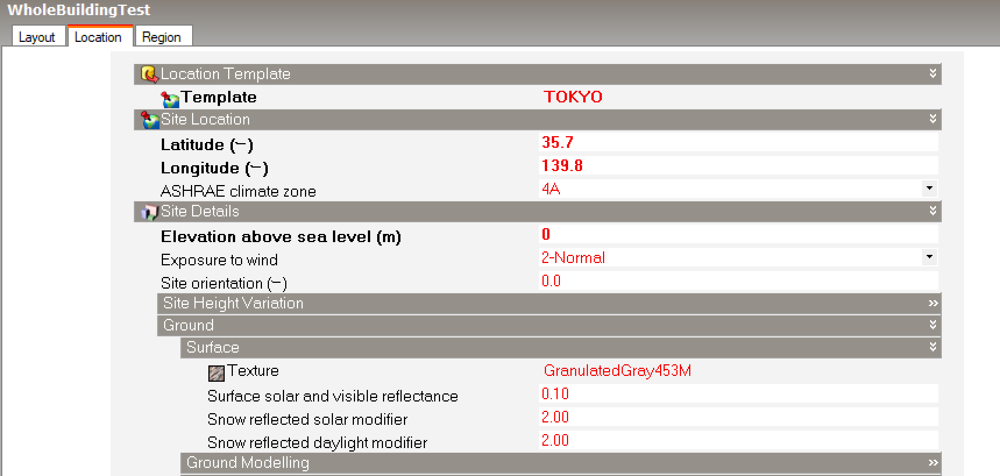
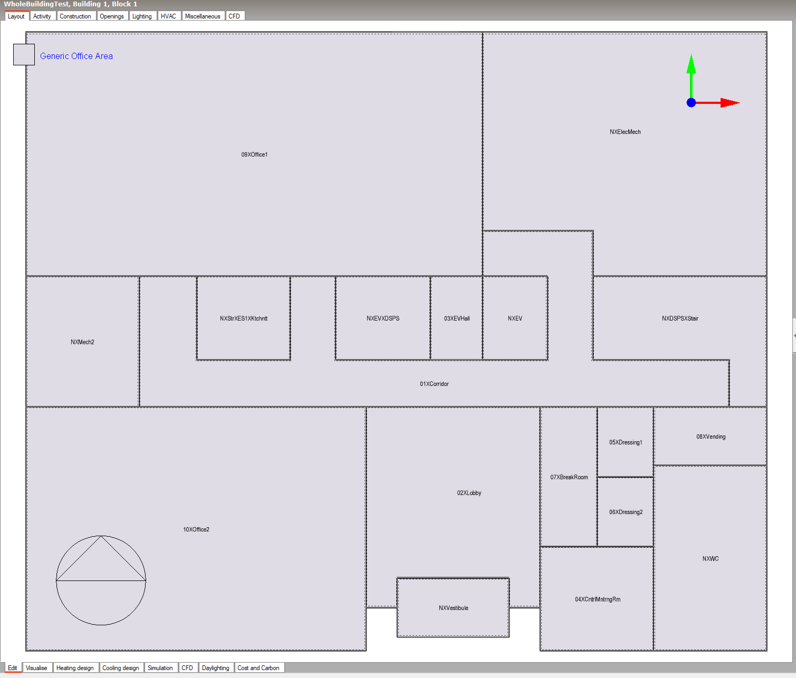
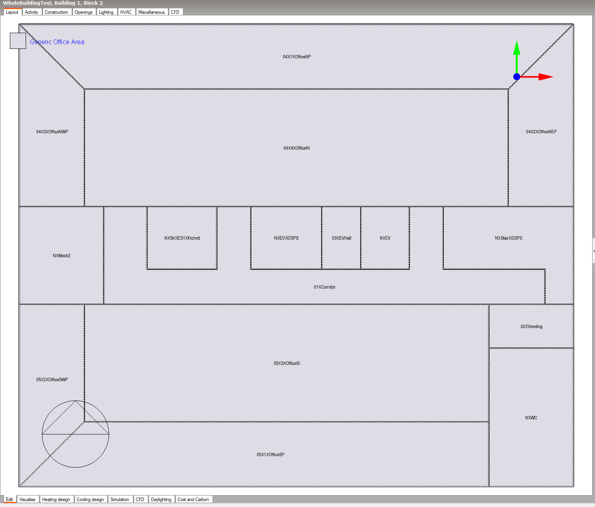
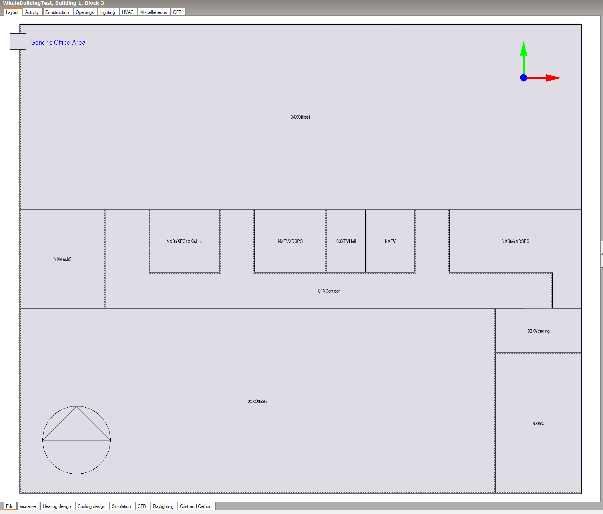
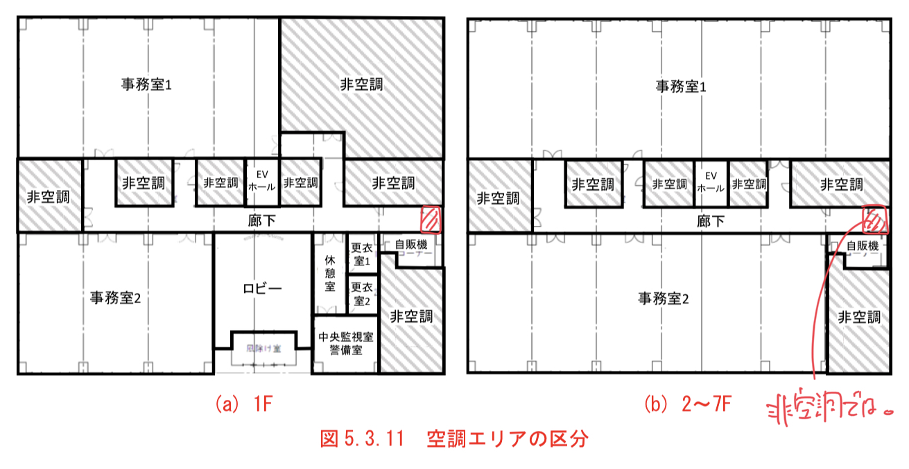
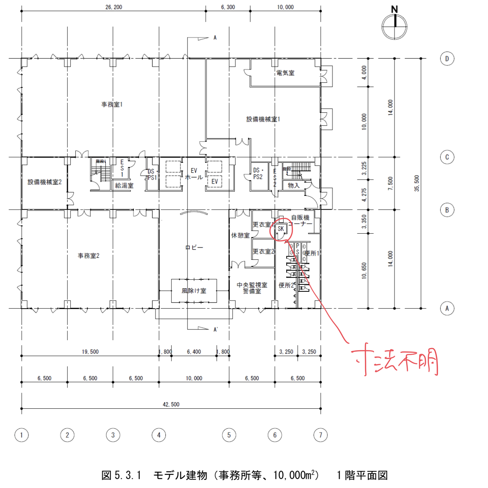
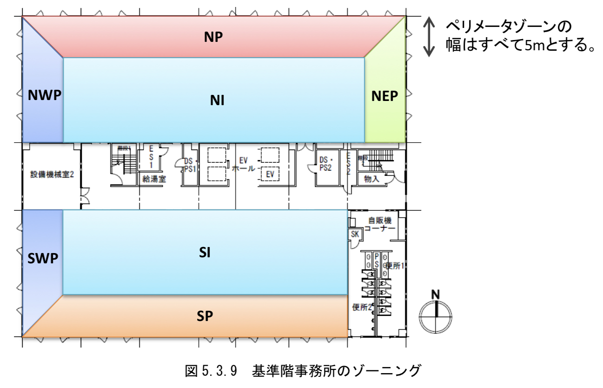
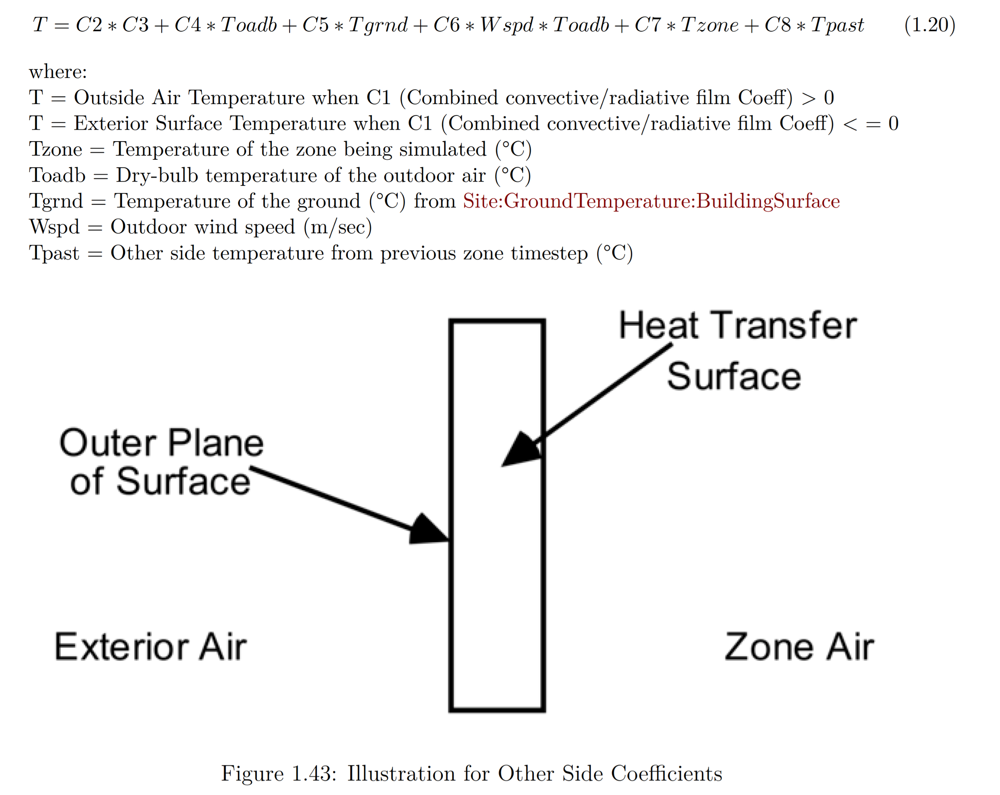

// Case 建物全体テスト

=== DesignBuilderによる建物形状等のモデル化 (2021/9/22)

==== 計算地点情報

....
計算地点は東京（北緯35.7°、東経139.8°）とする。
海抜0m、地物反射率10％とする。
....

.緯度経度、海抜、地物反射率の設定（Design Builder）

....
斜面日射量の計算では天空放射輝度分布一様（Isotropicモデル）とする。
....

EnergyPlusでは、天空放射輝度分布一様（Isotropicモデル）を想定して計算がなされる。 +
参考：　https://bigladdersoftware.com/epx/docs/9-4/engineering-reference/sky-radiance-model.html[bigladder解説]

==== 建物形状

....
表5.3.1、図5.3.1から図5.3.9、表5.3.2に建物全体テストに用いるモデル建物の概要、平面図、矩計図、断面の詳細図、梁伏図、空調ゾーニング図、各居室の面積を示す。
これらをもとに建物の形状を入力する。床、天井の面積は表5.3.2に示す室面積（有効面積）を入力する。
....

.建物モデル 1階（Design Builder）

.建物モデル 2〜6階（Design Builder）

.建物モデル 7階（Design Builder）

* 東側階段の前室は非空調では？

* 自動販売機コーナー横のSKの寸法が分からない。

* 1階、7階はゾーニングする必要はない？

=== EnergyPlus idfファイルの編集 (2021/10/18)

* 曜日の設定 +
* 助走計算の設定 +
* ゾーン間換気の設定 +
* 外気導入量の設定 +
* 室内温度設定値の変更（冬期22度、夏期26度の設定しか無く、中間期が設定されていなかった） +
* 室内湿度の設定 

==== 曜日の設定

1月1日を「日曜日」としたいため、気象データの日付を1989年（1989年は1月1日が日曜日）に設定し、
RunPeriod における Year を 1989年に設定した。また、Start Day をSundayに設定した。

.RunPeriodの設定
----
RunPeriod,
    RunPeriod 1,             !- Name
    1,                       !- Begin Month
    1,                       !- Begin Day of Month
    1988,                    !- Begin Year
    12,                      !- End Month
    31,                      !- End Day of Month
    1989,                    !- End Year
    Sunday,                  !- Day of Week for Start Day
    No,                      !- Use Weather File Holidays and Special Days
    No,                      !- Use Weather File Daylight Saving Period
    Yes,                     !- Apply Weekend Holiday Rule
    Yes,                     !- Use Weather File Rain Indicators
    Yes,                     !- Use Weather File Snow Indicators
    No;                      !- Treat Weather as Actual
----

==== 助走計算の設定

助走計算を2週間分行っているが、非空調となっているのか、1月4日の負荷がとても大きくなってしまう。
これを回避するために、RunPeriod における Begin Year を1988年に設定し、2年分計算させることにした。

.RunPeriodの設定
----
RunPeriod,
    RunPeriod 1,             !- Name
    1,                       !- Begin Month
    1,                       !- Begin Day of Month
    1988,                    !- Begin Year
    12,                      !- End Month
    31,                      !- End Day of Month
    1989,                    !- End Year
    Sunday,                  !- Day of Week for Start Day
    No,                      !- Use Weather File Holidays and Special Days
    No,                      !- Use Weather File Daylight Saving Period
    Yes,                     !- Apply Weekend Holiday Rule
    Yes,                     !- Use Weather File Rain Indicators
    Yes,                     !- Use Weather File Snow Indicators
    No;                      !- Treat Weather as Actual
----

==== ゾーン間換気の設定

ZoneMixing にゾーン間換気の設定を行った。ゾーン間空気移動量は境界長さあたり 150 m3/(h・m) とした。

.ZoneMixing
----
ZoneMixing,
    1F:01XCorridor_1,        !- Name
    1F:01XCorridor,          !- Zone Name
    On,                      !- Schedule Name
    Flow/Zone,               !- Design Flow Rate Calculation Method
    0.125,                   !- Design Flow Rate {m3/s}
    ,                        !- Flow Rate per Zone Floor Area {m3/s-m2}
    ,                        !- Flow Rate per Person {m3/s-person}
    ,                        !- Air Changes per Hour {1/hr}
    1F:03XEVHALL,            !- Source Zone Name
    0;                       !- Delta Temperature {deltaC}

ZoneMixing,
    1F:01XCorridor_2,        !- Name
    1F:01XCorridor,          !- Zone Name
    On,                      !- Schedule Name
    Flow/Zone,               !- Design Flow Rate Calculation Method
    0.083333333,             !- Design Flow Rate {m3/s}
    ,                        !- Flow Rate per Zone Floor Area {m3/s-m2}
    ,                        !- Flow Rate per Person {m3/s-person}
    ,                        !- Air Changes per Hour {1/hr}
    1F:08XVENDING,           !- Source Zone Name
    0;                       !- Delta Temperature {deltaC}

ZoneMixing,
    1F:01XCorridor_3,        !- Name
    1F:01XCorridor,          !- Zone Name
    On,                      !- Schedule Name
    Flow/Zone,               !- Design Flow Rate Calculation Method
    0.416666667,             !- Design Flow Rate {m3/s}
    ,                        !- Flow Rate per Zone Floor Area {m3/s-m2}
    ,                        !- Flow Rate per Person {m3/s-person}
    ,                        !- Air Changes per Hour {1/hr}
    1F:02XLOBBY,             !- Source Zone Name
    0;                       !- Delta Temperature {deltaC}
----

==== 室温設定値の指定（冷房期、中間期、暖房期）

室温設定値を冷房期、中間期、暖房期に分けて指定する。

まず、ゾーンの設定は次の通りとする。ゾーンの名称は「ROOM1」とする。

.Zoneの設定
----
Zone,
    ROOM1,                   !- Name
    0,                       !- Direction of Relative North {deg}
    0,                       !- X Origin {m}
    0,                       !- Y Origin {m}
    0,                       !- Z Origin {m}
    1,                       !- Type
    1,                       !- Multiplier
    ,                        !- Ceiling Height {m}
    1907.3599,               !- Volume {m3}
    366.8,                   !- Floor Area {m2}
    TARP,                    !- Zone Inside Convection Algorithm
    ,                        !- Zone Outside Convection Algorithm
    Yes;                     !- Part of Total Floor Area
----

ZoneControl:Thermostatの設定を行う。 +
名称は「ROOM1 Thermostat」とし、
引用する年間スケジュールの名称を「Zone Control Type Sched」と決めて入力する。 +
オブジェクトタイプは「ThermostatSetpoint:DualSetpoint」を選択し、
室温設定値のスケジュールを「Dual Setpoint」と決めて入力する。

.ZoneControl:Thermostat の設定
----
ZoneControl:Thermostat,
    ROOM1 Thermostat,                   !- Name
    ROOM1,                              !- Zone or ZoneList Name
    Zone Control Type Sched,            !- Control Type Schedule Name
    ThermostatSetpoint:DualSetpoint,    !- Control 1 Object Type
    Dual Setpoint Sched;                !- Control 1 Name
----

ZoneControl:Thermostatにおいて、
名称を「Zone Control Type Sched」と決めた年間スケジュールを次のように設定する。

.Schedule:Year の設定
----
Schedule:Year,
    Zone Control Type Sched, !- Name
    Control Type,            !- Schedule Type Limits Name
    Control Type Week Sch,   !- Schedule:Week Name 1
    1,                       !- Start Month 1
    1,                       !- Start Day 1
    12,                      !- End Month 1
    31;                      !- End Day 1

Schedule:Week:Daily,
    Control Type Week Sch,  !- Name
    Control Type Day Sch,  !- Sunday Schedule:Day Name
    Control Type Day Sch,  !- Monday Schedule:Day Name
    Control Type Day Sch,  !- Tuesday Schedule:Day Name
    Control Type Day Sch,  !- Wednesday Schedule:Day Name
    Control Type Day Sch,  !- Thursday Schedule:Day Name
    Control Type Day Sch,  !- Friday Schedule:Day Name
    Control Type Day Sch,  !- Saturday Schedule:Day Name
    Control Type Day Sch,  !- Holiday Schedule:Day Name
    Control Type Day Sch,  !- SummerDesignDay Schedule:Day Name
    Control Type Day Sch,  !- WinterDesignDay Schedule:Day Name
    Control Type Day Sch,  !- CustomDay1 Schedule:Day Name
    Control Type Day Sch;  !- CustomDay2 Schedule:Day Name

Schedule:Day:Hourly,
    Control Type Day Sch,    !- Name
    Control Type,            !- Schedule Type Limits Name
    4,                       !- Hour 1
    4,                       !- Hour 2
    4,                       !- Hour 3
    4,                       !- Hour 4
    4,                       !- Hour 5
    4,                       !- Hour 6
    4,                       !- Hour 7
    4,                       !- Hour 8
    4,                       !- Hour 9
    4,                       !- Hour 10
    4,                       !- Hour 11
    4,                       !- Hour 12
    4,                       !- Hour 13
    4,                       !- Hour 14
    4,                       !- Hour 15
    4,                       !- Hour 16
    4,                       !- Hour 17
    4,                       !- Hour 18
    4,                       !- Hour 19
    4,                       !- Hour 20
    4,                       !- Hour 21
    4,                       !- Hour 22
    4,                       !- Hour 23
    4;                       !- Hour 24
----

ZoneControl:Thermostatにおいて、
名称を「Dual Setpoint Sched」と決めた室温設定値のスケジュールを次のように設定する。 +
暖房時の室温設定値スケジュール、冷房時の室温設定値スケジュールともに名称を「Room Temp Setpoint Schedule」とする。

.ThermostatSetpoint:DualSetpoint の設定
----
ThermostatSetpoint:DualSetpoint,
    Dual Setpoint Sched,                  !- Name
    Room Temp Setpoint Schedule,              !- Heating Setpoint Temperature Schedule Name
    Room Temp Setpoint Schedule;              !- Cooling Setpoint Temperature Schedule Name
----

スケジュール「Room Temp Setpoint Schedule」は次のように定義する。

.Schedule
----
Schedule:Compact,
    Room Temp Setpoint Schedule,    !- Name
    Temperature,                    !- Schedule Type Limits Name

    Through: 31 Mar,                !- Field 1
    For: Weekdays  WinterDesignDay, !- Field 2
    Until: 24:00,                   !- Field 10
    22,                             !- Field 11

    Through: 31 May,                !- Field 1
    For: Weekdays,                  !- Field 2
    Until: 24:00,                   !- Field 10
    24,                             !- Field 11

    Through: 30 Sep,                !- Field 1
    For: Weekdays SummerDesignDay,  !- Field 2
    Until: 24:00,                   !- Field 10
    26,                             !- Field 11

    Through: 30 Nov,                !- Field 1
    For: Weekdays,                  !- Field 2
    Until: 24:00,                   !- Field 10
    24,                             !- Field 11

    Through: 31 Dec,                !- Field 16
    For: Weekdays,                  !- Field 17
    Until: 24:00,                   !- Field 10
    22;                             !- Field 11
----

暖房、冷房の動く時間帯、期間を次のように設定する。 +
暖房、暖房ともON/OFFスケジュールの名称は「ROOM1 Availability Sch」とする。

.ZoneHVAC:IdealLoadsAirSystem
----
ZoneHVAC:IdealLoadsAirSystem,
    ROOM1 Ideal Loads Air,   !- Name
    ,                        !- Availability Schedule Name
    Node ROOM1 In,           !- Zone Supply Air Node Name
    ,                        !- Zone Exhaust Air Node Name
    ,                        !- System Inlet Air Node Name
    35,                      !- Maximum Heating Supply Air Temperature {C}
    12,                      !- Minimum Cooling Supply Air Temperature {C}
    0.0156,                  !- Maximum Heating Supply Air Humidity Ratio {kgWater/kgDryAir}
    0.0077,                  !- Minimum Cooling Supply Air Humidity Ratio {kgWater/kgDryAir}
    LimitCapacity,           !- Heating Limit
    Autosize,                !- Maximum Heating Air Flow Rate {m3/s}
    Autosize,                !- Maximum Sensible Heating Capacity {W}
    LimitFlowRateAndCapacity,!- Cooling Limit
    7.947333,                !- Maximum Cooling Air Flow Rate {m3/s}
    Autosize,                !- Maximum Total Cooling Capacity {W}
    ROOM1 Availability Sch,  !- Heating Availability Schedule Name
    ROOM1 Availability Sch,  !- Cooling Availability Schedule Name
    Humidistat,              !- Dehumidification Control Type
    ,                        !- Cooling Sensible Heat Ratio {dimensionless}
    Humidistat,              !- Humidification Control Type
    ,                        !- Design Specification Outdoor Air Object Name
    ,                        !- Outdoor Air Inlet Node Name
    ,                        !- Demand Controlled Ventilation Type
    DifferentialDryBulb,     !- Outdoor Air Economizer Type
    Sensible,                !- Heat Recovery Type
    ,                        !- Sensible Heat Recovery Effectiveness {dimensionless}
    ;                        !- Latent Heat Recovery Effectiveness {dimensionless}
----

.Schedule
----
Schedule:Compact,
    ROOM1 Availability Sch,  !- Name
    Temperature,             !- Schedule Type Limits Name
    Through: 31 Dec,         !- Field 1
    For: Weekdays  WinterDesignDay SummerDesignDay,  !- Field 2
    Until: 07:00,            !- Field 3
    0,                       !- Field 4
    Until: 21:00,            !- Field 5
    1,                       !- Field 6
    Until: 24:00,            !- Field 7
    0,                       !- Field 8
    For: Weekends AllOtherDays,  !- Field 9
    Until: 24:00,            !- Field 10
    0;                       !- Field 11
----

==== 室内湿度の設定 

まず、湿度のスケジュールを次のように設定した。

.Schedule:Compact
----
! Modified schedule: On 24/7
Schedule:Compact,
    1F:01XCorridor Humidifying RH Schedule,  !- Name
    Any Number,              !- Schedule Type Limits Name
    Through: 31 Mar,         !- Field 1
    For: AllDays,            !- Field 2
    Until: 24:00,            !- Field 3
    40,                      !- Field 4
    Through: 30 Nov,         !- Field 5
    For: AllDays,            !- Field 6
    Until: 24:00,            !- Field 7
    0,                       !- Field 8
    Through: 31 Dec,         !- Field 9
    For: AllDays,            !- Field 10
    Until: 24:00,            !- Field 11
    40;                      !- Field 12

! Modified schedule: On 24/7
Schedule:Compact,
    1F:01XCorridor Dehumidifying RH Schedule,  !- Name
    Any Number,              !- Schedule Type Limits Name
    Through: 31 Mar,         !- Field 1
    For: AllDays,            !- Field 2
    Until: 24:00,            !- Field 3
    100,                     !- Field 4
    Through: 30 Nov,         !- Field 5
    For: AllDays,            !- Field 6
    Until: 24:00,            !- Field 7
    50,                      !- Field 8
    Through: 31 Dec,         !- Field 9
    For: AllDays,            !- Field 10
    Until: 24:00,            !- Field 11
    100;                     !- Field 12
----

加湿の設定は、ZoneControl:Humidistat で行う。

.ZoneControl:Humidistat
----
ZoneControl:Humidistat,
    1F:01XCorridor Humidistat,  !- Name
    1F:01XCorridor,          !- Zone Name
    1F:01XCorridor Humidifying RH Schedule,  !- Humidifying Relative Humidity Setpoint Schedule Name
    1F:01XCorridor Dehumidifying RH Schedule;  !- Dehumidifying Relative Humidity Setpoint Schedule Name
----

=== EnergyPlus idfファイルの編集 (2021/11/19)

* 外気導入の削除 +
* 隣室条件（非空調室、上下階）の設定 +
* 人体発熱の設定を調整 +
* ブラインドの角度を修正（日本の90度はアメリカの0度） +

==== 外気導入の削除

外気導入を削除し、すきま風分のみとした。

.ZoneInfiltration:DesignFlowRate
----
ZoneInfiltration:DesignFlowRate,
    1F:01XCorridor Infiltration 1,  !- Name
    1F:01XCorridor,          !- Zone or ZoneList Name
    On 24/7,                 !- Schedule Name
    Flow/zone,               !- Design Flow Rate Calculation Method
    0.0109,                  !- Design Flow Rate {m3/s}
    ,                        !- Flow per Zone Floor Area {m3/s-m2}
    ,                        !- Flow per Exterior Surface Area {m3/s-m2}
    ,                        !- Air Changes per Hour {1/hr}
    1,                       !- Constant Term Coefficient
    0,                       !- Temperature Term Coefficient
    0,                       !- Velocity Term Coefficient
    0;                       !- Velocity Squared Term Coefficient
----

==== Outside Boundary Condition

BuildingSurface:DetailedオブジェクトのField: Outside Boundary Conditionにて、
壁の外側の条件を設定することができる。 +
OtherSideCoefficientsを選択すると計算式で与えることもできる。

link:https://bigladdersoftware.com/epx/docs/9-4/input-output-reference/group-thermal-zone-description-geometry.html#field-outside-boundary-condition-3[bigladder:BuildingSurface:Detailed]

.Outside Boundary Condition の選択肢
....

1.	Surface
この表面が内部表面である場合はこれを選択します。
値は、ベースゾーンのサーフェスまたは別のゾーンのサーフェスのいずれかになります。
隣接するゾーンの表面を指定することにより、2つのゾーン間の熱バランスを正確にシミュレートできます。
EnergyPlusは、ゾーンのグループを同時にシミュレートし、ゾーン間の熱伝達を含みます。
ただし、これにより計算が複雑になるため、2つのゾーンに大きな温度差がない限り、他のゾーンを指定する必要はありません。 
2つのゾーンに大きな違いがない場合（温度に関して）、サーフェスはそれ自体を外部環境として使用するか、このフィールドを断熱として指定する必要があります。
このサーフェスの「外側」（に隣接）のサーフェス名は、次のフィールドに配置されます。

2.	Adiabatic 
同じゾーンの内面。この表面はゾーン外に熱を伝達しませんが、それでも熱を熱質量で蓄えます。
表面の内面のみがゾーンと熱を交換します（つまり、表面の両側がゾーンと熱を交換する内部パーティションをモデル化するには、2つの断熱表面が必要です）。
外部境界条件オブジェクトは空白のままにすることができます。

3.	Zone
これはSurfaceに似ていますが、EnergyPlusは、これがサーフェスに入力されると、隣接するゾーンに必要なサーフェスを自動的に作成します。
サーフェスに窓やドアがある場合、EnergyPlusは適切なサブサーフェスも自動的に作成します。

4.	Outdoors
この表面が外気温条件にさらされる場合は、これが選択です。
この種の表面の詳細な仕様については、以下の太陽への露出と風への露出を参照してください。

5.	Foundation
代替モデル（現在はKivaTMモデルのみ）を使用して、基礎表面の多次元熱伝達を説明します。
外側境界条件オブジェクトは、Foundation：Kivaオブジェクトの名前を参照します（または、追加の断熱材なしでデフォルトの基礎を使用するには、空白のままにします）。

6.	Ground
この表面の外側の温度は、その月のSite：GroundTemperature：Surfaceの値になります。

7.	GroundFCfactorMethod
この表面が地面に露出していて、Construction：CfactorUndergroundWallを使用している場合は、これが選択です。この表面の外側の温度は、その月のSite：GroundTemperature：FcfactorMethod値になります。

8.	OtherSideCoefficients
このサーフェスにカスタムのユーザー指定の温度またはその他のパラメーターがある場合（SurfaceProperty：OtherSideCoefficientsの仕様を参照）、これを選択します。
外側の境界条件は、SurfaceProperty：OtherSideCoefficients仕様の名前になります。

9.	OtherSideConditionsModel
この表面に、外部に取り付けられた、蒸散コレクターや通気型太陽光発電パネルなどの特別にモデル化されたマルチスキンコンポーネントがある場合（SurfaceProp-erty：OtherSideConditionsModel仕様を参照）、これを選択します。外面環境は、SurfaceProperty：OtherSideConditionsModel仕様の名前になります。

10. GroundSlabPreprocessorAverage
スラブプリプロセッサ計算の平均結果を使用します。

11. GroundSlabPreprocessorCore
スラブプリプロセッサ計算からのコア結果を使用します。

12. GroundSlabPreprocessorPerimeter
スラブプリプロセッサ計算からの境界結果を使用します。

13. GroundBasementPreprocessorAverageWall
地下室のプリプロセッサ計算からの平均壁結果を使用します。

14. GroundBasementPreprocessorAverageFloor
地下室のプリプロセッサ計算からの平均フロア結果を使用します。

15. GroundBasementPreprocessorUpperWall
地下室のプリプロセッサ計算からの上部壁の結果を使用します。

16. GroundBasementPreprocessorLowerWall
地下室のプリプロセッサ計算からの下部壁の結果を使用します。
....

==== SurfaceProperty:OtherSideCoefficients

link:https://bigladdersoftware.com/epx/docs/9-4/input-output-reference/group-advanced-surface-concepts.html#surfacepropertyothersidecoefficients[bigladder:SurfaceProperty:OtherSideCoefficients]

サーフェスのステートメント（Outside Boundary Condition）において、OtherSideCoefficientsを参照することで、サーフェスの外側の温度を直接制御することができます。
また、OtherSideCoefficientsを使用して、サーフェイスの外部対流熱伝達係数と、それに対応する外気温度を制御することもできます。
OtherSideCoefficientsを使用する場合、太陽の影響は考慮されないことに注意する必要があります。
さらに、OtherSideCoefficientsがサーフェスに指定された場合、そのサーフェスのサブサーフェスにも適用されます（サブサーフェスは独自の係数セットを持つことができます）。

OtherSideCoefficientsは、すべてのタイプの伝熱面に同じ効果を与えます。
言い換えれば、OtherSideCoefficientsを指定した室内表面と、同一のOtherSideCoefficientsを指定した外壁は、まったく同じようにシミュレーションされます。
OtherSideCoefficientsを使用するサーフェスは、新しいまたは別のタイプのサーフェスと考えるべきです。すべての熱伝達面は、伝導伝達関数によって同じようにシミュレートされます。
様々な種類の伝熱面の唯一の違いは、伝熱面の反対側の環境です。例えば、外壁の場合は屋外の環境が相手側の環境となります。
内壁の場合、表面の外側の面の温度は、表面の内側の面の温度と等しく設定されます。
同様に、OtherSideCoefficientsを指定したサーフェスでは、他面環境をコントロールすることができます。

サーフェスを介した熱伝導は、ゾーンロードの計算において非常に重要な要素です。
この熱伝達を計算するための情報は、表面が屋外環境やシミュレーションされている別のゾーンにさらされていれば、すぐに入手できます。
時には、EnergyPlusモデルに含まれていないエリアに隣接する表面の熱伝達をモデル化したい場合があります。
例えば、オフィスエリアが倉庫に隣接していて、ユーザーはオフィスエリアのシミュレーションにしか興味がない場合です。
OtherSideCoefficientsが指定されたインテリアサーフェスは、サーフェスの反対側の環境を制御するために使用することができ、それによって隣接するサーフェスを介した熱伝達を考慮することができます。

OtherSideCoefficientsは、以下に示すように表面の「反対側」に影響を与えます。各係数には特別な意味があります。
特定の係数を使用しない場合は、0または空白を入力することができます。
反対側の係数を使用する方法は2つあることに注意してください。
外側面の温度を直接設定する場合（下記の対流・輻射複合係数が0以下の場合）と、
フィルム係数（下記の対流・輻射複合係数の正の値）と外気温度の両方を設定する場合に使用します。

.SurfaceProperty:OtherSideCoefficients
----
!  Example input using temperature schedule
SurfaceProperty:OtherSideCoefficients,
      OSCCoef:Zn005:Wall003,   !- Name
      0,                       !- Combined Convective/Radiative Film Coefficient {W/m2-K}
      0.000000,                !- Constant Temperature {C}
      1.000000,                !- Constant Temperature Coefficient
      0.000000,                !- External Dry-Bulb Temperature Coefficient
      0.000000,                !- Ground Temperature Coefficient
      0.000000,                !- Wind Speed Coefficient
      0.000000,                !- Zone Air Temperature Coefficient
      Zn005Wall003OtherSideTempSched;  !- Constant Temperature Schedule Name

!  Example input for outside heat transfer coefficient of 1.23, using Toadb
SurfaceProperty:OtherSideCoefficients,
      OSCCoef:Zn005:Wall004,   !- Name
      1.230000,                !- Combined Convective/Radiative Film Coefficient {W/m2-K}
      0.000000,                !- Constant Temperature {C}
      0.000000,                !- Constant Temperature Coefficient
      1.000000,                !- External Dry-Bulb Temperature Coefficient
      0.000000,                !- Ground Temperature Coefficient
      0.000000,                !- Wind Speed Coefficient
      0.000000,                !- Zone Air Temperature Coefficient
      ,                        !- Constant Temperature Schedule Name
      No,                      !- Sinusoidal Variation of Constant Temperature Coefficient
      24,                      !- Period of Sinusoidal Variation {hr}
      0.,                      !- Previous Other Side Temperature Coefficient
      ,                        !- Minimum Other Side Temperature Limit {C}
      ;                        !- Maximum Other Side Temperature Limit {C}
----

ガイドラインでは「非空調室が隣接している場合、計算対象室と外気の中間温度を仮定する
（1F 床面は地下部をピット と想定して隣室扱いとし、同様の仮定とする）」と記されているので、次のように設定する。

.隣室条件の設定
----
BuildingSurface:Detailed,
    1F:10XOffice2_Partition_4_0_0,  !- Name
    Wall,                    !- Surface Type
    IW1 - IBEC,              !- Construction Name
    1F:10XOffice2,           !- Zone Name
    OtherSideCoefficients,   !- Outside Boundary Condition
    NonACRoom,               !- Outside Boundary Condition Object
    NoSun,                   !- Sun Exposure
    NoWind,                  !- Wind Exposure
    0,                       !- View Factor to Ground
    4,                       !- Number of Vertices
    -22.94929697,            !- Vertex 1 X-coordinate {m}
    1.48340817,              !- Vertex 1 Y-coordinate {m}
    10,                      !- Vertex 1 Z-coordinate {m}
    -29.44929697,            !- Vertex 2 X-coordinate {m}
    1.48340817,              !- Vertex 2 Y-coordinate {m}
    10,                      !- Vertex 2 Z-coordinate {m}
    -29.44929697,            !- Vertex 3 X-coordinate {m}
    1.48340817,              !- Vertex 3 Y-coordinate {m}
    15.2,                    !- Vertex 3 Z-coordinate {m}
    -22.94929697,            !- Vertex 4 X-coordinate {m}
    1.48340817,              !- Vertex 4 Y-coordinate {m}
    15.2;                    !- Vertex 4 Z-coordinate {m}

SurfaceProperty:OtherSideCoefficients,
    NonACRoom,               !- Name
    9,                       !- Combined Convective/Radiative Film Coefficient {W/m2-K}
    ,                        !- Constant Temperature {C}
    ,                        !- Constant Temperature Coefficient
    0.5,                     !- External Dry-Bulb Temperature Coefficient
    ,                        !- Ground Temperature Coefficient
    ,                        !- Wind Speed Coefficient
    0.5,                     !- Zone Air Temperature Coefficient
    ,                        !- Constant Temperature Schedule Name
    No,                      !- Sinusoidal Variation of Constant Temperature Coefficient
    24;                      !- Period of Sinusoidal Variation {hr}
----

OtherSideCoefficientsは、下記の式で与えられる。係数C1〜C8は以下で説明する入力項目である。

.OtherSideCoefficients 

===== Name

OtherSideCoefficientsをOutside Boundary Conditionとして使用しているSurfaceステートメントで参照される文字列です。

===== Combined Convective/Radiative Film Coefficient (C1)

これはトリガーとなる値である。
値が0より大きい場合、それは複合対流/放射膜係数であるとみなされる。
値が0より大きい場合、残りのフィールドは、まず外気温度を計算し、次に外気温度とフィルム係数に基づいて外部表面温度を計算するために使用される。
このフィールドが0以下の場合、残りのフィールドは表面温度を計算するために使用されます（外気温度ではありません）。
このフィールドの単位は、対流熱伝達率と同じ　W/(m2*K)　です。

===== Constant Temperature (C2)

このフィールドは、表面温度または外気温度のいずれかを計算する際に一定の要素となる温度項を定義する。
2番目のパラメータにスケジュール名が含まれている場合、このパラメータの値はスケジュールの値で上書きされます。
このフィールドのデフォルトは0.0です。

===== Constant Temperature Coefficient (C3)

このフィールドでは、一定の温度に適用される一定の係数を定義する（前のフィールドを参照）。
このパラメータは無次元である。
C2の設定にスケジュールが使用されている場合、このパラメータの値は通常1.0です。
このフィールドは、Sinusoidal Variation of Constant Temperature Coefficient = Yesの場合は無視されます。
このフィールドのデフォルトは1.0です。

===== External Dry-Bulb Temperature Coefficient (C4)

このフィールドでは、外気乾球温度に適用される一定の係数を定義する。
このパラメータは無次元です。このフィールドのデフォルトは0.0です。

===== Ground Temperature Coefficient (C5)

このフィールドでは、地面の温度（参考：Site:GroundTemperature:BuildingSurface）に適用される一定の係数を定義します。
このパラメータは無次元です。

===== Wind Speed Coefficient (C6)

このフィールドは、外気乾球温度と風速の積に適用される一定の係数を定義する。
このパラメータは、逆速度またはs/mの単位を持ちます。このフィールドのデフォルトは0.0です。

===== Zone Air Temperature Coefficient (C7)

このフィールドは、このサーフェスが属するゾーンの温度に適用される一定の係数を定義する。
このパラメータは無次元です。このフィールドのデフォルトは0.0です。

===== Constant Temperature Schedule Name

このフィールドは、スケジュール名を入力するために使用される。そのスケジュールは「一定」の温度値C2を供給する。
C2にスケジュールが使用されている場合、C3フィールドの値は通常1.0であることに注意してください。
空白でない場合、このフィールドには有効なスケジュール名を入力する必要があります。

===== Sinusoidal Variation of Constant Temperature Coefficient

このフィールドはオプションで、一定温度に適用される係数を規定する別の方法を定義するために使用できます（フィールド「Constant Temperature」および「Constant Temperature Coefficient」を参照）。
このパラメータは、以下の式では "C2 "と表示されています。このフィールドが省略されるか、空白にされるか、または「No」に設定された場合、C2は定数です（フィールド「Constant Temperature Coefficient」で定義されます）。
ただし、この項目が「Yes」に設定されている場合、C2の値はユニタリーサイン波に応じて以下のように変化します。

期間の値は、次のフィールドで制御されます。時間帯の値は、ゾーンのタイムステップに基づいており、単位は時間である。
ここでのサイン関数は、ラジアンとしての入力を使用します。
このオプションを使用すると、「C2」の値は-1.0～1.0の間で変化し、「一定の温度係数」フィールドに入力された値は使用されません。
このオプションは、前のフィールドで一定の温度をスケジュールするのと同時に使用することはできません。

===== Period of Sinusoidal Variation

このフィールドは、前のフィールドで選択した「Sinusoidal Variation of Constant Temperature Coefficient」機能を使用する際に、正弦波の周期を定義するために使用される。
このフィールドは、正弦波の期間を時間単位で表します。
デフォルトは24時間で、日周期の正弦波が得られます。ここに入力された値は、前のフィールドの式における「period」である。

===== Previous Other Side Temperature Coefficient (C8)

このフィールドでは、前のゾーン・タイム・ステップからこのオブジェクトによって計算された相手側温度に適用される一定の係数を定義する。
このパラメータは無次元です。このフィールドのデフォルトは0.0です。

===== Minimum Other Side Temperature Limit

このフィールドでは、相手側の温度結果の下限値を℃で指定する。

===== Maximum Other Side Temperature Limit

このフィールドでは、他方の温度結果の上限を℃で指定する。

==== Pepple

人体発熱の設定を行う。

参考：　https://bigladdersoftware.com/epx/docs/9-4/input-output-reference/group-internal-gains-people-lights-other.html#people[bigladder解説]

.People
----
People,
    People 1F:09XOffice1,    !- Name
    1F:09XOffice1,           !- Zone or ZoneList Name
    JP Office - office occupants,  !- Number of People Schedule Name
    People/Area,             !- Number of People Calculation Method
    ,                        !- Number of People
    0.1,                     !- People per Zone Floor Area {person/m2}
    ,                        !- Zone Floor Area per Person {m2/person}
    0.3,                     !- Fraction Radiant
    0.67,                    !- Sensible Heat Fraction
    Activity Schedule 19469, !- Activity Level Schedule Name
    ,                        !- Carbon Dioxide Generation Rate {m3/s-W}
    No;                      !- Enable ASHRAE 55 Comfort Warnings
----

Peopleは、空間の状態に対する居住者の影響をモデル化するために使用される。
以下の定義では、基本的な影響に加えて、居住者グループの熱的快適性を報告するために使用できる情報を提供しています。
EnergyPlusには、Fanger、Pierce Two-Node、および Kansas State University Two-Node の熱的快適性モデルが用意されている。
ユーザーは、空気速度スケジュール名の後に適切な選択キーワードを追加するだけで、
各Peopleステートメントにこれらのモデルのいずれかを選択することができます。
熱的快適性の計算は、これらの熱的快適性モデルの特定の要求を含む人々の声明に対してのみ行われます。.
このオブジェクトは、ゾーンの二酸化炭素シミュレーションのために、人々の活動レベルに基づく二酸化炭素発生率の入力も必要です。

===== Name

Peopleオブジェクトの名前です。すべてのPeopleオブジェクトで一意でなければなりません。

===== Zone or ZoneList Name

このフィールドはゾーン（参照：Zone）またはゾーンリスト（参照：ZoneList）の名前であり、
特定の人数定義を建物内のサーマルゾーンまたはサーマルゾーンのセットにリンクする。
ZoneListオプションを使用すると、この人数定義はゾーンリストの各ゾーンに適用され、ゾーン内の人数をグローバルに定義することになる。
Zonelistオプションは、人数計算方法のpeople/areaおよびarea/personオプションと一緒に使うと効果的です。

実際のピープル・オブジェクトの名前は、<ゾーン名> <ピープル・オブジェクト名> となり、
名前フィールドの標準的な長さ (100文字) 未満でなければなりません。
この標準的な長さよりも大きい場合は、切り捨てられてしまうため、出力レポートで指定することが困難になる場合があります。
生成された名前が100文字を超える場合は、警告が表示されます。
このように連結された他の名前と重複する場合、深刻なエラーが発生し、実行が終了します。

===== Number of People Schedule Name

このフィールドには、人数パラメーターを変更するスケジュール（参考：スケジュール）の名前を入力します（「人数計算方法と関連フィールド」参照）。
スケジュールの値は任意の正の数とすることができます。
このステートメントで定義されたゾーンの実際の人数は、人数フィールドとこのフィールドに名前で指定されたスケジュールの値の積である。

===== Number of People Calculation Method

このフィールドは、次の3つのフィールドのうちどのフィールドを埋めるかを示すキー／選択肢であり、ゾーン内の居住者（人）の公称数を計算する方法を記述します。キー／選択肢は以下の通りです。

人 +
この選択肢では、居住者（人）の数をそのまま挿入する方法が採用されます。(Number of Peopleフィールドは埋められていなければなりません。)

人/面積 +
この選択では、ゾーンの床面積あたりの係数が使用されます。(People per Zone Floor Areaフィールドが入力される必要があります)。

面積／人 +
この選択では、使用される方法は一人当たりの床面積の係数となります。(人あたりのゾーン床面積」フィールドが入力されている必要があります）。)

===== Number of People

このフィールドは、ゾーン内の最大人数を表すために使用され、それにスケジュール分数（スケジュールフィールドを参照）が掛けられます。
EnergyPlusでは、人数は実数のスケジュールに適用される「ダイバーシティ・ファクター」とすることができるため、若干柔軟性があります。
なお、スケジュールの値は時間ごとに変化しますが、人数のフィールドはすべてのシミュレーション環境で一定です。

===== People per Zone Floor Area

この係数（人/m2)は、ゾーンの床面積とともに使用され、「人数」欄に記載された最大人数を決定します。方法欄の選択は「人/面積」としてください。

===== Zone Floor Area per Person

この係数（m2/人）をゾーンの床面積と合わせて使用し、「人数」欄に記載された最大人数を決定します。方法欄の選択は「面積／人」としてください。

===== Fraction Radiant

このフィールドは0.0から1.0までの10進数で、ゾーン内の人間が発する熱の種類を特徴づけるために使用される。
このフィールドで指定された数値は、ゾーン内の人間からの長波長放射ゲインの量を与えるために、人間によって放出される総顕在エネルギーに乗算されます。
顕在負荷の残りは対流熱利得であると仮定する。なお、人からの潜熱は輻射熱と対流熱のどちらにも含まれない。
詳細はエンジニアリング・リファレンス・ドキュメントを参照のこと。デフォルト値は0.30です。

===== Sensible Heat Fraction

ユーザーはこのフィールドを使用して、このPEOPLEオブジェクトによるヒートゲインの固定顕在分を指定することができます。
通常、プログラムは顕在/潜熱の分割を計算しますが、このフィールドではユーザーがこの分割を制御できます。
このフィールドは自動計算されます。フィールドが空白または自動計算の場合、プログラムは顕在/潜熱の分割を計算し、値が入力された場合は、現在の総ヒートゲインの顕在率として使用されます。

===== Activity Level Schedule Name

このフィールドは、設計条件におけるゾーンの一人当たりのヒートゲインの量を決定するスケジュールの名前である。
このヒートゲインは、基本的なゾーンのヒートバランスや、熱的快適性のモデル化に影響を与える。
この値は、空間温度の変化を考慮して、相関関係に基づいて多少修正される。
スケジュールの値は任意の正の数であり、このパラメータの単位は一人当たりのワットである。
このスケジュールは、対流、輻射、潜熱を含む一人当たりの総ヒートゲインを表す。
内部のアルゴリズムにより、全体のうち顕在的なものと潜在的なものが判断されます。
そして、上記の「放射分数」で指定された値を用いて、顕在分を放射分と対流分に分けます。
詳細については、エンジニアリングリファレンスを参照してください。

活動レベルの値は、一般的なオフィス活動における1人当たり約100〜150ワットから、
競技レスリングなどの激しい身体活動における1人当たり900ワット以上までの範囲となります。
次の表（表1）は、2005 ASHRAE Handbook of Fundamentalsの8.6ページの表[table:wind-speed-profile-coefficients-ashrae]に基づいています。
ASHRAE HOFからの情報に加えて、活動レベルのスケジュール値に必要なW/Personの値の列が追加されています。
この欄には、標準的な成人の体表面積である1.8m2 を使用して、活動レベルをW/m2 を乗じる。
活動量計の値が正常な範囲を逸脱した場合、警告が表示されます。また、値が低すぎたり高すぎたりすると、熱的快適性の報告値が歪むことがあります。

===== Carbon Dioxide Generation Rate

この数値入力フィールドは、一人当たりの二酸化炭素発生率をm3/s-Wの単位で指定します。
このオブジェクトからの総二酸化炭素発生率は人の数 * 人のスケジュール * 人の活動 * 二酸化炭素発生率。デフォルト値は3.82E-8 m3/s-Wです（ASHRAE Standard 62.1-2007の一般成人を対象とした0.0084 cfm/met/personの値から取得）。
最大値はデフォルト値の10倍とすることができます。

===== Enable ASHRAE 55 comfort warnings

このフィールドには、「Yes」または「No」のいずれかを指定します。
Yesを指定すると、空間の状態がASHRAE 55の快適範囲外にある場合に警告が生成されます。
"Simplified ASHRAE 55-2004 Graph Related Outputs "および "Simplified ASHRAE 55 Warnings "の項で説明します。
デフォルトではこれらの警告は表示されませんので、空間が快適範囲外にあるかどうかを知りたい場合は、このフィールドを「Yes」に設定する必要があります。

===== Mean Radiant Temperature Calculation Type

このフィールドは、ユーザーが熱的快適性モデルに使用したい平均放射温度（MRT）計算のタイプを指定します。
現時点では、MRTの計算タイプには、ゾーン平均、表面加重、角度係数のリストの3つのオプションがあります。
デフォルトの計算は「ゾーン平均」で、フィールドが空白のままの場合に使用されます。
ゾーン平均MRT計算では、熱的快適性の計算に使用されるMRTは、ゾーン内の「平均」ポイントのものです。
MRTは、ゾーン内のすべての表面の面積放射率加重平均に基づいて計算されます。
すべての表面の放射率が十分に小さい（ゼロに近い）場合は、ゼロ除算のエラーを避けるために、平均放射温度は空間の平均気温に設定されます。

もう1つのMRT計算タイプは「SurfaceWeighted」です。
この計算タイプの目的は、すべての表面と空間内の人の位置に対する正確なビューファクターを定義することなく、
特定の表面の近くにいる空間内の人を推定することです。
表面加重計算タイプが選択された場合、熱的快適性の計算で使用されるMRTは、実際には、人が最も近い表面の温度（次のフィールド「表面名」で定義）とゾーン平均MRT（上記で定義）の平均です。
理論的には、人から任意の平らな表面への最大ビューファクターはおよそ0.5であるため、表面温度だけは使用されません。
表面加重の計算では、選択された表面はゾーン平均MRTの計算の一部であるため、実際には50％よりもわずかに重み付けされています。
繰り返しになりますが、この単純化は、ビューファクターや人の正確な位置の指定を避けるために行われました。

3つ目のオプションは「AngleFactor」を使用することです。
このオプションでは、人物からゾーン内の様々な表面までの角度係数を定義することで、空間内での人物の位置をより明確にすることができます。
このオプションでは、ユーザーは放射線の観点から人が見ることのできる表面をリストアップし、各表面の角度（またはビュー）ファクターを定義する必要があります。
ComfortViewFactorAnglesオブジェクト（次のオブジェクトの説明を参照）は、ユーザーにこの機会を与えることを目的としています。

===== Surface Name/Angle Factor List Name

このフィールドは、ユーザーがMRTの計算タイプに「SurfaceWeighted」または「AngleFactor」を選択した場合のみ有効です（前出の入力フィールドの説明を参照）。
SurfaceWeighted "の場合、このフィールドには、人々が居住するゾーン内のサーフェスの名前が入ります。
この表面は、特定の表面の近くにいる人のより代表的なMRTを算出するために、上記で定義されたMRTの計算に使用されます。
SurfaceWeighted "MRT計算方法を使用した熱的快適性の計算に使用されるMRTは、このフィールドで指定された表面の温度と "ゾーン平均 "MRT（上記の平均放射温度計算タイプフィールドを参照）の平均値です。
AngleFactor "の場合、このフィールドは別の場所で定義されたComfortViewFactorAngles入力オブジェクトの名前である。
このフィールドは、前のフィールドが「SurfaceWeighted」または「AngleFactor」に設定されていて、
Fanger、Pierce、またはKSUの熱的快適性モデルのいずれかを実行するように設定されている場合に必要です。

===== Work Efficiency Schedule Name

このフィールドは、熱的快適性の計算に使用される人体内のエネルギー使用効率を決定するスケジュールの名前です。
なお、ゾーンのヒートバランス計算では、身体で生成されたすべてのエネルギーが熱に変換されると仮定する。
値がゼロの場合、体内で生成されたすべてのエネルギーが熱に変換されます。
ユニティの値は、身体で生成されるエネルギーのすべてが機械的エネルギーに変換されることを意味する。
スケジュールで定義されたこのパラメータの値は、0.0から1.0の間でなければなりません。0より大きい値を設定すると、
熱が減少して空間内の人の熱的快適性のエネルギーバランスに影響を与え、その結果、PMVの結果が予想より低く表示される。
この値がゼロ以外の場合は、熱に変換された正味の活動量とゾーン条件が熱的快適性を維持するのに十分であることを保証するために、
基本的な活動レベルが選択されていることを確認してください。
このフィールドは、Fanger、Pierce、またはKSUの熱的快適性モデルのいずれかを実行する際に必要です。
この欄にスケジュールが記載されていても、熱的快適性モデルが選択されていない場合は、
警告メッセージが表示され、このスケジュールはエラーファイルに「unused」と記載されます。

===== Clothing Insulation Calculation Method

このフィールドは、次の2つのフィールドのうち、どのフィールドを埋めるかを示すキー／選択肢のフィールドで、
ゾーン内の居住者（人）の衣服の断熱値を計算する方法を記述しています。キー／選択肢は以下の通りです。

ClothingInsulationSchedule（衣類断熱スケジュール） +
この選択肢では、居住者（人）の衣類断熱値のスケジュールをそのまま挿入する方法が用いられます。(Clothing Insulation Schedule Nameフィールドは入力する必要があります。)

DynamicClothingModelASHRAE55 +
この選択では、ASHRAE RP-884およびRP-921データベースから抽出した6,333件の観測結果に基づいてSchiavon and Lee (2013)が開発した動的予測衣類断熱モデルが使用されます。このモデルは、以下の図のように、午前6時に測定された外気温度の関数として衣類の断熱性を変化させます。

計算方法スケジュール +
このオプションを選択すると、1日の異なる時間帯にどの方法を使用するかを決定するスケジュール（次のフィールドに入力）に応じて、使用する方法をClothingInsulationScheduleまたはDynamicClothingModelASHRAE55のいずれかにすることができます。このオプションを選択した場合、次のフィールド「衣類断熱計算方法のスケジュール名」は必須入力となります。

===== Clothing Insulation Calculation Method Schedule Name

このフィールドは、1日の特定の時間帯にどの衣類断熱方法（ClothingInsulationScheduleまたはDynamicClothingModelASHRAE55）を使用するかを指定します。
スケジュールの値が1の場合はClothingInsulationSchedule方式、
2の場合はDynamicClothingModelASHRAE55方式を意味します。
このフィールドは、「Clothing Insulation Calculation Method」フィールドが「CalculationMethodSchedule」に設定されている場合のみ必要です。
このフィールドを空白にしておくと、指定された衣類の断熱計算方法が使用され、シミュレーション中に変更されません。

===== Clothing Insulation Schedule Name

このフィールドは、シミュレーション期間の様々な時間帯に典型的なゾーンの居住者が着用する衣服の量を定義するスケジュールの名前です。ClothingInsulationScheduleを選択してください（"ClothingInsulationSchedule"）。
このパラメータは正の実数であり、単位はCloである。
Cloの典型的な値は、ASHRAE 2009 HOFの表7、9.8ページ（衣服のアンサンブルについて）および表[table:window-modeling-options]、9.9ページ（衣服の値について）または http://www.cbe.berkeley.edu/comforttool/ に記載されています。
このフィールドは、Fanger、Pierce、またはKSUの熱的快適性モデルのいずれかを実行する際に必要です。
ここにスケジュールが表示されていても、温熱環境モデルが選択されていない場合は、警告メッセージが表示され、
このスケジュールはエラーファイルに「unused」と記載されます。

===== Air Velocity Schedule Name

このフィールドは、シミュレーション期間中の空間内の空気の移動量を時間の関数として概算するスケジュールの名前です。
スケジュールの各数値は正の実数であり、単位はメートル毎秒である必要がある。
このフィールドは、Fanger、Pierce、またはKSの熱的快適性モデルのいずれかを実行する際に必要です。
ここにスケジュールが記載されていても、温熱環境モデルが選択されていない場合は、警告メッセージが表示され、
このスケジュールはエラーファイルに「unused」と記載されます。

===== Thermal Comfort Model Type (up to 5 allowed)

最後の1つから5つのフィールドはオプションで、EnergyPlus内の様々な熱的快適性モデルを起動するためのものです。
Fanger、Pierce、KSU、AdaptiveASH55、AdaptiveCEN15251というキーワードを入力することで、
ユーザーはこの特定の人の発言に対するFanger、Pierce Two-Node、Kansas State UniversityTwo-Node、およびASHRAE Standard 55とCEN Standard 15251の適応型快適モデルの結果を要求することができる。

AdaptiveASH55は、過去7日間の実行平均外気温度が10.0～33.5℃の場合にのみ適用されます。
AdaptiveCEN15251 は、過去 30 日間の実行平均外気温度が 10.0～30.0℃の場合にのみ適用されます。
なお、最大5つのモデルを指定することができるため、ユーザーは必要に応じて5つのモデルすべてを用いてEnergyPlusにこのPeople Statementで特定された人の熱的快適性を計算させることができる。
なお、KSUモデルは計算量が多く、シミュレーションの実行時間が大幅に増加する可能性があります。
熱的快適性の計算方法については、『エンジニアリング・リファレンス』を参照してください。

