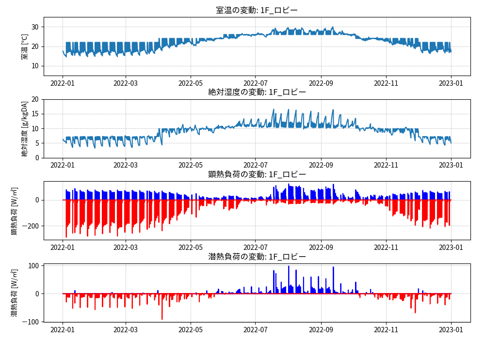
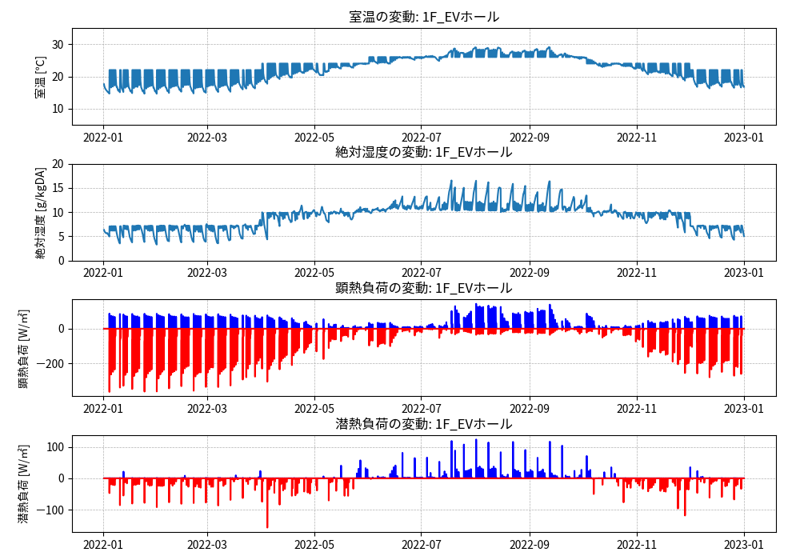
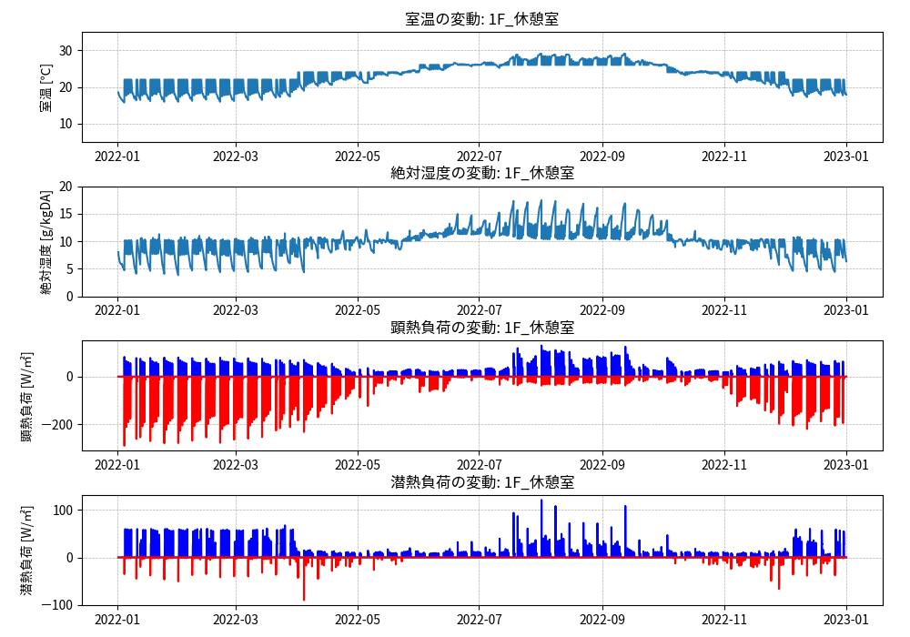
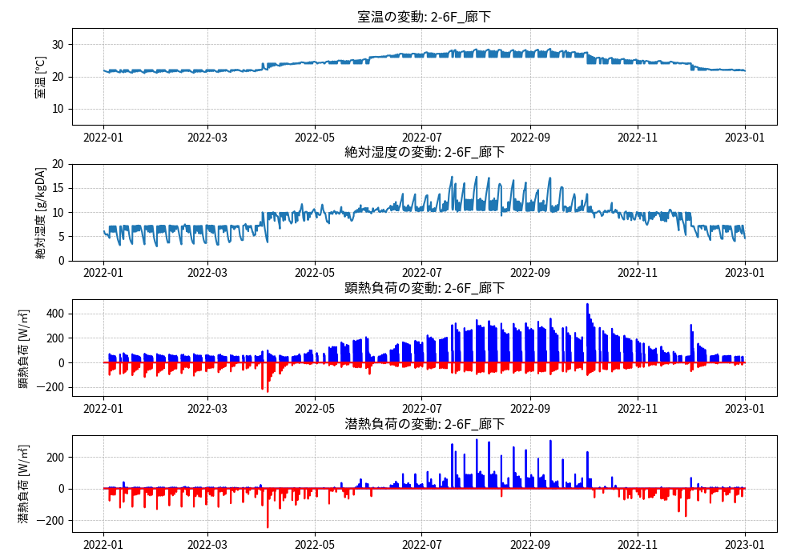
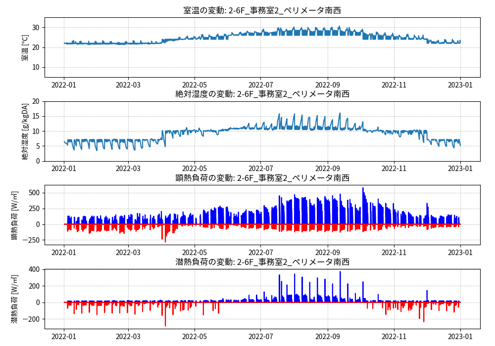
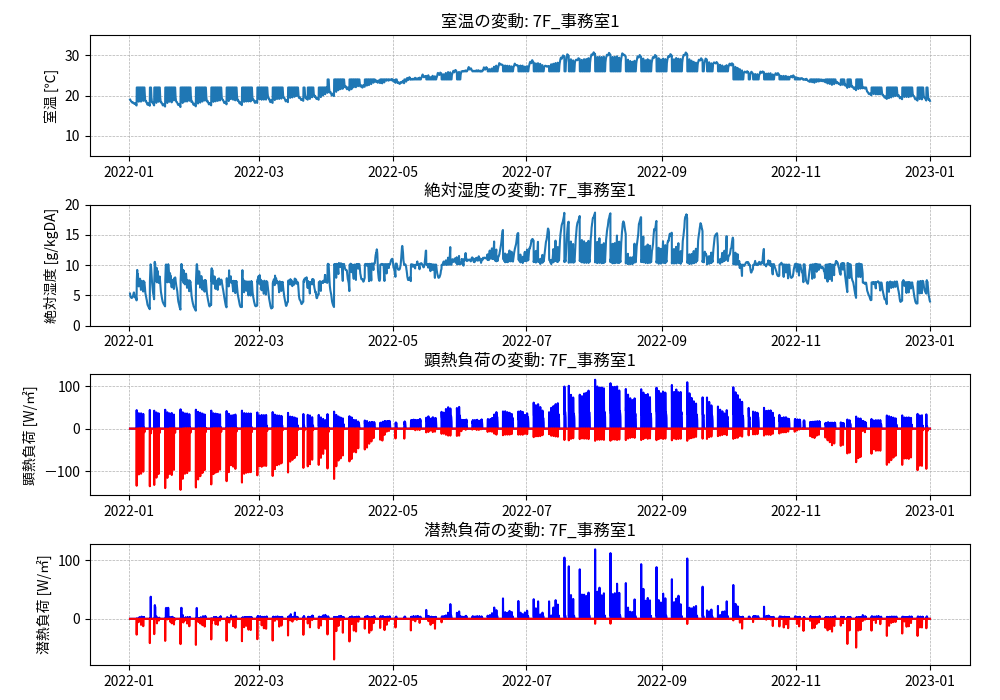

// Case 建物全体テスト

=== DesignBuilderによる建物形状等のモデル化 (2021/9/22)

==== 計算地点情報

....
計算地点は東京（北緯35.7°、東経139.8°）とする。
海抜0m、地物反射率10％とする。
....

.緯度経度、海抜、地物反射率の設定（Design Builder）
image::figures/caseWBT_001.png[図1,600]

....
斜面日射量の計算では天空放射輝度分布一様（Isotropicモデル）とする。
....

EnergyPlusでは、天空放射輝度分布一様（Isotropicモデル）を想定して計算がなされる。 +
参考：　https://bigladdersoftware.com/epx/docs/9-4/engineering-reference/sky-radiance-model.html[bigladder解説]

==== 建物形状

....
表5.3.1、図5.3.1から図5.3.9、表5.3.2に建物全体テストに用いるモデル建物の概要、平面図、矩計図、断面の詳細図、梁伏図、空調ゾーニング図、各居室の面積を示す。
これらをもとに建物の形状を入力する。床、天井の面積は表5.3.2に示す室面積（有効面積）を入力する。
....

.建物モデル 1階（Design Builder）

.建物モデル 2〜6階（Design Builder）

.建物モデル 7階（Design Builder）
image::figures/caseWBT_004.png[図4,600]

* 東側階段の前室は非空調では？

* 自動販売機コーナー横のSKの寸法が分からない。

image::figures/caseWBT_006.jpg[図6,600]

* 1階、7階はゾーニングする必要はない？

image::figures/caseWBT_007.jpg[図7,600]

=== EnergyPlus idfファイルの編集 (2021/10/18)

* 曜日の設定 +
* 助走計算の設定 +
* ゾーン間換気の設定 +
* 外気導入量の設定 +
* 室内温度設定値の変更（冬期22度、夏期26度の設定しか無く、中間期が設定されていなかった） +
* 室内湿度の設定 

==== 曜日の設定

1月1日を「日曜日」としたいため、気象データの日付を1989年（1989年は1月1日が日曜日）に設定し、
RunPeriod における Year を 1989年に設定した。また、Start Day をSundayに設定した。

.RunPeriodの設定
----
RunPeriod,
    RunPeriod 1,             !- Name
    1,                       !- Begin Month
    1,                       !- Begin Day of Month
    1988,                    !- Begin Year
    12,                      !- End Month
    31,                      !- End Day of Month
    1989,                    !- End Year
    Sunday,                  !- Day of Week for Start Day
    No,                      !- Use Weather File Holidays and Special Days
    No,                      !- Use Weather File Daylight Saving Period
    Yes,                     !- Apply Weekend Holiday Rule
    Yes,                     !- Use Weather File Rain Indicators
    Yes,                     !- Use Weather File Snow Indicators
    No;                      !- Treat Weather as Actual
----

==== 助走計算の設定

助走計算を2週間分行っているが、非空調となっているのか、1月4日の負荷がとても大きくなってしまう。
これを回避するために、RunPeriod における Begin Year を1988年に設定し、2年分計算させることにした。

.RunPeriodの設定
----
RunPeriod,
    RunPeriod 1,             !- Name
    1,                       !- Begin Month
    1,                       !- Begin Day of Month
    1988,                    !- Begin Year
    12,                      !- End Month
    31,                      !- End Day of Month
    1989,                    !- End Year
    Sunday,                  !- Day of Week for Start Day
    No,                      !- Use Weather File Holidays and Special Days
    No,                      !- Use Weather File Daylight Saving Period
    Yes,                     !- Apply Weekend Holiday Rule
    Yes,                     !- Use Weather File Rain Indicators
    Yes,                     !- Use Weather File Snow Indicators
    No;                      !- Treat Weather as Actual
----

==== ゾーン間換気の設定

ZoneMixing にゾーン間換気の設定を行った。ゾーン間空気移動量は境界長さあたり 150 m3/(h・m) とした。

.ZoneMixing
----
ZoneMixing,
    1F:01XCorridor_1,        !- Name
    1F:01XCorridor,          !- Zone Name
    On,                      !- Schedule Name
    Flow/Zone,               !- Design Flow Rate Calculation Method
    0.125,                   !- Design Flow Rate {m3/s}
    ,                        !- Flow Rate per Zone Floor Area {m3/s-m2}
    ,                        !- Flow Rate per Person {m3/s-person}
    ,                        !- Air Changes per Hour {1/hr}
    1F:03XEVHALL,            !- Source Zone Name
    0;                       !- Delta Temperature {deltaC}

ZoneMixing,
    1F:01XCorridor_2,        !- Name
    1F:01XCorridor,          !- Zone Name
    On,                      !- Schedule Name
    Flow/Zone,               !- Design Flow Rate Calculation Method
    0.083333333,             !- Design Flow Rate {m3/s}
    ,                        !- Flow Rate per Zone Floor Area {m3/s-m2}
    ,                        !- Flow Rate per Person {m3/s-person}
    ,                        !- Air Changes per Hour {1/hr}
    1F:08XVENDING,           !- Source Zone Name
    0;                       !- Delta Temperature {deltaC}

ZoneMixing,
    1F:01XCorridor_3,        !- Name
    1F:01XCorridor,          !- Zone Name
    On,                      !- Schedule Name
    Flow/Zone,               !- Design Flow Rate Calculation Method
    0.416666667,             !- Design Flow Rate {m3/s}
    ,                        !- Flow Rate per Zone Floor Area {m3/s-m2}
    ,                        !- Flow Rate per Person {m3/s-person}
    ,                        !- Air Changes per Hour {1/hr}
    1F:02XLOBBY,             !- Source Zone Name
    0;                       !- Delta Temperature {deltaC}
----

==== 室温設定値の指定（冷房期、中間期、暖房期）

室温設定値を冷房期、中間期、暖房期に分けて指定する。

まず、ゾーンの設定は次の通りとする。ゾーンの名称は「ROOM1」とする。

.Zoneの設定
----
Zone,
    ROOM1,                   !- Name
    0,                       !- Direction of Relative North {deg}
    0,                       !- X Origin {m}
    0,                       !- Y Origin {m}
    0,                       !- Z Origin {m}
    1,                       !- Type
    1,                       !- Multiplier
    ,                        !- Ceiling Height {m}
    1907.3599,               !- Volume {m3}
    366.8,                   !- Floor Area {m2}
    TARP,                    !- Zone Inside Convection Algorithm
    ,                        !- Zone Outside Convection Algorithm
    Yes;                     !- Part of Total Floor Area
----

ZoneControl:Thermostatの設定を行う。 +
名称は「ROOM1 Thermostat」とし、
引用する年間スケジュールの名称を「Zone Control Type Sched」と決めて入力する。 +
オブジェクトタイプは「ThermostatSetpoint:DualSetpoint」を選択し、
室温設定値のスケジュールを「Dual Setpoint」と決めて入力する。

.ZoneControl:Thermostat の設定
----
ZoneControl:Thermostat,
    ROOM1 Thermostat,                   !- Name
    ROOM1,                              !- Zone or ZoneList Name
    Zone Control Type Sched,            !- Control Type Schedule Name
    ThermostatSetpoint:DualSetpoint,    !- Control 1 Object Type
    Dual Setpoint Sched;                !- Control 1 Name
----

ZoneControl:Thermostatにおいて、
名称を「Zone Control Type Sched」と決めた年間スケジュールを次のように設定する。

.Schedule:Year の設定
----
Schedule:Year,
    Zone Control Type Sched, !- Name
    Control Type,            !- Schedule Type Limits Name
    Control Type Week Sch,   !- Schedule:Week Name 1
    1,                       !- Start Month 1
    1,                       !- Start Day 1
    12,                      !- End Month 1
    31;                      !- End Day 1

Schedule:Week:Daily,
    Control Type Week Sch,  !- Name
    Control Type Day Sch,  !- Sunday Schedule:Day Name
    Control Type Day Sch,  !- Monday Schedule:Day Name
    Control Type Day Sch,  !- Tuesday Schedule:Day Name
    Control Type Day Sch,  !- Wednesday Schedule:Day Name
    Control Type Day Sch,  !- Thursday Schedule:Day Name
    Control Type Day Sch,  !- Friday Schedule:Day Name
    Control Type Day Sch,  !- Saturday Schedule:Day Name
    Control Type Day Sch,  !- Holiday Schedule:Day Name
    Control Type Day Sch,  !- SummerDesignDay Schedule:Day Name
    Control Type Day Sch,  !- WinterDesignDay Schedule:Day Name
    Control Type Day Sch,  !- CustomDay1 Schedule:Day Name
    Control Type Day Sch;  !- CustomDay2 Schedule:Day Name

Schedule:Day:Hourly,
    Control Type Day Sch,    !- Name
    Control Type,            !- Schedule Type Limits Name
    4,                       !- Hour 1
    4,                       !- Hour 2
    4,                       !- Hour 3
    4,                       !- Hour 4
    4,                       !- Hour 5
    4,                       !- Hour 6
    4,                       !- Hour 7
    4,                       !- Hour 8
    4,                       !- Hour 9
    4,                       !- Hour 10
    4,                       !- Hour 11
    4,                       !- Hour 12
    4,                       !- Hour 13
    4,                       !- Hour 14
    4,                       !- Hour 15
    4,                       !- Hour 16
    4,                       !- Hour 17
    4,                       !- Hour 18
    4,                       !- Hour 19
    4,                       !- Hour 20
    4,                       !- Hour 21
    4,                       !- Hour 22
    4,                       !- Hour 23
    4;                       !- Hour 24
----

ZoneControl:Thermostatにおいて、
名称を「Dual Setpoint Sched」と決めた室温設定値のスケジュールを次のように設定する。 +
暖房時の室温設定値スケジュール、冷房時の室温設定値スケジュールともに名称を「Room Temp Setpoint Schedule」とする。

.ThermostatSetpoint:DualSetpoint の設定
----
ThermostatSetpoint:DualSetpoint,
    Dual Setpoint Sched,                  !- Name
    Room Temp Setpoint Schedule,              !- Heating Setpoint Temperature Schedule Name
    Room Temp Setpoint Schedule;              !- Cooling Setpoint Temperature Schedule Name
----

スケジュール「Room Temp Setpoint Schedule」は次のように定義する。

.Schedule
----
Schedule:Compact,
    Room Temp Setpoint Schedule,    !- Name
    Temperature,                    !- Schedule Type Limits Name

    Through: 31 Mar,                !- Field 1
    For: Weekdays  WinterDesignDay, !- Field 2
    Until: 24:00,                   !- Field 10
    22,                             !- Field 11

    Through: 31 May,                !- Field 1
    For: Weekdays,                  !- Field 2
    Until: 24:00,                   !- Field 10
    24,                             !- Field 11

    Through: 30 Sep,                !- Field 1
    For: Weekdays SummerDesignDay,  !- Field 2
    Until: 24:00,                   !- Field 10
    26,                             !- Field 11

    Through: 30 Nov,                !- Field 1
    For: Weekdays,                  !- Field 2
    Until: 24:00,                   !- Field 10
    24,                             !- Field 11

    Through: 31 Dec,                !- Field 16
    For: Weekdays,                  !- Field 17
    Until: 24:00,                   !- Field 10
    22;                             !- Field 11
----

暖房、冷房の動く時間帯、期間を次のように設定する。 +
暖房、暖房ともON/OFFスケジュールの名称は「ROOM1 Availability Sch」とする。

.ZoneHVAC:IdealLoadsAirSystem
----
ZoneHVAC:IdealLoadsAirSystem,
    ROOM1 Ideal Loads Air,   !- Name
    ,                        !- Availability Schedule Name
    Node ROOM1 In,           !- Zone Supply Air Node Name
    ,                        !- Zone Exhaust Air Node Name
    ,                        !- System Inlet Air Node Name
    35,                      !- Maximum Heating Supply Air Temperature {C}
    12,                      !- Minimum Cooling Supply Air Temperature {C}
    0.0156,                  !- Maximum Heating Supply Air Humidity Ratio {kgWater/kgDryAir}
    0.0077,                  !- Minimum Cooling Supply Air Humidity Ratio {kgWater/kgDryAir}
    LimitCapacity,           !- Heating Limit
    Autosize,                !- Maximum Heating Air Flow Rate {m3/s}
    Autosize,                !- Maximum Sensible Heating Capacity {W}
    LimitFlowRateAndCapacity,!- Cooling Limit
    7.947333,                !- Maximum Cooling Air Flow Rate {m3/s}
    Autosize,                !- Maximum Total Cooling Capacity {W}
    ROOM1 Availability Sch,  !- Heating Availability Schedule Name
    ROOM1 Availability Sch,  !- Cooling Availability Schedule Name
    Humidistat,              !- Dehumidification Control Type
    ,                        !- Cooling Sensible Heat Ratio {dimensionless}
    Humidistat,              !- Humidification Control Type
    ,                        !- Design Specification Outdoor Air Object Name
    ,                        !- Outdoor Air Inlet Node Name
    ,                        !- Demand Controlled Ventilation Type
    DifferentialDryBulb,     !- Outdoor Air Economizer Type
    Sensible,                !- Heat Recovery Type
    ,                        !- Sensible Heat Recovery Effectiveness {dimensionless}
    ;                        !- Latent Heat Recovery Effectiveness {dimensionless}
----

.Schedule
----
Schedule:Compact,
    ROOM1 Availability Sch,  !- Name
    Temperature,             !- Schedule Type Limits Name
    Through: 31 Dec,         !- Field 1
    For: Weekdays  WinterDesignDay SummerDesignDay,  !- Field 2
    Until: 07:00,            !- Field 3
    0,                       !- Field 4
    Until: 21:00,            !- Field 5
    1,                       !- Field 6
    Until: 24:00,            !- Field 7
    0,                       !- Field 8
    For: Weekends AllOtherDays,  !- Field 9
    Until: 24:00,            !- Field 10
    0;                       !- Field 11
----

==== 室内湿度の設定 

まず、湿度のスケジュールを次のように設定した。

.Schedule:Compact
----
! Modified schedule: On 24/7
Schedule:Compact,
    1F:01XCorridor Humidifying RH Schedule,  !- Name
    Any Number,              !- Schedule Type Limits Name
    Through: 31 Mar,         !- Field 1
    For: AllDays,            !- Field 2
    Until: 24:00,            !- Field 3
    40,                      !- Field 4
    Through: 30 Nov,         !- Field 5
    For: AllDays,            !- Field 6
    Until: 24:00,            !- Field 7
    0,                       !- Field 8
    Through: 31 Dec,         !- Field 9
    For: AllDays,            !- Field 10
    Until: 24:00,            !- Field 11
    40;                      !- Field 12

! Modified schedule: On 24/7
Schedule:Compact,
    1F:01XCorridor Dehumidifying RH Schedule,  !- Name
    Any Number,              !- Schedule Type Limits Name
    Through: 31 Mar,         !- Field 1
    For: AllDays,            !- Field 2
    Until: 24:00,            !- Field 3
    100,                     !- Field 4
    Through: 30 Nov,         !- Field 5
    For: AllDays,            !- Field 6
    Until: 24:00,            !- Field 7
    50,                      !- Field 8
    Through: 31 Dec,         !- Field 9
    For: AllDays,            !- Field 10
    Until: 24:00,            !- Field 11
    100;                     !- Field 12
----

加湿の設定は、ZoneControl:Humidistat で行う。

.ZoneControl:Humidistat
----
ZoneControl:Humidistat,
    1F:01XCorridor Humidistat,  !- Name
    1F:01XCorridor,          !- Zone Name
    1F:01XCorridor Humidifying RH Schedule,  !- Humidifying Relative Humidity Setpoint Schedule Name
    1F:01XCorridor Dehumidifying RH Schedule;  !- Dehumidifying Relative Humidity Setpoint Schedule Name
----

=== 計算結果（2021/10/18時点）

* 冷房負荷と暖房負荷が同時に発生する。

image::figures_caseWBT/建物全体テスト_温湿度と熱負荷のグラフ_7F_事務室2".png[図]

==== pepple

参考：　https://bigladdersoftware.com/epx/docs/9-4/input-output-reference/group-internal-gains-people-lights-other.html#people[bigladder解説]

peppleは、空間の状態に対する居住者の影響をモデル化するために使用される。
以下の定義では、基本的な影響に加えて、居住者グループの熱的快適性を報告するために使用できる情報を提供しています。
EnergyPlusには、Fanger、Pierce Two-Node、およびKansas State University Two-Nodeの熱的快適性モデルが用意されている。
ユーザーは、空気速度スケジュール名の後に適切な選択キーワードを追加するだけで、各Peopleステートメントにこれらのモデルのいずれかを選択することができます。
熱的快適性の計算は、これらの熱的快適性モデルの特定の要求を含む人々の声明に対してのみ行われます。.
このオブジェクトは、ゾーンの二酸化炭素シミュレーションのために、人々の活動レベルに基づく二酸化炭素発生率の入力も必要です。

===== Name

Peopleオブジェクトの名前です。すべてのPeopleオブジェクトで一意でなければなりません。

===== Zone or ZoneList Name

このフィールドはゾーン（参照：Zone）またはゾーンリスト（参照：ZoneList）の名前であり、
特定の人数定義を建物内のサーマルゾーンまたはサーマルゾーンのセットにリンクする。
ZoneListオプションを使用すると、この人数定義はゾーンリストの各ゾーンに適用され、ゾーン内の人数をグローバルに定義することになる。
Zonelistオプションは、人数計算方法のpeople/areaおよびarea/personオプションと一緒に使うと効果的です。

実際のピープル・オブジェクトの名前は、<ゾーン名> <ピープル・オブジェクト名> となり、
名前フィールドの標準的な長さ (100文字) 未満でなければなりません。
この標準的な長さよりも大きい場合は、切り捨てられてしまうため、出力レポートで指定することが困難になる場合があります。
生成された名前が100文字を超える場合は、警告が表示されます。
このように連結された他の名前と重複する場合、深刻なエラーが発生し、実行が終了します。

===== Number of People Schedule Name

このフィールドには、人数パラメーターを変更するスケジュール（参考：スケジュール）の名前を入力します（「人数計算方法と関連フィールド」参照）。
スケジュールの値は任意の正の数とすることができます。
このステートメントで定義されたゾーンの実際の人数は、人数フィールドとこのフィールドに名前で指定されたスケジュールの値の積である。

===== Number of People Calculation Method

このフィールドは、次の3つのフィールドのうちどのフィールドを埋めるかを示すキー／選択肢であり、ゾーン内の居住者（人）の公称数を計算する方法を記述します。キー／選択肢は以下の通りです。

人 +
この選択肢では、居住者（人）の数をそのまま挿入する方法が採用されます。(Number of Peopleフィールドは埋められていなければなりません。)

人/面積 +
この選択では、ゾーンの床面積あたりの係数が使用されます。(People per Zone Floor Areaフィールドが入力される必要があります)。

面積／人 +
この選択では、使用される方法は一人当たりの床面積の係数となります。(人あたりのゾーン床面積」フィールドが入力されている必要があります）。)

===== Number of People

このフィールドは、ゾーン内の最大人数を表すために使用され、それにスケジュール分数（スケジュールフィールドを参照）が掛けられます。
EnergyPlusでは、人数は実数のスケジュールに適用される「ダイバーシティ・ファクター」とすることができるため、若干柔軟性があります。
なお、スケジュールの値は時間ごとに変化しますが、人数のフィールドはすべてのシミュレーション環境で一定です。

===== People per Zone Floor Area

この係数（人/m2)は、ゾーンの床面積とともに使用され、「人数」欄に記載された最大人数を決定します。方法欄の選択は「人/面積」としてください。

===== Zone Floor Area per Person

この係数（m2/人）をゾーンの床面積と合わせて使用し、「人数」欄に記載された最大人数を決定します。方法欄の選択は「面積／人」としてください。

===== Fraction Radiant

このフィールドは0.0から1.0までの10進数で、ゾーン内の人間が発する熱の種類を特徴づけるために使用される。
このフィールドで指定された数値は、ゾーン内の人間からの長波長放射ゲインの量を与えるために、人間によって放出される総顕在エネルギーに乗算されます。
顕在負荷の残りは対流熱利得であると仮定する。なお、人からの潜熱は輻射熱と対流熱のどちらにも含まれない。
詳細はエンジニアリング・リファレンス・ドキュメントを参照のこと。デフォルト値は0.30です。

===== Sensible Heat Fraction

ユーザーはこのフィールドを使用して、このPEOPLEオブジェクトによるヒートゲインの固定顕在分を指定することができます。
通常、プログラムは顕在/潜熱の分割を計算しますが、このフィールドではユーザーがこの分割を制御できます。
このフィールドは自動計算されます。フィールドが空白または自動計算の場合、プログラムは顕在/潜熱の分割を計算し、値が入力された場合は、現在の総ヒートゲインの顕在率として使用されます。

===== Activity Level Schedule Name

このフィールドは、設計条件におけるゾーンの一人当たりのヒートゲインの量を決定するスケジュールの名前である。
このヒートゲインは、基本的なゾーンのヒートバランスや、熱的快適性のモデル化に影響を与える。
この値は、空間温度の変化を考慮して、相関関係に基づいて多少修正される。
スケジュールの値は任意の正の数であり、このパラメータの単位は一人当たりのワットである。
このスケジュールは、対流、輻射、潜熱を含む一人当たりの総ヒートゲインを表す。
内部のアルゴリズムにより、全体のうち顕在的なものと潜在的なものが判断されます。
そして、上記の「放射分数」で指定された値を用いて、顕在分を放射分と対流分に分けます。
詳細については、エンジニアリングリファレンスを参照してください。

活動レベルの値は、一般的なオフィス活動における1人当たり約100〜150ワットから、
競技レスリングなどの激しい身体活動における1人当たり900ワット以上までの範囲となります。
次の表（表1）は、2005 ASHRAE Handbook of Fundamentalsの8.6ページの表[table:wind-speed-profile-coefficients-ashrae]に基づいています。
ASHRAE HOFからの情報に加えて、活動レベルのスケジュール値に必要なW/Personの値の列が追加されています。
この欄には、標準的な成人の体表面積である1.8m2 を使用して、活動レベルをW/m2 を乗じる。
活動量計の値が正常な範囲を逸脱した場合、警告が表示されます。また、値が低すぎたり高すぎたりすると、熱的快適性の報告値が歪むことがあります。

===== Carbon Dioxide Generation Rate

この数値入力フィールドは、一人当たりの二酸化炭素発生率をm3/s-Wの単位で指定します。
このオブジェクトからの総二酸化炭素発生率は人の数 * 人のスケジュール * 人の活動 * 二酸化炭素発生率。デフォルト値は3.82E-8 m3/s-Wです（ASHRAE Standard 62.1-2007の一般成人を対象とした0.0084 cfm/met/personの値から取得）。
最大値はデフォルト値の10倍とすることができます。

===== Enable ASHRAE 55 comfort warnings

このフィールドには、「Yes」または「No」のいずれかを指定します。
Yesを指定すると、空間の状態がASHRAE 55の快適範囲外にある場合に警告が生成されます。
"Simplified ASHRAE 55-2004 Graph Related Outputs "および "Simplified ASHRAE 55 Warnings "の項で説明します。
デフォルトではこれらの警告は表示されませんので、空間が快適範囲外にあるかどうかを知りたい場合は、このフィールドを「Yes」に設定する必要があります。

===== Mean Radiant Temperature Calculation Type

このフィールドは、ユーザーが熱的快適性モデルに使用したい平均放射温度（MRT）計算のタイプを指定します。
現時点では、MRTの計算タイプには、ゾーン平均、表面加重、角度係数のリストの3つのオプションがあります。
デフォルトの計算は「ゾーン平均」で、フィールドが空白のままの場合に使用されます。
ゾーン平均MRT計算では、熱的快適性の計算に使用されるMRTは、ゾーン内の「平均」ポイントのものです。
MRTは、ゾーン内のすべての表面の面積放射率加重平均に基づいて計算されます。
すべての表面の放射率が十分に小さい（ゼロに近い）場合は、ゼロ除算のエラーを避けるために、平均放射温度は空間の平均気温に設定されます。

もう1つのMRT計算タイプは「SurfaceWeighted」です。
この計算タイプの目的は、すべての表面と空間内の人の位置に対する正確なビューファクターを定義することなく、
特定の表面の近くにいる空間内の人を推定することです。
表面加重計算タイプが選択された場合、熱的快適性の計算で使用されるMRTは、実際には、人が最も近い表面の温度（次のフィールド「表面名」で定義）とゾーン平均MRT（上記で定義）の平均です。
理論的には、人から任意の平らな表面への最大ビューファクターはおよそ0.5であるため、表面温度だけは使用されません。
表面加重の計算では、選択された表面はゾーン平均MRTの計算の一部であるため、実際には50％よりもわずかに重み付けされています。
繰り返しになりますが、この単純化は、ビューファクターや人の正確な位置の指定を避けるために行われました。

3つ目のオプションは「AngleFactor」を使用することです。
このオプションでは、人物からゾーン内の様々な表面までの角度係数を定義することで、空間内での人物の位置をより明確にすることができます。
このオプションでは、ユーザーは放射線の観点から人が見ることのできる表面をリストアップし、各表面の角度（またはビュー）ファクターを定義する必要があります。
ComfortViewFactorAnglesオブジェクト（次のオブジェクトの説明を参照）は、ユーザーにこの機会を与えることを目的としています。

===== Surface Name/Angle Factor List Name

このフィールドは、ユーザーがMRTの計算タイプに「SurfaceWeighted」または「AngleFactor」を選択した場合のみ有効です（前出の入力フィールドの説明を参照）。
SurfaceWeighted "の場合、このフィールドには、人々が居住するゾーン内のサーフェスの名前が入ります。
この表面は、特定の表面の近くにいる人のより代表的なMRTを算出するために、上記で定義されたMRTの計算に使用されます。
SurfaceWeighted "MRT計算方法を使用した熱的快適性の計算に使用されるMRTは、このフィールドで指定された表面の温度と "ゾーン平均 "MRT（上記の平均放射温度計算タイプフィールドを参照）の平均値です。
AngleFactor "の場合、このフィールドは別の場所で定義されたComfortViewFactorAngles入力オブジェクトの名前である。
このフィールドは、前のフィールドが「SurfaceWeighted」または「AngleFactor」に設定されていて、
Fanger、Pierce、またはKSUの熱的快適性モデルのいずれかを実行するように設定されている場合に必要です。

===== Work Efficiency Schedule Name

このフィールドは、熱的快適性の計算に使用される人体内のエネルギー使用効率を決定するスケジュールの名前です。
なお、ゾーンのヒートバランス計算では、身体で生成されたすべてのエネルギーが熱に変換されると仮定する。
値がゼロの場合、体内で生成されたすべてのエネルギーが熱に変換されます。
ユニティの値は、身体で生成されるエネルギーのすべてが機械的エネルギーに変換されることを意味する。
スケジュールで定義されたこのパラメータの値は、0.0から1.0の間でなければなりません。0より大きい値を設定すると、
熱が減少して空間内の人の熱的快適性のエネルギーバランスに影響を与え、その結果、PMVの結果が予想より低く表示される。
この値がゼロ以外の場合は、熱に変換された正味の活動量とゾーン条件が熱的快適性を維持するのに十分であることを保証するために、
基本的な活動レベルが選択されていることを確認してください。
このフィールドは、Fanger、Pierce、またはKSUの熱的快適性モデルのいずれかを実行する際に必要です。
この欄にスケジュールが記載されていても、熱的快適性モデルが選択されていない場合は、
警告メッセージが表示され、このスケジュールはエラーファイルに「unused」と記載されます。

===== Clothing Insulation Calculation Method

このフィールドは、次の2つのフィールドのうち、どのフィールドを埋めるかを示すキー／選択肢のフィールドで、
ゾーン内の居住者（人）の衣服の断熱値を計算する方法を記述しています。キー／選択肢は以下の通りです。

ClothingInsulationSchedule（衣類断熱スケジュール） +
この選択肢では、居住者（人）の衣類断熱値のスケジュールをそのまま挿入する方法が用いられます。(Clothing Insulation Schedule Nameフィールドは入力する必要があります。)

DynamicClothingModelASHRAE55 +
この選択では、ASHRAE RP-884およびRP-921データベースから抽出した6,333件の観測結果に基づいてSchiavon and Lee (2013)が開発した動的予測衣類断熱モデルが使用されます。このモデルは、以下の図のように、午前6時に測定された外気温度の関数として衣類の断熱性を変化させます。

計算方法スケジュール +
このオプションを選択すると、1日の異なる時間帯にどの方法を使用するかを決定するスケジュール（次のフィールドに入力）に応じて、使用する方法をClothingInsulationScheduleまたはDynamicClothingModelASHRAE55のいずれかにすることができます。このオプションを選択した場合、次のフィールド「衣類断熱計算方法のスケジュール名」は必須入力となります。

===== Clothing Insulation Calculation Method Schedule Name

このフィールドは、1日の特定の時間帯にどの衣類断熱方法（ClothingInsulationScheduleまたはDynamicClothingModelASHRAE55）を使用するかを指定します。
スケジュールの値が1の場合はClothingInsulationSchedule方式、
2の場合はDynamicClothingModelASHRAE55方式を意味します。
このフィールドは、「Clothing Insulation Calculation Method」フィールドが「CalculationMethodSchedule」に設定されている場合のみ必要です。
このフィールドを空白にしておくと、指定された衣類の断熱計算方法が使用され、シミュレーション中に変更されません。

===== Clothing Insulation Schedule Name

このフィールドは、シミュレーション期間の様々な時間帯に典型的なゾーンの居住者が着用する衣服の量を定義するスケジュールの名前です。ClothingInsulationScheduleを選択してください（"ClothingInsulationSchedule"）。
このパラメータは正の実数であり、単位はCloである。
Cloの典型的な値は、ASHRAE 2009 HOFの表7、9.8ページ（衣服のアンサンブルについて）および表[table:window-modeling-options]、9.9ページ（衣服の値について）に記載されています）またはwww.cbe.berkeley.edu/comforttool/。
このフィールドは、Fanger、Pierce、またはKSUの熱的快適性モデルのいずれかを実行する際に必要です。
ここにスケジュールが表示されていても、温熱環境モデルが選択されていない場合は、警告メッセージが表示され、
このスケジュールはエラーファイルに「unused」と記載されます。

===== Air Velocity Schedule Name

このフィールドは、シミュレーション期間中の空間内の空気の移動量を時間の関数として概算するスケジュールの名前です。
スケジュールの各数値は正の実数であり、単位はメートル毎秒である必要がある。
このフィールドは、Fanger、Pierce、またはKSの熱的快適性モデルのいずれかを実行する際に必要です。
ここにスケジュールが記載されていても、温熱環境モデルが選択されていない場合は、警告メッセージが表示され、
このスケジュールはエラーファイルに「unused」と記載されます。

===== Thermal Comfort Model Type (up to 5 allowed)

最後の1つから5つのフィールドはオプションで、EnergyPlus内の様々な熱的快適性モデルを起動するためのものです。
Fanger、Pierce、KSU、AdaptiveASH55、AdaptiveCEN15251というキーワードを入力することで、
ユーザーはこの特定の人の発言に対するFanger、Pierce Two-Node、Kansas State UniversityTwo-Node、およびASHRAE Standard 55とCEN Standard 15251の適応型快適モデルの結果を要求することができる。

AdaptiveASH55は、過去7日間の実行平均外気温度が10.0～33.5℃の場合にのみ適用されます。
AdaptiveCEN15251 は、過去 30 日間の実行平均外気温度が 10.0～30.0℃の場合にのみ適用されます。
なお、最大5つのモデルを指定することができるため、ユーザーは必要に応じて5つのモデルすべてを用いてEnergyPlusにこのPeople Statementで特定された人の熱的快適性を計算させることができる。
なお、KSUモデルは計算量が多く、シミュレーションの実行時間が大幅に増加する可能性があります。
熱的快適性の計算方法については、『エンジニアリング・リファレンス』を参照してください。

==== Sizing:Parameters

参考：　https://bigladdersoftware.com/epx/docs/9-4/input-output-reference/group-design-objects.html#sizingparameters[bigladder解説]

このオブジェクトでは、グローバルな冷暖房サイズ比を指定することができる。
これらの比率は、ゾーンレベルで、すべてのゾーンの冷暖房負荷と空気流量に適用される。
これらの新しい負荷と空気流量は、システムレベルの流量と容量の計算に使用され、すべてのコンポーネントのサイジング計算に使用される。
ユーザーは、計算されたゾーン設計流量シーケンスを平滑化するために使用できる移動平均ウィンドウの幅（負荷タイムステップ）を指定することもできます。
このパラメータの使用方法は以下の通りです。

===== Heating Sizing Factor

すべてのゾーン設計加熱負荷と風量に適用されるグローバル加熱サイズ比。

=====  Cooling Sizing Factor

すべてのゾーンの設計冷房負荷と風量に適用されるグローバル冷房サイズ比

===== Timesteps in Averaging Window

ゾーン設計流量シーケンスの平均化ウィンドウにおける負荷タイムステップの数。
デフォルトは1で、この場合、計算されたゾーン設計流量は負荷タイムステップで平均化される。

ゾーン設計空気流量の計算は、固定温度で加熱または冷却された空気が無限に供給される可能性を想定して実行される。
したがって、計算された設計風量は、負荷や負荷の変化がどれほど大きくても、また急激であっても、常に満たすことができる。
しかし、実際には、風量はダクトサイズとファンの容量によって制限されます。
理想的なゾーン設計流量の計算は、特にユーザーが夜間設定やセットバックのあるサーモスタットスケジュールを使用してサイジング計算を行っている場合、非現実的に大きな流量になる可能性があります。
計算されたゾーン設計流量は、常に負荷タイムステップの平均値である。
ユーザーは、サーモスタットの設定やセットバックの影響を軽減し、ウォームアップやクールダウンの流量が設計流量の計算を支配するのを防ぐために、より広範な平均を実行したいと思うかもしれません。
平均化ウィンドウの幅を指定することで、ユーザーはこれを行うことができます。

例えば、負荷計算のタイムステップが15分で、ユーザーが「平均化ウィンドウのタイムステップ」を4に指定した場合、ゾーンの設計空気流量は1時間の時間帯で平均化されます。
8を指定すると、2時間の期間で平均化されることになります。

==== Sizing:Zone

参考：　https://bigladdersoftware.com/epx/docs/9-4/input-output-reference/group-design-objects.html#sizingzone[bigladder解説]

Sizing:Zoneオブジェクトは、単一ゾーンのゾーン設計気流計算を行うために必要なデータを提供します。
この計算は、一定の温度と湿度で可変量の供給空気を想定している。
必要な情報は、ゾーン入口の給気条件、すなわち冷暖房の温度と湿度の比率である。
この計算は、入力に含まれるすべての設計日に対して行われる。
最大冷房負荷と風量、最大暖房負荷と風量は、システムレベルの設計計算やコンポーネントの自動サイジング計算のために保存されます。

Sizing:Zoneオブジェクトは、設計仕様の外気オブジェクトの名前を参照することで、ユーザーが設計外気流量を指定できる場所でもあります。
このデータは、システムのサイジング計算や、外気を使用するゾーン・コンポーネントのサイジングに使用するために保存されます。

ユーザーは、暖房および冷却設計空気流量に制限を設けることもできます。
以下の「暖房設計風量法」および「冷房設計風量法」と、各暖房・冷房風量入力フィールドの説明を参照してください。
ユーザーは、ゾーン設計計算において、専用外気システムがゾーン設計負荷と風量に与える影響を考慮するよう求めることができます。
設計計算では、理想化されたSOAシステムのゾーンへの熱付加率を計算し、その結果をゾーンの総負荷と流量に加減します。

===== Zone Name

このSizing:Zoneオブジェクトに対応するゾーンの名前。これは、このSizing:Zoneオブジェクトの入力データを使用して、設計風量の計算が行われるゾーンである。

===== Zone Cooling Design Supply Air Temperature Input Method

入力は、SupplyAirTemperatureまたはTemperatureDifferenceのいずれかでなければならない。
SupplyAirTemperature は、ゾーン冷却設計供給空気温度のフィールド入力が、ゾーン冷却設計空気流量の決定に使用されることを意味する。
TemperatureDifference は、ゾーン冷却設計供給空気温度差のフィールドの入力が、ゾーン冷却設計空気流量を決定するために使用されることを意味する。

===== Zone Cooling Design Supply Air Temperature

ゾーン冷却設計風量計算のための供給空気温度（摂氏）。
冷房設計日のシミュレーションでは、この温度の空気がゾーンに供給される。
ゾーンの負荷は、ゾーン空気流量を変化させることで満たされる。最大ゾーン流量は、ゾーン冷却設計風量として保存される。
このフィールドは、Zone Cooling Design Supply Air Temperature Input Method = SupplyAirTemperatureの場合にのみ使用される。

===== Zone Cooling Design Supply Air Temperature Difference

ゾーンの冷房設計空気流量を計算するための、冷房設計供給空気温度と室内空気温度の温度差（摂氏）。
冷房設計日のシミュレーションでは、この温度の空気がゾーンに供給される。
ゾーン負荷は、ゾーン風量を変化させることで満たされる。最大ゾーン流量は、ゾーン冷却設計風量として保存される。
このフィールドは、Zone Cooling Design Supply Air Temperature Input Method = TemperatureDifferenceの場合にのみ使用される。

===== Zone Heating Design Supply Air Temperature Input Method

入力は、SupplyAirTemperatureまたはTemperatureDifferenceのいずれかでなければならない。
SupplyAirTemperatureは、ゾーン暖房設計供給空気温度のフィールドからのユーザー入力が、ゾーン暖房設計空気流量の決定に使用されることを意味する。
温度差とは、ゾーン暖房設計供給空気温度差のフィールドからのユーザーの入力が、ゾーン暖房設計空気流量の決定に使用されることを意味する。

===== Zone Heating Design Supply Air Temperature

ゾーン暖房設計風量計算のための供給空気温度（摂氏）。暖房設計日のシミュレーションでは、この温度の空気がゾーンに供給される。
ゾーンの負荷は、ゾーンの空気流量を変化させることで満たされる。
ゾーンの最大流量は、ゾーン暖房設計風量として保存されます。
このフィールドは、Zone Heating Design Supply Air Temperature Input Method = SupplyAirTemperatureの場合にのみ使用される。

===== Zone Heating Design Supply Air Temperature Difference

ゾーンの暖房設計風量を計算するための、暖房設計供給空気温度と室内空気温度の温度差（摂氏）。
暖房設計日のシミュレーションでは、この温度の空気がゾーンに供給される。ゾーンの負荷は、ゾーン風量を変化させることで満たされる。
ゾーンの最大流量は、ゾーン暖房設計風量として保存されます。
このフィールドは、Zone Heating Design Supply Air Temperature Input Method = TemperatureDifferenceの場合にのみ使用される。

===== Zone Cooling Design Supply Air Humidity Ratio

ゾーン冷房設計風量計算における供給空気の乾燥空気1キログラムあたりの水のキログラム単位の湿度比。

===== Zone Heating Design Supply Air Humidity Ratio

ゾーン暖房設計風量計算における給気の乾燥空気1キログラムあたりの水のキログラム単位の湿度比。

===== Design Specification Outdoor Air Object Name

このアルファ・フィールドは、ゾーンの設計外気流量を指定するDesignSpecification:OutdoorAirオブジェクトの名前を指定する。
DesignSpecification:OutdoorAirオブジェクトのOutdoor Air MethodフィールドにIndoorAirQualityProcedureの選択肢が入力されると、同じフィールドのSumの選択肢に基づいて設計外気流量が計算される。
ProportionalControlBasedOnDesignOccupancy または ProportionalControlBasedonOccupancySchedule の選択が入力された場合、設計外気流量は、エンジニアリングリファレンスの「Proportional Control」のセクションで指定された方程式に基づいて計算されます。

===== Zone Heating Sizing Factor

この入力は、ゾーンレベルの暖房サイズ比である。ゾーンの設計暖房空気流量および負荷は、このフィールドに入力された数値を乗じて得られる。
この入力は、Sizing:Parametersオブジェクトの建物レベルのサイズ調整係数の入力よりも優先されます。
もちろん、このフィールドが空白またはゼロの場合は、Sizing:Parametersオブジェクトのグローバルな暖房のサイズ調整係数が使用されます。

===== Zone Cooling Sizing Factor

この入力は、ゾーンレベルの冷却サイズ比である。
ゾーン設計の冷却風量および負荷は、このフィールドに入力された数値を乗じて算出される。
この入力は、Sizing:Parametersオブジェクトに入力された建物レベルのサイジング係数よりも優先される。
もちろん、このフィールドが空白またはゼロの場合は、Sizing:Parametersオブジェクトのグローバル冷却サイズ係数が使用される。

===== Cooling Design Air Flow Method

入力は、Flow/Zone、DesignDay、または DesignDayWithLimit のいずれかでなければならない。Flow/Zoneは、プログラムがフィールドCooling Design Air Flow Rateの入力をゾーン設計冷却空気流量として使用することを意味する。DesignDayとは、プログラムがSizing:Zoneの入力データと設計日のシミュレーションを用いて、最小外気要求によって設定された制限以外の制限を課すことなく、ゾーン設計冷房空気流量を算出することを意味する。DesignDayWithLimitとは、「ゾーン床面積当たりの冷却最小風量」と「冷却最小風量」の最大値が、設計最大冷却風量の下限値を設定することを意味する。既定の方法はDesignDay：すなわち、プログラムは換気要件を条件として計算された設計値を使用する。

===== Cooling Design Air Flow Rate

設計ゾーンの冷却空気流量を立方メートル／秒で示す。この入力は、「Cooling Design Air Flow Method」が「Flow/Zone」と指定されている場合に使用される。この値には、グローバルまたはゾーンサイジングファクターとゾーンマルチプライヤーが乗じられる。

===== Cooling Minimum Air Flow per Zone Floor Area

平方メートルあたりのゾーン冷却最小体積流量（単位はm3/s-m2）。このフィールドは、「Cooling Design Air Flow Method」が「DesignDayWithLimit」と指定されている場合に使用される。この場合には、ゾーン設計冷却空気流量の下限を設定する。どのような場合でも、ゾーン床面積当たりの冷却最小風量、冷却最小風量、冷却最小風量フラクション、および設計外気風量（VRP調整を含む）から得られる最大風量を用いて、VAVシステムのゾーンの最小給気風量を設定する。既定値は0.000762で、0.15cfm/ft2に相当する。適用されるサイジングファクターは、この値には適用されない。

===== Cooling Minimum Air Flow

ゾーン冷却の最小体積流量（単位：m3/s）。このフィールドは、Cooling Design Air Flow MethodがDesignDayWithLimitとして指定されている場合に使用される。この場合には、ゾーン設計冷却空気流量の下限を設定する。すべての場合において、ゾーン床面積当たりの冷却最小空気流量、冷却最小空気流量、冷却最小空気流量フラクション、および設計外気流量（VRP調整を含む）から得られた最大流量が、VAVシステムのゾーンの最小供給空気流量を設定するために使用される。デフォルトはゼロである。適用されるサイジングファクターはこの値には適用されない。

===== Cooling Minimum Air Flow Fraction

ゾーン設計冷却体積流量の端数として表されるゾーン設計冷却体積流量の最小値。どのような場合でも、「ゾーン床面積当たりの冷却最小空気流量」、「冷却最小空気流量」、「冷却最小空気流量分数」から得られる最大流量と、設計外気流量（VRP調整を含む）を用いて、VAVシステムのゾーンの最小給気流量を設定する。既定値は 0.2 である。この入力は現在、VAVエアターミナルユニットおよびファンの最小流量のサイズ決定に使用される。現在、他のコンポーネントの自動サイジングには影響しない。

===== Heating Design Air Flow Method

入力は、Flow/Zone、DesignDay、または DesignDayWithLimit のいずれかでなければならない。Flow/Zoneは、プログラムがフィールドHeating Design Air Flow Rateの入力をゾーン設計加熱空気流量として使用することを意味する。DesignDayとは、プログラムがSizing:Zoneの入力データと設計日のシミュレーションを使用して、最低外気要件で設定された制限以外の制限を課すことなく、ゾーン設計暖房空気流量を計算することを意味する。DesignDayWithLimitとは、「ゾーン床面積あたりの暖房最大風量」および「暖房最大風量」の最大値により、設計最大暖房風量の下限値を設定することを意味する。既定の方法はDesignDayです。つまり、プログラムは換気要件を条件として計算された設計値を使用します。

===== Heating Design Air Flow Rate

設計ゾーンの暖房空気流量を立方メートル/秒で表したもの。この入力は、「暖房設計空気流量方法」が「流量／ゾーン」と指定されている場合に使用されます。この値には、グローバルまたはゾーンサイジングファクターとゾーンマルチプライヤーが掛けられます。

===== Heating Maximum Air Flow per Zone Floor Area

平方メートルあたりのゾーン暖房最大体積流量（単位はm3/s-m2）。このフィールドは、Heating Design Air Flow MethodがDesignDayWithLimitとして指定されている場合に使用される。この場合、ゾーン設計暖房用空気流量の上限を設定する。このフィールドと次の2つの入力フィールドでは、ゾーン床面積あたりの暖房最大風量、暖房最大風量、および暖房最大風量分数から得られる最大風量を使用して、VAVシステムのゾーンの最大暖房供給風量を設定する。既定値は0.002032で、0.40cfm/ft2に相当します。これらの入力フィールドを使って計算された最大暖房設計流量が、サイジング中に計算された設計暖房流量よりも大きい場合、これらの入力フィールドはサイジングに影響を与えません。最大暖房設計流量の計算には、これら3つのフィールドのうち1つだけを選択する方が適切な場合があります（つまり、これら3つのフィールドのうち1つ以上が0の場合は、最大暖房設計流量の計算には使用されません）。

===== Heating Maximum Air Flow

ゾーン暖房の最大体積流量（単位：m3/s）。このフィールドは、「暖房設計気流方法」がDesignDayWithLimitとして指定されている場合に使用される。この場合、ゾーン設計暖房空気流量の上限を設定する。このフィールドおよびその前後の2つの入力フィールドでは、ゾーン床面積あたりの暖房最大風量、暖房最大風量、および暖房最大風量分数から得られる最大風量を使用して、VAVシステムのゾーンの最大暖房供給風量を設定する。既定値は0.1415762で、300cfmに相当します。これらの入力フィールドを使用して計算された最大暖房設計流量が、サイジング時に計算された設計暖房流量よりも大きい場合、これらの入力フィールドはサイジングに影響を与えない。最大暖房設計流量の算出には、これら3つのフィールドのうち1つだけを選択する方が適切な場合がある（すなわち、これら3つのフィールドのうち1つ以上が0の場合、最大暖房設計流量の算出には使用されない）。

===== Heating Maximum Air Flow Fraction

ゾーン設計最大暖房流量をゾーン設計冷房流量の割合で表したもの。本フィールドおよび前の2つの入力フィールドでは、ゾーン床面積当たりの暖房最大風量、暖房最大風量、および暖房最大風量分数から得られる最大風量を用いて、VAVシステムのゾーンの最大暖房供給空気流量を設定する。既定値は0.3です。これらの入力フィールドを使用して計算された最大暖房設計流量が、サイジング中に計算された設計暖房流量よりも大きい場合、これらの入力フィールドはサイジングに影響を与えません。最大暖房設計流量を計算するには、これら3つのフィールドのうち1つだけを選択する方が適切な場合があります（つまり、これら3つのフィールドのうち1つ以上が0の場合は、最大暖房設計流量の計算には使用されません）。

===== Design Specification Zone Air Distribution Object Name

ゾーンまたはゾーン・リストに適用される空気分配の有効性と二次再循環空気の割合を定義するDesignSpecification:ZoneAirDistributionオブジェクトの名前。このオブジェクトは、DesignSpecification:ZoneAirDistributionオブジェクトが指定されていない場合、Controller:MechanicalVentilationオブジェクトの同じゾーンに使用することができる。

===== Account for Dedicated Outdoor Air System

デフォルトはNoである。Yesを選択すると、ゾーンサイジング計算では、後続の入力を使用して、専用外気システム（DOAS）によってゾーンに課せられるヒートゲインまたはロス（ヒートゲインは正、ヒートロスは負）を計算する。そして、このヒートゲインをゾーンの設計ヒートゲインに加え、DOASのヒートゲインとゾーンの設計ヒートゲインを満たすようにゾーンの設計風量を調整する。

===== Dedicated Outdoor Air System Control Strategy

これは、DOAシステムの理想的な制御戦略を3つの中から選ぶ選択フィールドです。選択肢は「NeutralSupplyAir」、「NeutralDehumidifiedSupplyAir」、「ColdSupplyAir」です。デフォルトは「NeutralSupplyAir」です。

NeutralSupplyAirは、ゾーンに供給される換気空気がほとんど加熱または冷却されないことを意味します。空気は、後続の2つのフィールドで指定された低温と高温の設定値の間を保つように加熱または冷却されます。これらのフィールドには、21.1℃と23.9℃が適しています。

NeutralDehumidifiedSupplyAirは、換気用空気を冷却して除湿した後、中性の温度に再加熱することを意味します。換気用空気は、（必要に応じて）下側の設定温度まで冷却され、上側の設定温度まで再加熱されます。設定値としては、14.4度と22.2度が良いでしょう。

ColdSupplyAirは、換気用の空気をゾーンへの冷却供給に使用することを意味します。冷たい外気は上限の設定値まで加熱され、暖かい外気は下限の設定値まで冷却されます。設定値としては、12.2℃と14.4℃が良いでしょう。

===== Dedicated Outdoor Air Low Temperature Setpoint for Design

DOAS設計制御戦略で使用する低めの設定点温度。デフォルトでは、3つの設計制御戦略について上記の値に自動設定されます。

===== Dedicated Outdoor Air High Temperature Setpoint for Design

DOASの設計制御戦略で使用する高い方のセットポイント温度です。単位は℃で、デフォルトは3つのデザイン制御戦略について上記の値に自動設定されます。

