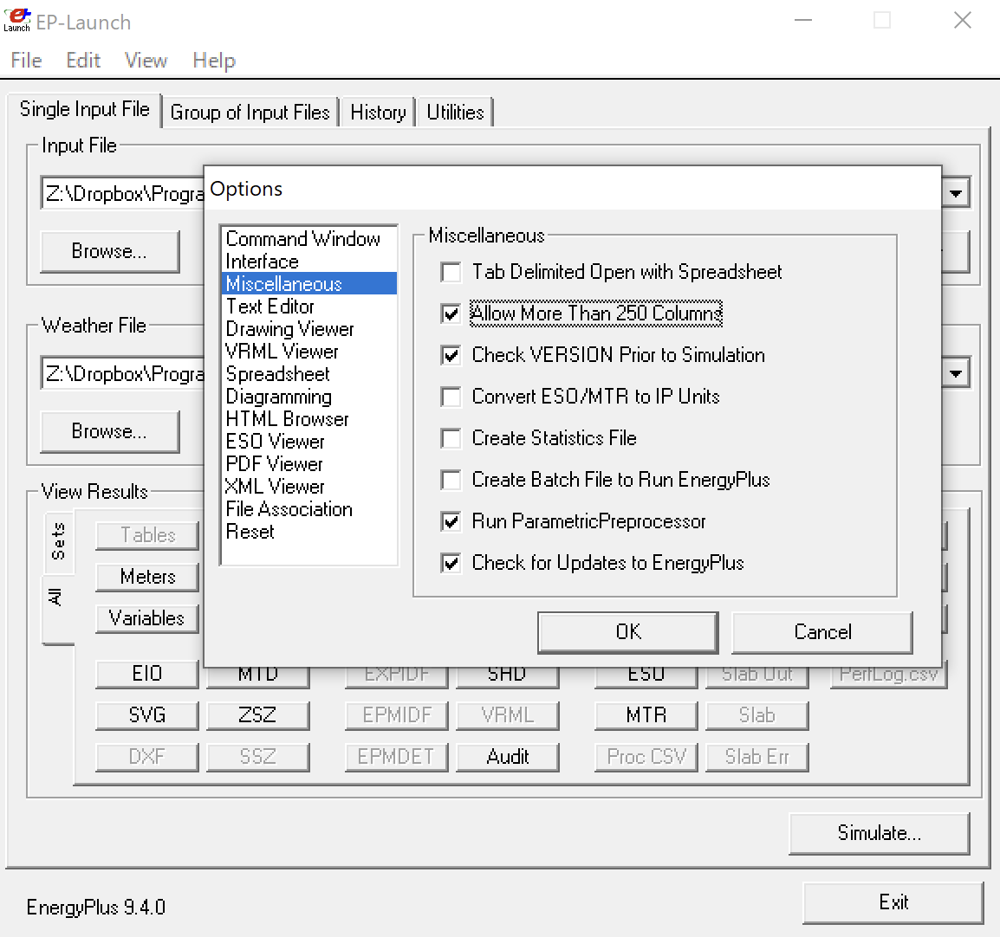

// 計算結果ファイル

=== rddファイル

rddファイル（コマンド Output:VariableDictionary,regular; もしくは Output:VariableDictionary,IDF; を指定することにより生成）には、
現在の入力ファイルに対して出力可能なすべての出力変数のリストが表示されます。
各シミュレーションは異なる出力変数を持値増すが、中には一定のものもあります（例えば、環境/外界に関する変数など）。
利用可能な出力変数を知るためには、ユーザーはまずシミュレーションを一度実行する必要があります。
この出力ファイルには、通常のもの（Input Output Referenceに記載されているもの）とIDF（Input Fileにコピー＆ペーストできるもの）の2種類があります。
このファイルが生成されると、IDFエディタでは Output:Variable に使用することができます。 +
また、Output:VariableDictionary,regular,Name;　とすることで出力を名前でソートすることもできます。

参考：　https://bigladdersoftware.com/epx/docs/9-4/output-details-and-examples/eplusout-rdd.html#eplusout.rdd[bigladder解説]

=== mddファイル

mddファイル（コマンド Output:VariableDictionary,regular; もしくは Output:VariableDictionary,IDF; を指定することにより生成）には、
現在の入力ファイルに対して出力可能なすべてのレポートメーターのリストが表示されます。
利用可能なレポートメーターを知るためには、まずシミュレーションを一度実行する必要があります。
この出力ファイルには、通常のもの（Input Output Referenceに記載されているもの）とIDF（Input Fileにコピー＆ペーストできるもの）の2種類があります。
このファイルが生成されると、IDFエディタでは Output:Meter もしくは Output:CumulativeMeter に使用できます。 +
メーターは常にZoneのタイムステップに累積されることに注意してください。これらは常に積算値です。

参考：　https://bigladdersoftware.com/epx/docs/9-4/output-details-and-examples/eplusout-mdd.html#eplusout.mdd[bigladder解説]

=== mtdファイル

このファイルには、「メーターの詳細」が記されています。 +
これは、どのレポート変数がどのメーターにあるか、また逆に、どのメーターがどのレポート変数を含んでいるかを示しています。 +
メーター詳細ファイルは2つの部分で構成されています。

メーター上にあるレポート変数については、そのレポート変数が載っているすべてのメーターを示しています。 +
次の例では、「Meters for　<レポート変数#>、<レポート変数名>」が表示され、その変数の値を「メーター」として累積するメーターが表示されます。

----
Meters for 1240,SPACE1-1:Lights-Electric Energy [J]
  OnMeter = Electricity:Facility [J]
  OnMeter = Electricity:Building [J]
  OnMeter = Electricity:Zone:SPACE1-1 [J]
  OnMeter = InteriorLights:Electricity [J]
  OnMeter = InteriorLights:Electricity:Zone:SPACE1-1 [J]
Meters for 1460,SPACE1-1:Zone Air System Sensible Heating Energy [J]
  OnMeter = EnergyTransfer:Facility [J]
  OnMeter = EnergyTransfer:Building [J]
  OnMeter = EnergyTransfer:Zone:SPACE1-1 [J]
  OnMeter = Heating:EnergyTransfer [J]
Meters for 1557,SPACE1-1 ZONE COIL:Heating Coil Heating Energy [J]
  OnMeter = EnergyTransfer:Facility [J]
  OnMeter = EnergyTransfer:HVAC [J]
  OnMeter = HeatingCoils:EnergyTransfer [J]
----

各メーターについて、そのメーターを構成するレポート変数が表示されます。 +
次の例では、「For Meter = ＜メーターの名前＞、contents are:」、その「メーター」に生じる各変数が表示されています。

----
For Meter = Electricity:Facility [J], contents are:
  SPACE1-1 LIGHTS 1:Lights Electric Energy
  SPACE2-1 LIGHTS 1:Lights Electric Energy
  SPACE3-1 LIGHTS 1:Lights Electric Energy
  SPACE4-1 LIGHTS 1:Lights Electric Energy
  SPACE5-1 LIGHTS 1:Lights Electric Energy
  SPACE1-1 ELECEQ 1:Electric Equipment Electric Energy
  SPACE2-1 ELECEQ 1:Electric Equipment Electric Energy
  SPACE3-1 ELECEQ 1:Electric Equipment Electric Energy
  SPACE4-1 ELECEQ 1:Electric Equipment Electric Energy
  SPACE5-1 ELECEQ 1:Electric Equipment Electric Energy
  SUPPLY FAN 1:Fan Electric Energy
  CENTRAL CHILLER:Chiller Electric Energy
  HW CIRC PUMP:Pump Electric Energy
  CW CIRC PUMP:Pump Electric Energy
----

=== EPlaunchにて実行する際におけるCSVファイルの制限

EPlaunchにてEnergyplusを実行する際、初期設定では出力されるCSVファイルの列数が250に制限されている。 +
EPlaunchのOptions画面において「Allow More Than 250 Columns」にチェックを入れると、この制約を解除してより多くの変数を一度に出力することができる。

.EPLaunchの設定

