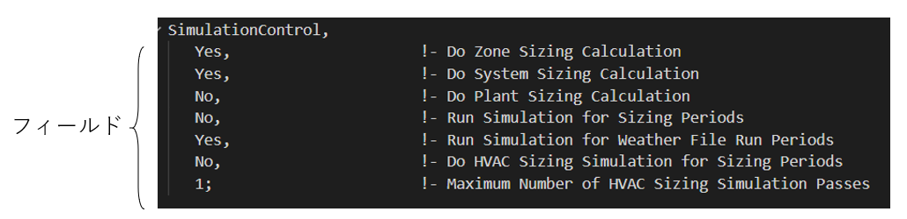

:toc: left
:toclevels: 2
:toc-title: 目次
:sectnums:
:sectnumlevels: 4
:sectlinks:

== はじめに
EnergyPlus初心者がAS140-2017のCase600を計算できるようになるまでのメモです

== EnergyPlusとは
原文はlink:https://energyplus.net/[こちら]を参照。 +
EnergyPlus™は、建物全体のエネルギーシミュレーションプログラムで、建物内の冷暖房、換気、照明、コンセント負荷などのエネルギー消費と水使用の両方をモデル化する。主な特徴は以下。

* 熱ゾーンの状態とHVACシステムの応答を統合して同時に解くことができる。HVACシステムがゾーン熱負荷を満たすことを前提とせず、無空調および低空調の空間をシミュレート可能。
* 輻射および対流の熱バランスに基づいた解法により、表面温度を算出でき、熱的快適性と結露の計算が可能。
* ユーザーが定義可能な1時間未満単位の時間ステップにより、熱ゾーンとHVACシステム間の相互作用を算出する。EnergyPlusはシミュレーションのスピードと精度を両立させながら、高速なダイナミクスを持つシステムをモデル化することができる。
* ゾーン間の空気の動きを考慮した熱質量移送モデル（combined heat and mass transfer models）
* 制御可能なブラインド、electrochromic glazing、窓ガラスに吸収される太陽エネルギーを層ごとのヒートバランスに基づき計算する高度な開口部モデル
* 視覚的な快適さをレポートし、照明制御を行うための照度とグレアの計算
* 標準的なシステム構成と新しいシステム構成の両方をサポートするコンポーネントベースのHVAC
* 数多くのHVACおよび照明制御ロジックを内蔵し、ユーザー定義の制御のための拡張可能なruntime scripting systemを搭載
* 他のエンジンとの連成シミュレーションのためのFunctional Mockup Interface (FMI)のインポートおよびエクスポート
* 標準的なサマリーレポートおよび詳細レポートに加え、年間から毎時までの時間分解能を選択できるユーザー定義のレポート

== IDFファイルについて
入力データファイル（input data file, idf）は、EnergyPlusが建物シミュレーションの作成に使用する主要ファイル。そのため、適切にidfファイルを作成することが肝要である。原文はlink:https://bigladdersoftware.com/epx/docs/9-4/input-output-reference/what-s-different-about-energyplus-input.html#general-input-rules[こちら]を参照。

=== 実行時の処理
* 各モジュールは通常、最初に呼び出されたときにすべての入力を取得する。
* 入力データファイルに順番は必要ない。
* 特定のシミュレーションで必要とされないデータは処理されない。
* SO DesignDayは、Design Day（DesignとDayの間に1つのスペース）やDesign Day（DesignとDayの間に2つのスペース）と同じではない。しかし、アルファ・オブジェクト（文字列を指す？）は大文字と小文字を区別しないので、DesignDayは'designday'や'SizingPeriod:DesignDay'と同じになる。

=== 入力ルール
* 入力に用いられる追加のファイルは特定のオブジェクト（Schedule:Fileオブジェクトなど）から参照される。
* 入力データは順番に関係なく、EnergyPlusのシミュレーションモジュールが必要に応じてデータを取得し、ソートする。さらに、EnergyPlusはすべてを動的に割り当てるため、ゾーンやサーフェスなどの数に制限はない。
* 入力オブジェクトの最初の行には、コンマまたはセミコロンを入れなければならない（MUST）。
* フィールドは行の境界を越えてはならない。通常、コンマまたは（適切な）セミコロンが行の最後のフィールド値でない場合は、フィールドが挿入される。コンマで区切られていれば、複数のフィールドが1行に表示可能。最後にセミコロンを付けることも可能。
* カンマはフィールドを区切る。したがって、フィールドにカンマを埋め込むことはできない。エラーは発生しないが、思い通りの結果は得られない。フィールド内のカンマに対応するために、フィールドを “ で囲むことはできない。
* 空白行は可能。
* 感嘆符「！」によってコメントアウトされ、感嘆符の後の行にあるものは無視される。
* 入力レコードの長さ（入力行の長さ）は最大500文字。それ以上の長さにしてもエラーにはならないが、、思い通りの結果は得られない。
* 入力データファイルの各アルファ文字列（アルファフィールド長）は、最大100文字。それを超えるものは切り捨てられる。これは、フィールド内のすべての名前（ゾーン名、ノード名、スケジュール名など）に適用される。
* タブなどの特殊文字は、ファイルに含めるべきではない。ただし、タブはスペースに変換されるので、対応可能。すべての数値は柔軟に入力することができ、単精度変数に処理される（例：1.0、1.000、1、.1E+1はすべて同じように処理される）。

=== 出力
* サマリーレベルまたは詳細（変数）レベルのいずれかが出力される。
* サマリーレポートはサイジング結果だけでなく、多くの入力に対して存在する。
* より詳細な変数レベルのレポートは、より適切な表示のためには後処理が必要。
* 「変数」および「出力変数」（Output:Variableおよび/またはOutput:Meterオブジェクト）という用語は互換的に使用されることに注意。
* ほとんどのEnergyPlusレポートは、エクセルまたは “delimited variable ”レポートを処理できるその他のソフトウェアで簡単に見られる。EnergyPlusのレポートは、コンマで区切られたレポートから、“スタイル ”オブジェクトを使ってユーザーがデリミタ（コンマ、スペースなど）を選択できるように徐々に移行している。
** Tab - .tabの拡張子を持つレポートは、タブをデリミタとする。これらのレポートファイルは「eplus<xxx>.tab」のような名前になり、<xxx>はレポートの種類の短い名前（例：Zszはゾーンサイジング、Mapはデイライティングマップ）。
** Csv - .csvの拡張子を持つレポートでは、デリミタとしてカンマが使用される。
** Txt - .txtの拡張子を持つレポートは、デリミタとしてスペースが利用されている。
** Html - .htmlの拡張子を持つレポートは、ウェブ・ブラウザに対応している。

== DesignBuilderでのモデリング

== IDFファイルの修正

== 計算結果の整理

