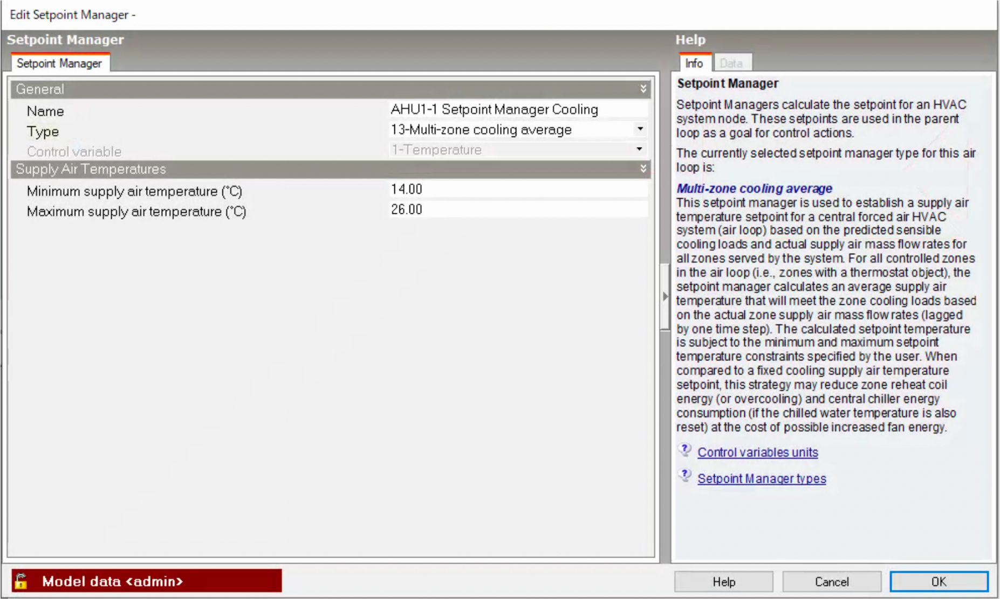
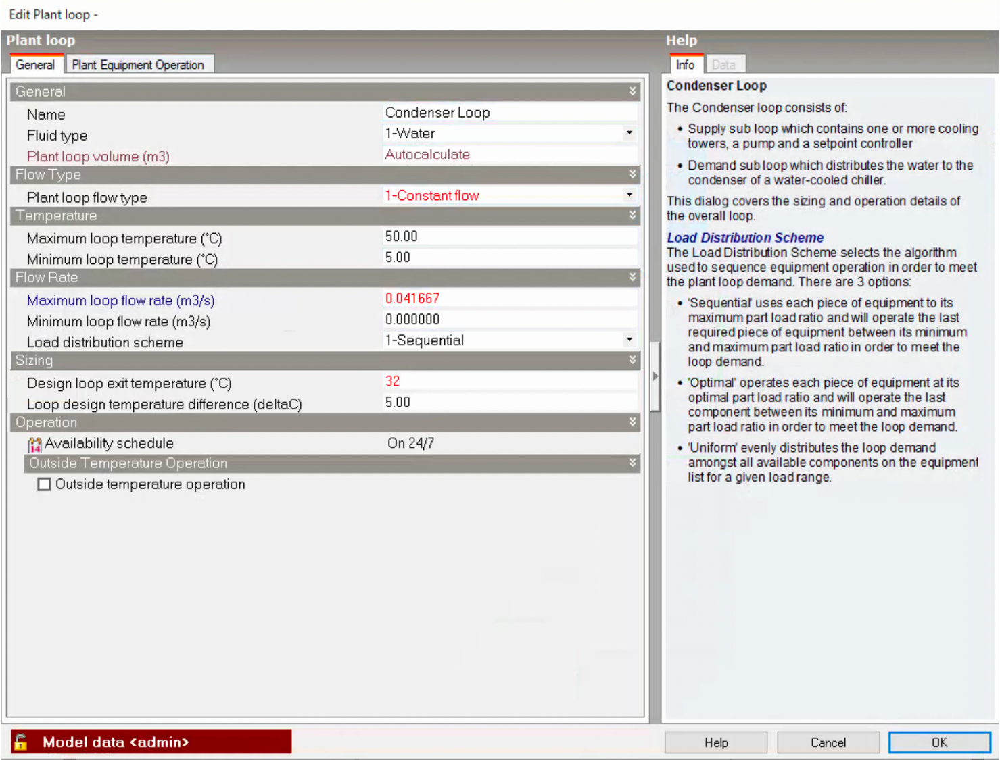

== DesignBuilderを用いた全体システムモデルの作成（JE100:CAVシステム）

DesignBuilder（以下、DB）を用いて全体システムテストモデル（JE100：CAVシステム）を作成する。DBのバージョンは6.1.8.021である。

=== 建物モデル
先に作成している建物全体テストのモデル「JSBC2018.dsb」をベースに作成していく。まず、ファイルを開いた際に、DBのバージョンが異なる場合は自動でバージョンがアップデートされる。

.建物モデル

全体システムテストでは基準階のみが計算対象であるため、基準階を除いて削除する。

.基準階モデル

=== HVAC Systemシートの作成
Model Options > Data > HVACにおいて、設定をSimpleからDetailedに変更する。

.Model Optionsの設定

.設定変更後（左のツリーに新たにHVAC Systemのシートが追加される）

=== HVAC zone groupの作成
空調機のグループごとにHVAC zone groupを作成する。ツールバーのアイコンからAdd Zone Groupを選択しドロップする。下図のようにリストから該当ゾーンをチェックする。

.HVAC zone group

=== Zoneへの給排気オブジェクトの追加
HVAC zone group内の1つのゾーンを選択し、給気オブジェクト（ここではCAV no reheat）と排気オブジェクトを追加する。これらは1つのゾーンに追加すると、自動的に同じグループ内の他のゾーンにも追加される。

.給排気オブジェクトの追加

各ゾーンのCAVオブジェクトの最大風量を入力する。

.CAVオブジェクトの最大風量の設定

=== 空調機ループの作成
ツールバーのアイコンからAdd Generic Air Loopを選択しドロップする。

.空調機ループの追加

ツリーから空調機ループを選択し、設定画面を開き、仕様を入力する。ここでは空調機の名称と設計外気風量のみをデフォルトから変更した。

.空調機ループの設定

ツリーからDemand Sideを選択し、ツールバーからConnect componentsを選択して給気と排気のダクトを接続する。

.Demand sideの接続

次にSupply Sideの設定を行う。まず、空調機オブジェクト内に冷温水コイルと加湿器を追加する。 +
※気化式加湿器のオブジェクトが存在しないため、ここでは代わりにEvaporative coolerを追加した。このオブジェクトで気化式加湿器の代替が可能かどうかは今後の検討で明らかにする。

.冷温水コイルと加湿器の追加

空調機オブジェクトの仕様を入力する。ここでは設計給気風量と最小・最大外気風量をデフォルトから変更した。外気風量は一定で運用されるため最小・最大ともに設計外気風量を入力した。

.空調機の設定（給気風量）

.空調機の設定（外気風量）

ファンオブジェクトの仕様を入力する。ここでは定格静圧をデフォルトから変更した。 +
※ファン効率とモーター効率の入力については要確認

.ファンの設定

冷水コイルオブジェクトの仕様を入力する。ここでは設計上の出入口条件と最大流量をデフォルトから変更した。 +
※冷水コイルにはWater cooling coilとWater cooling coil - detailedの2種類があるが、ここでは前者を使用した。この2つのモデルの違いについて確認が必要。

.冷水コイルの設定

温水コイルオブジェクトの仕様を入力する。ここでは設計上の加熱量、出入口条件と最大流量をデフォルトから変更した。 +
※冷水コイルとの違いについて要確認

.温水コイルの設定

Evaporative coolerオブジェクトの仕様を入力する。いくつかのTypeがあるが、ここではDirect Research Specialを選択した。このTypeでは、入口空気状態に応じて気化冷却のON/OFFが可能である。とりあえず、冬期の室内条件（22℃、40％）から上限湿球温度を13.9℃と設定した。Water pump powerが仮で入力した数字であり、結果を評価する上ではエネルギー消費量にはカウントしない。 +
※Evaporative coolerの動作については要確認

.Evaporative coolerの設定

最後に給気系統にSetpoint managerを追加する。正しいモデル化方法を分かっていないが、仮に冷房用と暖房用のManagerをそれぞれ追加した。

.給気系統のSetpoint manager

マルチゾーンの系統はMulti-zone cooling/heating averageを選択し、シングルゾーンの系統はSingle zone cooling/heatingを選択した。 +
※この設定で適切に動作するかはシミュレーション結果を要確認

.マルチゾーンの設定

.シングルゾーンの設定

最終的に2次側モデルは下図のようになる。

.完成した2次側モデル

=== 冷水ループの作成
ツールバーからAdd Primary/Secondary Chilled Water Plant Loopを選択しドロップする。

.Primary/Secondary Chilled Water Plant Loop

続いて冷水ループの仕様を入力する。台数制御の設定は、チラーの運転順位を設定する必要があるため、実際にはチラーオブジェクトを追加後に設定する。

.冷水ループの設定（熱媒、最大流量、送水温度とデルタT）

.冷水ループの設定（台数制御）

次に3台のチラーとポンプを追加し、仕様を入力する。

.チラーとポンプを追加した冷水ループ
image::figures/figure28.png[]

.AHPの設定

.AHP1次ポンプの設定

.ARの設定

.AR1次ポンプの設定

=== 冷却水ループの作成
ツールバーからAdd Condenser Loopを選択しドロップする。

.Condenser Loop

Condenser Loop、冷却塔、冷却水ポンプの仕様を入力する。

.Condenser Loopの設定

.冷却塔の設定

=== 温水ループの作成
温水用空気熱源HPのモデルがないため、とりあえずガス焚きボイラのみを設定した。 +
※温水ループのモデル化については今後要検討

=== 完成した全体システム
全体システム（仮）は以下のような構成となる。

.全体システム

=== モデル化にあたっての疑問点等
* CAVの場合の給気温度制御の設定、室温設定。給気温度で室温制御は可能か？
* 気化式加湿器は？
* 温水用の空冷HPはある？
* 1次ポンプと2次ポンプの設定。
* 複数台の2次ポンプは可能？
* 基準階だけのモデリングは可能？Zone list multiplierでできるか？

